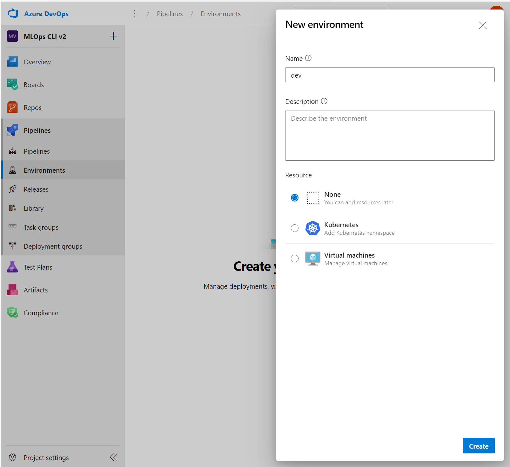
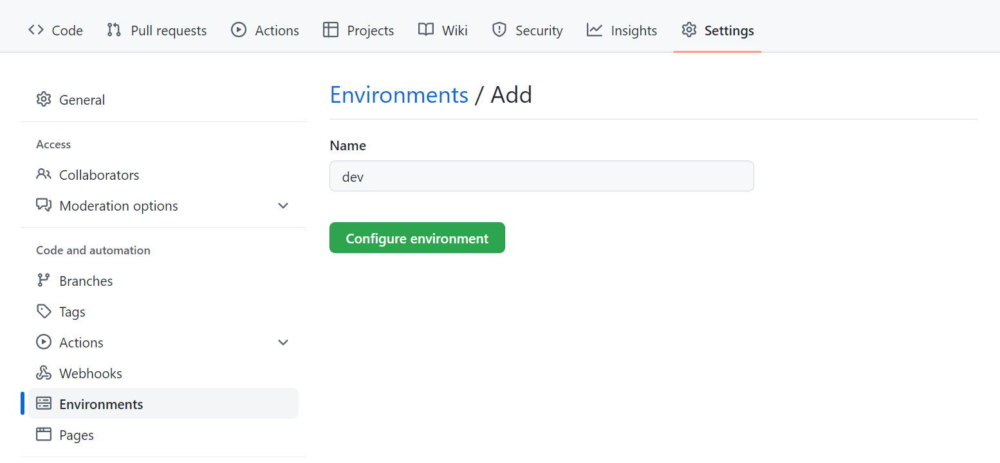

Within DevOps, an **environment** refers to a collection of resources. These resources are used to deploy an application, or with machine learning projects, to deploy a model.

## Use environments for continuous delivery

How many environments you work with, depends on your organization. Commonly, there are at least two environments: *development* or *dev* and *production* or *prod*. Plus, you can add environments in between like a *staging* or *pre-production* (*pre-prod*) environment. 

With continuous delivery, a typical approach is to:

1. Experiment with model training in the *development* environment.
2. Move the best model to the *staging* or *pre-prod* environment to deploy and test the model.
3. Finally *release* the model to the *production* environment to deploy the model so that end-users can consume it.

> [!Note]
> In this module, we refer to the DevOps interpretation of environments. Note that Azure Machine Learning also uses the term environments to describe a collection of Python packages needed to run a script. These two concepts of environments are independent from each other. Learn more about [Azure Machine Learning environments](/azure/machine-learning/concept-environments). 

## Organize Azure Machine Learning environments

When you implement MLOps, and work with machine learning models at a large scale, it's a best practice to work with separate environments for different stages. 

Imaging your team uses a dev, pre-prod, and prod environment. Not everyone on your team should get access to all environments. Data scientists may only work within the dev environment with non-production data, while machine learning engineers work on deploying the model in the pre-prod and prod environment with production data. 

Having separate environments will make it easier to control access to resources. Each environment can then be associated with a separate Azure Machine Learning workspace. 


Within Azure, you'll use role-based access control (RBAC) to give colleagues the right level of access to the subset of resources they need to work with.

Alternatively, you can use only one Azure Machine Learning workspace. When you use one workspace for development and production, you'll have a smaller Azure footprint and less management overhead. However, RBAC will apply to both dev and prod, which may mean that you're giving people too little or too much access to resources.

> [!Tip]
> Learn more about [best practices to organize Azure Machine Learning resources](/azure/cloud-adoption-framework/ready/azure-best-practices/ai-machine-learning-resource-organization).

To work with environments for different stages of the model development, you can target an environment when running an **Azure Pipeline** or workflow with **GitHub Actions**.

## Azure DevOps environments

To work with environments in Azure DevOps, you first need to create environments. Then, you can specify which environment you want to deploy to within an Azure Pipeline.

1. Within Azure DevOps, expand the **Pipelines** menu.
2. Select **Environments**.
3. Create a **new environment**.
4. Give your environment a name.
5. Choose **None** for resources. You target a specific Azure Machine Learning workspace in the pipeline itself.
6. Select **Create**.



After creating the environments in Azure DevOps and having different Azure Machine Learning workspaces associated with each environment, you can specify which environment you want to deploy to in the Azure Pipelines YAML file:

```yml
trigger: 
- main

stages:
- stage: deployDev
  displayName: 'Deploy to development environment'
  jobs:
    - deployment: publishPipeline
      displayName: 'Model Training'
      pool:
        vmImage: 'Ubuntu-18.04'
      environment: dev
      strategy:
       runOnce:
         deploy:
          steps:
          - template: aml-steps.yml
            parameters:
              serviceconnectionname: 'spn-aml-workspace-dev'
```

The value for `environment` in the YAML file is `dev`, indicating the model is trained in the development environment. Through the **service connection**, you specify which Azure Machine Learning workspace you want to use for model training.

> [!Tip]
> Learn more about [how to create and target an environment with Azure DevOps](/azure/devops/pipelines/process/environments).

## GitHub environments

To use environments with GitHub Actions, you first need to create an environment. Then, you can use an environment in your workflow.

To create an environment within your GitHub repository (repo):

1. Go to the **Settings** tab within your repo.
2. Select **Environments**.
3. Create a **new environment**.
4. Enter a name.
5. Select **Configure environment**.



To associate an environment with a specific Azure Machine Learning workspace, you can create an **environment secret** to give only that environment access to an Azure Machine Learning workspace.

To use an environment in a workflow, you can add which environment you want to deploy to by including it in the YAML file:

```yml
name: Train model

on:
  push:
    branches: [ main ]

jobs:
  build:
    runs-on: ubuntu-latest
    environment:
        name: dev 
    steps:
    - name: check out repo
      uses: actions/checkout@v2
    - name: install az ml extension
      run: az extension add -n ml -y
    - name: azure login
      uses: azure/login@v1
      with:
        creds: ${{secrets.AZURE_CREDENTIALS}}
    - name: set current directory
      run: cd src
    - name: run pipeline
      run: az ml job create --file src/aml_service/pipeline-job.yml --resource-group dev-ml-rg --workspace-name dev-ml-ws
```

In the example, the `AZURE_CREDENTIALS` secret contains the connection information to the Azure Machine Learning workspace used for this environment.

> [!Tip]
> Learn more about [how to create and use an environment with GitHub Actions](https://docs.github.com/actions/deployment/targeting-different-environments/using-environments-for-deployment).

