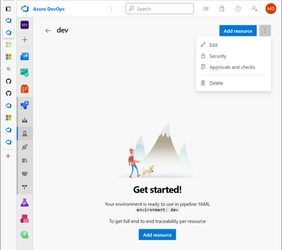
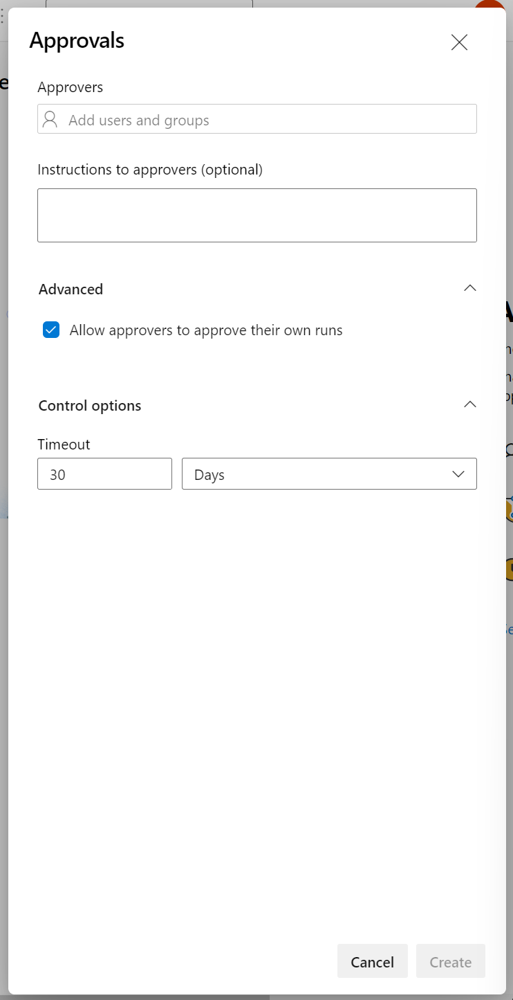
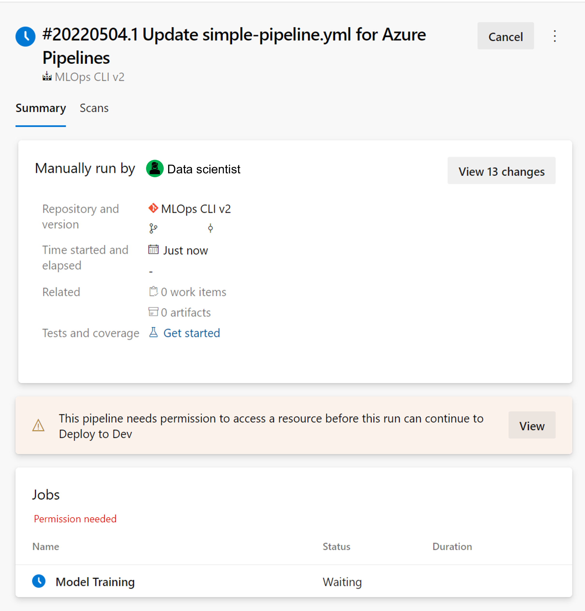
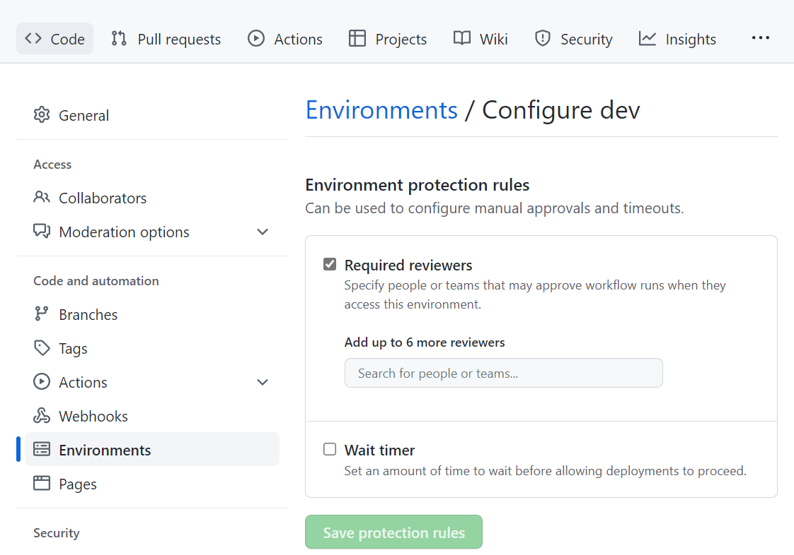
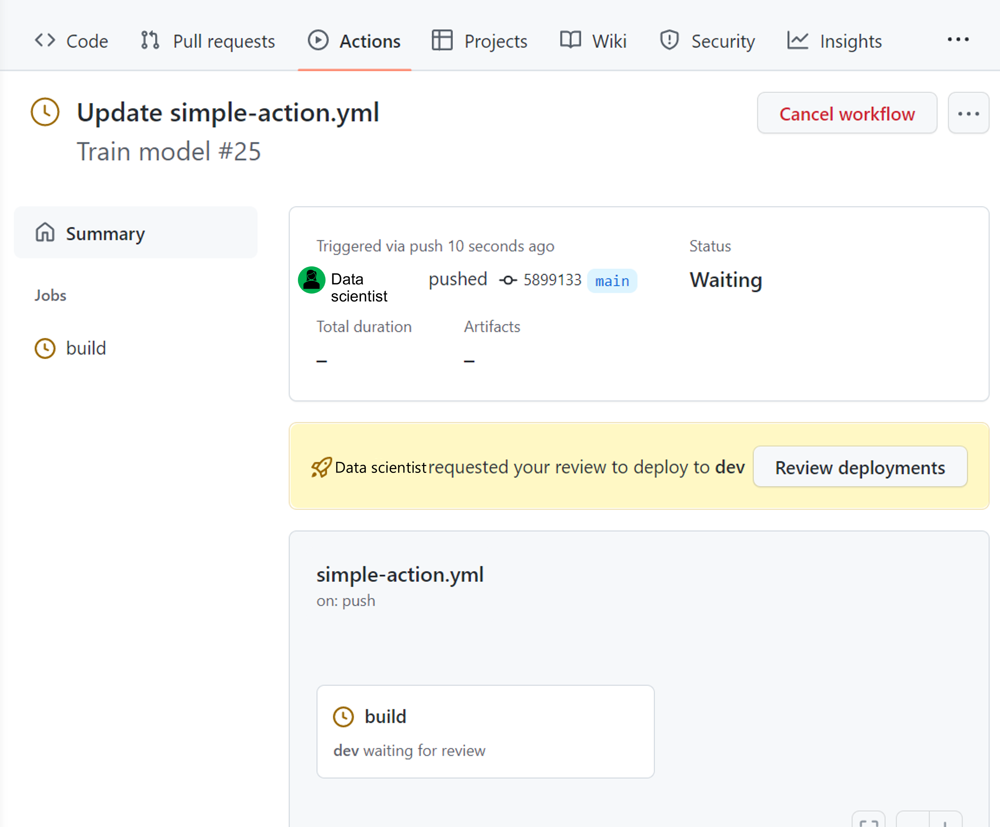

There are many advantages to using environments in machine learning projects. When you have separate environments for development, staging, and production, you can more easily control access to resources. 

Another benefit of using environments is that you can add **approval checks**. By adding a required *manual* approval between environments, you can control the continuous deployment of a model from development to staging, to production.

## Create an approval check within Azure Pipelines

To add an approval check to an environment in Azure Pipelines, navigate to the environment you created:

1. Select **Approvals and checks**.
2. Select **Approvals**.
3. Add users or a group of users you want to enlist as approvers.
4. Optionally, add instructions for the approvers.

Whenever you want to run a pipeline, which targets an environment with an approval check, the approvers will get notified that they need to permit the pipeline to run.

After an approver gives permission for a pipeline to run within the time-out range, the pipeline will execute. 

> [!Tip]
> Learn more about [how to define approvals and checks in Azure Pipelines](/azure/devops/pipelines/process/approvals).

## Create an approval check within GitHub Actions

To add an approval check within GitHub, navigate to the environment you created:

1. Enable **required reviewers**.
2. Select the GitHub users you want to enlist as approvers.
3. **Save** the protection rules.

Whenever a workflow in GitHub Actions wants to deploy to an environment with an approval check, the approvers will get notified that their review is requested. 

After you as an approver have reviewed the deployment, the workflow will run.

> [!Tip]
> Learn more about [how to add reviewers to environment protection rules in GitHub](https://docs.github.com/actions/deployment/targeting-different-environments/using-environments-for-deployment) and [how to review deployments](https://docs.github.com/actions/managing-workflow-runs/reviewing-deployments).