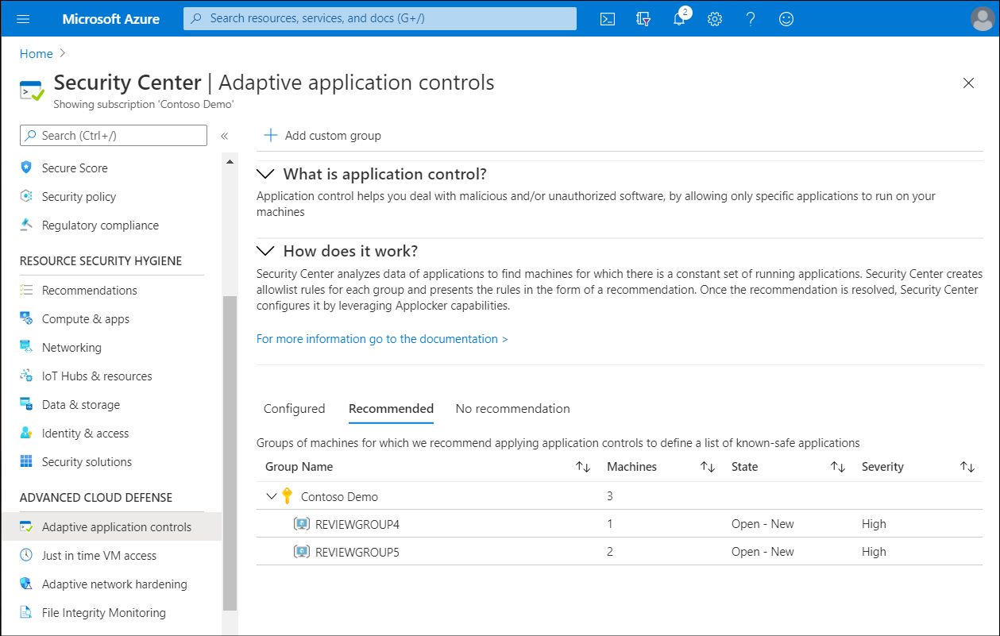

Adaptive application control can help Contoso IT operations staff determine which applications are allowed to run on their Azure (and non-Azure) VMs. Being able to control applications in this way can help harden their VMs against malware.

> [!NOTE]
> For non-Azure and Linux machines, adaptive application control is supported in audit mode only.

## What is adaptive application control?

Adaptive application control uses machine learning to analyze the applications running on your VMs. You configure and manage adaptive application controls in Security Center. Once enabled, the Adaptive application controls feature creates an allowlist from its machine-learning analysis.

> [!NOTE]
> Security Center requires at least two weeks of data to perform this analysis.

Using Adaptive application controls can help simplify the process of configuring and maintaining application policies. By using Adaptive application controls, you can:

- Block attempts to run potentially malicious applications.
- Receive alerts when adaptive application control blocks an application.

     > [!NOTE]
     > These blocks and alerts might be generated by attempts to run applications that could otherwise be missed by antimalware solutions.

- Comply with your organization's requirements that you use only licensed software.
- Avoid using unwanted software, including old or unsupported apps.
- Prevent specific software tools from running.
- Enable IT to control access to sensitive data.

## Enable adaptive application control

To implement adaptive application control, you must use Security Center. Use the following procedure to begin the process of implementing adaptive application control:

1. In the Azure portal, open **Security Center**.
2. In the navigation pane, in the **ADVANCED CLOUD DEFENSE** section, select **Adaptive application controls**.
3. In the **Adaptive application controls** blade, expand **How does it work?**.

Within *How does it work* are three tabs: **Configured**, **Recommended**, and **No recommendation**. These are described in the following table:

|Tab|Description|
|-----------------|------------------------------------------------------------|
|Configured|This is a list of groups containing the VMs that are already configured with application control.|
|Recommended|This tab offers a list of groups for which application control is recommended. Security Center uses machine learning to identify VMs that are good candidates for application control based on whether the VMs consistently run the same applications.|
|No recommendation|This is a list of groups containing VMs without any application control recommendations—for example, VMs on which applications are always changing and haven’t reached a steady state.|
