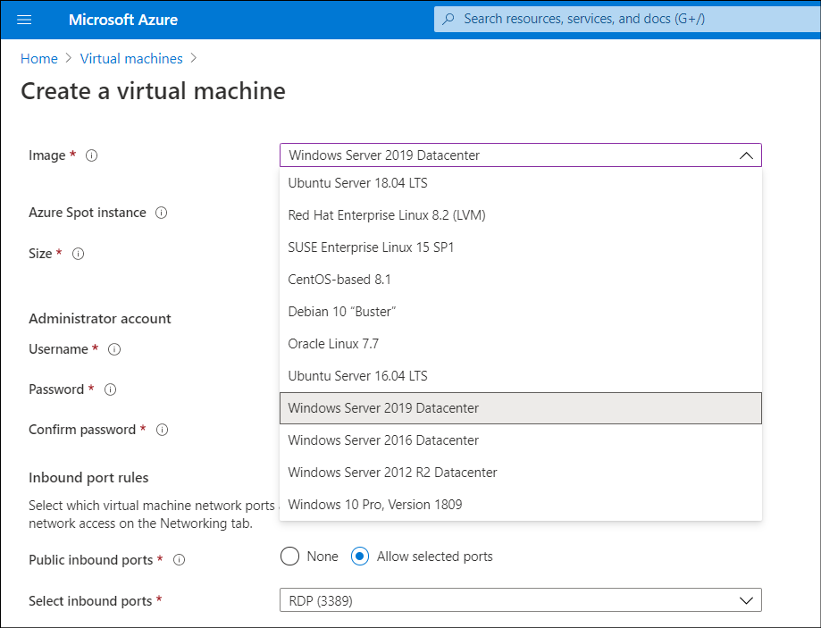

IT operations staff at Contoso have spent a considerable amount of time deploying VMs to Azure as part of a pilot program. Before they begin deploying additional VMs, they've asked you to determine whether imaging could be used to assist with these deployments. You've worked with creating VMs from generalized images at Contoso in an on-premises environment, and learn that it's possible to create Azure IaaS VMs using the same approach. But first, you need to know how to create a generalized image in Azure.

## What are VM images?

When you create a VM, you must specify a VM image that contains a generalized operating system and optionally, other preconfigured software. Azure uses the image to create a new virtual hard disk (VHD) from which it can start your VM. The **Image** list on the **Create a virtual machine** blade in the Azure portal, displayed in the following screenshot, presents a list of commonly used images.



> [!NOTE]
> A *VM image* is a template from which you can create the VHDs to run a VM. The VHDs for a typical VM image contain a preconfigured version of an operating system.

To choose something more specific to your needs, you can select **Browse all public and private images**. You can choose from items in Azure Marketplace or Contoso's own images. Azure Marketplace supplies many VM images that you can use as a starting point to build your own VM image. Examples include:

- Various versions of Windows Server, optionally with Microsoft SQL Server installed.
- Linux variants with software such as MySQL, MongoDB, Cassandra, or other databases already configured.

> [!TIP]
> For a complete list of VM images, visit the [Azure Marketplace virtual machine images](https://aka.ms/azure-marketplace-vm-images?Azure-portal=true) page.

## What is a generalized image?

After you create a VM and customize it by configuring and installing additional applications according to your requirements, you can save it as a new image. The new image will be a set of VHDs from which you can create additional VMs. However, you need to clean up the image first, because when you create a VM the operating system data is updated with several items, including:

- The host name of your VM.
- The administrator username and credentials.
- Log files.
- Security identifiers for various operating system services.

These items must be reset to their default settings before you capture an image. When you reset these items in a VM, you *generalize* the VM.

### Generalize a VM

Use the **Sysprep.exe** tool to generalize a Windows VM. Follow these steps:

1. Sign in to the Windows VM.
2. Open an elevated **Command Prompt**.
3. Navigate to the **C:\windows\system32\sysprep** folder.
4. Run **sysprep.exe**.
5. In the **System Preparation Tool** dialog box, select the settings in the following table, and then select **OK**.

|Property|Value|
|:------------------------|:--------------------------------------------|
|**System Cleanup Action**|Enter System Out-of-Box Experience (OOBE)|
|**Generalize**|Select|
|**Shutdown Options**|Shutdown|


After the VM has been shut down, you should deallocate it while it's in this clean state. You can do this via the Azure portal, via Azure PowerShell, or Azure Command-Line Interface (Azure CLI). In the Azure portal, select the appropriate VM, and then on the toolbar, select **Stop**. At the **Stop this virtual machine** prompt, select **OK**.

> [!NOTE]
> The VM might display a state of **Stopped**, but it isn't deallocated.

After the VM has the status of **Stopped (deallocated)**, continue to the next step.

In PowerShell, run the following command to stop and deallocate the VM:

```powershell
Stop-AzVM -ResourceGroupName <resource group> `
    -Name <virtual machine name> `
    -Force
```

If you're using the Azure CLI, run the following command instead:

```AzureCLI
az vm deallocate \
    --resource-group <resource group> \
    --name <virtual machine name>
```

> [!TIP]
> Although we recommend that you deallocate the VM, when you use the Azure portal to create an image from a VM it automatically deallocates the VM.

> [!IMPORTANT]
> Keep in mind that you continue to pay for compute resources if your VM is stopped but not deallocated.

> [!NOTE]
> After the image is created, you can upload the VHD. For instructions, refer to [Upload a VHD to Azure or copy a managed disk to another region - Azure PowerShell](https://aka.ms/upload-vhd-using-azure-powershell?Azure-portal=true).
