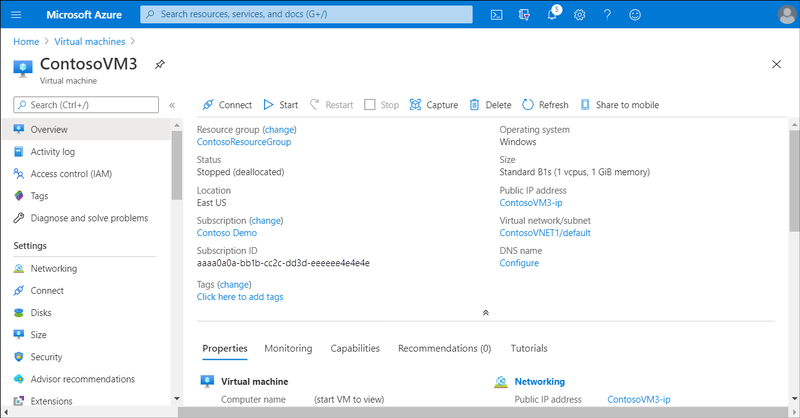
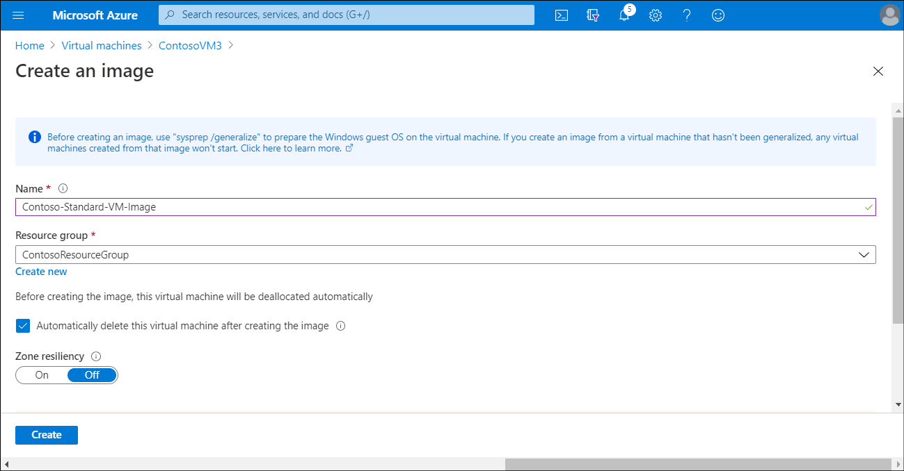
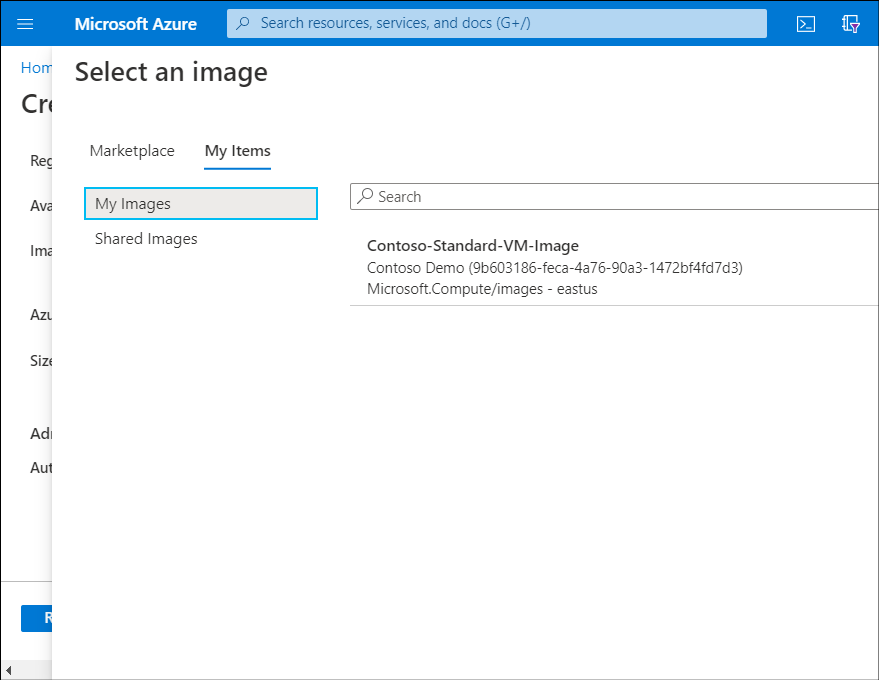
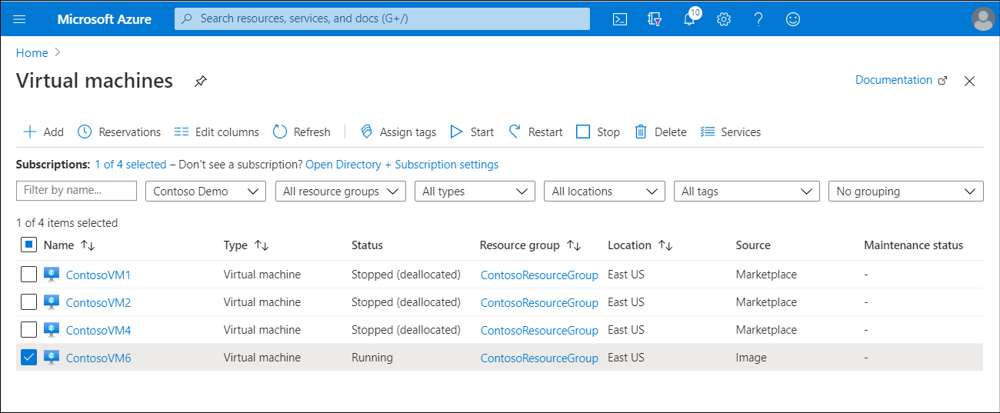

After you have generalized the VM, you can create a managed image. You can then create new VMs from this managed image.

> [!CAUTION]
> Capturing a VM image from a VM will make the VM unusable. Furthermore, this action can't be undone.

## Create a managed image from a generalized VM

The managed image you create will include all of the disks associated with the generalized VM. You can create a managed image from a generalized VM by using the Azure portal, the Azure CLI, or PowerShell.

To create an image in the Azure portal, use the following procedure:

1. Select the appropriate VM.
2. On the toolbar, select **Capture**.

    

3. On the **Create an image** blade, enter a **Name** and then select a **Resource group**.

4. If you want to remove the source VM, select the **Automatically delete this virtual machine after creating the image** check box.

    > [!NOTE]
    > You must enter the existing VM's name to confirm this action.

5. Select **Create**.

    

> [!TIP]
> Additionally, you can create resilient images that are backed by zone-redundant storage. This feature provides increased availability for your images. To enable this feature, change **Zone resiliency** to **On**.

> [!TIP]
> Before you can capture a VM image from a generalized Azure VM, you must mark it as generalized using the `Set-AzVm -ResourceGroupName $rgName -Name $vmName -Generalized` command.

In PowerShell, use the following commands to create a VM image from a generalized and deallocated VM:

```powershell
$vm = Get-AzVM -ResourceGroupName <resource group> `
    -Name <generalized virtual machine>

$image = New-AzImageConfig -SourceVirtualMachineId `
    $vm.ID -Location <virtual machine location>

New-AzImage -Image $image `
    -ImageName <image name> `
    -ResourceGroupName <resource group>
```

For Azure CLI, use the following commands:

```AzureCLI
az image create \
    --name <image name> \
    --resource-group <resource group> \
    --source <generalized virtual machine>
```

## Create a new VM from a managed image

After your managed image is created, you can create new VMs using the image using the Azure portal, or by using PowerShell or Azure CLI.

To use the Azure portal to create a new VM, perform the following procedure:

1. In the Azure portal, navigate to **Virtual machines**, and then select **+ Add**.
2. Enter the necessary details, including **Subscription**, **Resource group**, **Virtual machine name**, and **Region**.
3. Then select **Browse all public and private images**.
4. On the **Select an image** blade, select the **My Items** tab.
5. Your newly created image should be present in the list. Select it.

    

6. Configure the remaining required information: **Size**, **Username**, **Password**, **Inbound port rules**, and **License type**.

    > [!TIP]
    > When you create a VM from your image, you must configure the **License type**.  This isn't necessary when you create a VM from the Azure Marketplace.

7. Optionally, go through the **Start with a preset configuration** wizard to review the **Disks**, **Networking**, **Management**, **Advanced**, and **Tags** settings.
8. When you're done, select **Review + create**.
9. When prompted, select **Create**.

Alternatively, you can use the PowerShell `New-AzVm` command, or the Azure CLI `az vm create` command to create a new VM. The following examples illustrate the syntax.

### Use PowerShell

Use the following command to create a new VM in PowerShell:

```powershell
New-AzVm `
    -ResourceGroupName <resource group> `
    -Name <new virtual machine name> `
    -ImageName <image name> `
    -Location <location of image> `
```

### Use Azure CLI

To create a new VM using Azure CLI, use the following command:

```AzureCLI
az vm create \
    --resource-group <resource group> \
    --name <new virtual machine name> \
    --image <image name> \
    --location <location of image>
```

> [!NOTE]
> If you want to try out what you've learned, run this exercise: [Create an image of an Azure VM from the Azure CLI and provision a new VM](https://aka.ms/create-image-of-vm-from-cli-and-provision-new-vm?Azure-portal=true). It's based on a sandbox, so you don't need an Azure subscription.

If you review your list of VMs in the Azure portal, after creating your new VM from your managed image you'll notice that the new VM displays the source as **Image**.


