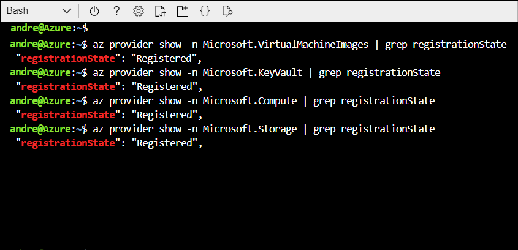

You decide to test Azure Image Builder to discover if it can meet the needs of the Contoso IT operations staff. You plan to create a Windows VM by using Azure Image Builder and a sample .json template that you have downloaded from the GitHub library. But first, you must register Azure Image Builder with your Azure subscription.

> [!NOTE]
> In this preview, you can't use the Azure portal to work with Azure Image Builder.

## Register Azure Image Builder

To use Azure Image Builder in public preview, you must register the features in your Azure subscription. The following steps provide guidance on this process.

1. To register Azure Image Builder, run the following Azure CLI command:

   ``` Azure CLI
   az feature register --namespace Microsoft.VirtualMachineImages --name VirtualMachineTemplatePreview`
   ```

1. Check the status of the feature registration using the following command:
  
   ``` Azure CLI
   az feature show --namespace Microsoft.VirtualMachineImages --name VirtualMachineTemplatePreview | grep state
   ```

1. Check your registration status using the following command:

    ``` Azure CLI
    az provider show -n Microsoft.VirtualMachineImages | grep registrationState
    az provider show -n Microsoft.KeyVault | grep registrationState
    az provider show -n Microsoft.Compute | grep registrationState
    az provider show -n Microsoft.Storage | grep registrationState
    ```

1. If any provider doesn't display `Registered`, run the following command:

    ```AzureCLI
    az provider register -n Microsoft.VirtualMachineImages
    az provider register -n Microsoft.Compute
    az provider register -n Microsoft.KeyVault
    az provider register -n Microsoft.Storage
    ```

When all is ready, all providers should display as `Registered`.



## Create an image

The next steps are to create an image, and then create the VM from the image. To create an image, perform the following procedure:

1. Set variables that you'll use during the build process:

    ```AzureCLI
    # Resource group name
    imageResourceGroup=ContosoWinImgBuilderRG
    # Region location
    location=WestUS2
    # Name for the image
    imageName=ContosoWinBuilderImage
    # Run output name
    runOutputName=ContosoWindows
    # name of the image to be created
    imageName=ContosoWinImage
    # Create a variable for your subscription ID
    subscriptionID=<Your subscription ID>
    ```

   > [!TIP]
   > You can determine your subscription ID using the `az account show | grep id` command.

2. Create a resource group: `az group create -n $imageResourceGroup -l $location`.

   > [!TIP]
   > You can, of course, use an existing resource group if you prefer. However, it's easier to manage (from a cleanup perspective) if you create one for this specific purpose.

3. Create a user-assigned identity and set permissions on the resource group:

   ```AzureCLI
    # create user assigned identity for image builder to access the storage account where the script is located
    identityName=aibBuiUserId$(date +'%s')
    az identity create -g $imageResourceGroup -n $identityName

    # get identity id
    imgBuilderCliId=$(az identity show -g $imageResourceGroup -n $identityName | grep "clientId" | cut -c16- | tr -d '",')

    # get the user identity URI, needed for the template
    imgBuilderId=/subscriptions/$subscriptionID/resourcegroups/$imageResourceGroup/providers/Microsoft.ManagedIdentity/userAssignedIdentities/$identityName

    # download preconfigured role definition example
    curl https://raw.githubusercontent.com/danielsollondon/azvmimagebuilder/master/solutions/12_Creating_AIB_Security_Roles/aibRoleImageCreation.json -o aibRoleImageCreation.json

    imageRoleDefName="Azure Image Builder Image Def"$(date +'%s')

    # update the definition
    sed -i -e "s/<subscriptionID>/$subscriptionID/g" aibRoleImageCreation.json
    sed -i -e "s/<rgName>/$imageResourceGroup/g" aibRoleImageCreation.json
    sed -i -e "s/Azure Image Builder Service Image Creation Role/$imageRoleDefName/g" aibRoleImageCreation.json

    # create role definitions
    az role definition create --role-definition ./aibRoleImageCreation.json

    # grant role definition to the user assigned identity
    az role assignment create \
    --assignee $imgBuilderCliId \
    --role $imageRoleDefName \
    --scope /subscriptions/$subscriptionID/resourceGroups/$imageResourceGroup
    ```

4. Download the image configuration template:

   ```AzureCLI
   curl https://raw.githubusercontent.com/danielsollondon/azvmimagebuilder/master/quickquickstarts/0_Creating_a_Custom_Windows_Managed_Image/helloImageTemplateWin.json -o helloImageTemplateWin.json
   sed -i -e "s/<subscriptionID>/$subscriptionID/g" helloImageTemplateWin.json
   sed -i -e "s/<rgName>/$imageResourceGroup/g" helloImageTemplateWin.json
   sed -i -e "s/<region>/$location/g" helloImageTemplateWin.json
   sed -i -e "s/<imageName>/$imageName/g" helloImageTemplateWin.json
   sed -i -e "s/<runOutputName>/$runOutputName/g" helloImageTemplateWin.json
   sed -i -e "s%<imgBuilderId>%$imgBuilderId%g" helloImageTemplateWin.json
   ```

5. Create the image by submitting the image configuration to the VM Image Builder service:

   ```AzureCLI
   az resource create \
    --resource-group $imageResourceGroup \
    --properties @helloImageTemplateWin.json \
    --is-full-object \
    --resource-type Microsoft.VirtualMachineImages/imageTemplates \
    -n helloImageTemplateWin01
   ```

   > [!TIP]
   > You can edit the code using a text editor.

   After the image creation completes, Azure Image Builder displays a success message in the console, and creates an Image Builder Configuration Template in the `$imageResourceGroup`. You can review this resource in the resource group in the Azure portal if you enable **Show hidden types**. In the background, Azure Image Builder also creates a staging resource group in your subscription. This resource group is used for the image build. It will be in this format: `IT_<DestinationResourceGroup>_<TemplateName>_<GUID>`.

6. Start the image build:

   ```AzureCLI
    az resource invoke-action \
     --resource-group $imageResourceGroup \
     --resource-type  Microsoft.VirtualMachineImages/imageTemplates \
     -n helloImageTemplateWin01 \
     --action Run
    ```

> [!NOTE]
> The image build can take up to 15 minutes.

## Build a VM

The final step is to create a VM from the newly built image. To build the VM, run the following command in Azure CLI:

```AzureCLI
az vm create \
  --resource-group $imageResourceGroup \
  --name aibImgWinVm00 \
  --admin-username azureuser \
  --admin-password <password> \
  --image $imageName \
  --location $location
```

> [!TIP]
> Change the administrator name in the preceding code to suit your requirements.

After you have built your VM, you should verify the customization. You do this by opening a Remote Desktop Protocol (RDP) connection to the VM, signing in with the defined username and password, and verifying the presence of the following objects:

- buildActions
- buildArtifacts

> [!NOTE]
> When you have finished, clean up all the resources that you created during the build process. For more details, refer to [Clean up](https://aka.ms/clean-up).

## Additional reading

You can learn more by reviewing the following documents:

- [Preview: Create a Windows VM with Azure Image Builder](https://aka.ms/create-windows-vm-with-azure-image-builder?Azure-portal=true)
- [Preview: Create a Windows image and distribute it to a Shared Image Gallery](https://aka.ms/create-windows-image-and-distribute-to-shared-image-gallery?Azure-portal=true)
- [Preview: Create a new VM image version from an existing image version using Azure Image Builder in Windows](https://aka.ms/create-new-vm-image-version-from-existing-image-version-using-azure-image-builder-in-windows?Azure-portal=true)
