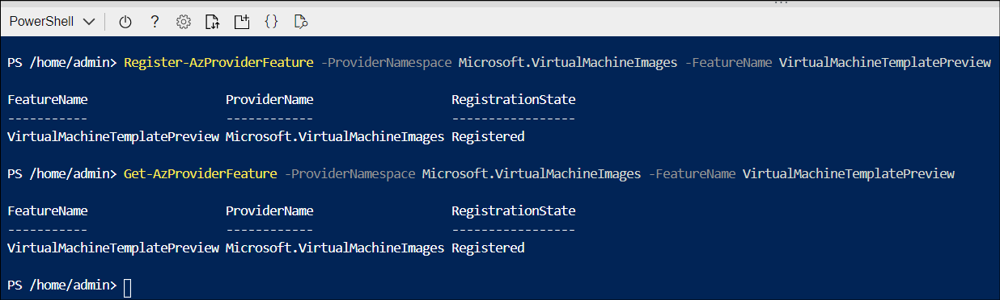

IT operations staff at Contoso decide to test Azure Image Builder using Azure PowerShell to create a Windows VM. The high-level steps involved are broadly similar to the process discussed in the last unit. 

> [!IMPORTANT]
> While Azure Image Builder is in preview, you must manually install the required Azure PowerShell modules. 

To install the required PowerShell modules, use the following Azure PowerShell command:

``` Azure PowerShell
'Az.ImageBuilder', 'Az.ManagedServiceIdentity' | ForEach-Object {Install-Module -Name $_ -AllowPrerelease}
```

When prompted, select **Y** and select Enter. 

## Register Azure Image Builder

The first thing you must do to use Azure Image Builder in public preview is to register the features in your Azure subscription. The following steps provide guidance on this process: 

1. Open the Azure portal, and then on the menu, select **Cloud Shell**. 
2. In Cloud Shell, switch to **PowerShell**. 
3. Select your Azure subscription by running the following PowerShell command:

   ``` Azure PowerShell
    $subscriptionID = (Get-AzContext).Subscription.Id
    Write-Output $subscriptionID
    Set-AzContext -SubscriptionId $subscriptionID
   ```

4. Next, and only if this is your first time using Azure Image Builder, register the new `VirtualMachineTemplatePreview` feature by running the following PowerShell command: 

   ``` Azure PowerShell
   Register-AzProviderFeature -ProviderNamespace Microsoft.VirtualMachineImages -FeatureName VirtualMachineTemplatePreview
   ```

5. Check the status of the feature registration using the following command:
  
   ``` Azure PowerShell
   Get-AzProviderFeature -ProviderNamespace Microsoft.VirtualMachineImages -FeatureName VirtualMachineTemplatePreview
   ```

6. Register the following resource providers:

   - Microsoft.Compute
   - Microsoft.KeyVault
   - Microsoft.Storage
   - Microsoft.VirtualMachineImages


   Use the following command to register the resource providers:

    ``` Azure PowerShell
   Get-AzResourceProvider -ProviderNamespace Microsoft.Compute, Microsoft.KeyVault, Microsoft.Storage, Microsoft.VirtualMachineImages | Where-Object RegistrationState -ne Registered | Register-AzResourceProvider
    ```

   


## Create an image

The next steps will create an image, and then create the VM from the image. To create an image, perform the following procedure:

1. Set variables that you'll use during the build process:

    ```Azure PowerShell
    # Destination image resource group name
    $imageResourceGroup = 'ContosoWinImgBuilderRG'
    # Azure region
    $location = 'WestUS2'
    # Name of the image to be created
    $imageTemplateName = 'ContosoWinBuilderImage'
    # Distribution properties of the managed image upon completion
    $runOutputName = 'ContosoDistResults'
    ```

2. Create a resource group: `New-AzResourceGroup -Name $imageResourceGroup -Location $location`.

   > [!TIP]
   > You can use an existing resource group if you prefer.

3. Create a user-assigned identity and set role permissions:

   ```Azure PowerShell
   [int]$timeInt = $(Get-Date -UFormat '%s')
   $imageRoleDefName = "Azure Image Builder Image Def $timeInt"
   $identityName = "myIdentity$timeInt"
   New-AzUserAssignedIdentity -ResourceGroupName $imageResourceGroup -Name $identityName
   $identityNameResourceId = (Get-AzUserAssignedIdentity -ResourceGroupName $imageResourceGroup -Name $identityName).Id
   $identityNamePrincipalId = (Get-AzUserAssignedIdentity -ResourceGroupName $imageResourceGroup -Name $identityName).PrincipalId
   ```

4. Assign permissions for the new identity to distribute images:

   ```Azure PowerShell
   $myRoleImageCreationUrl =  'https://raw.githubusercontent.com/danielsollondon/azvmimagebuilder/master/solutions/12_Creating_AIB_Security_Roles/aibRoleImageCreation.json'
   $myRoleImageCreationPath = "$env:TEMP\myRoleImageCreation.json"
   
   Invoke-WebRequest -Uri $myRoleImageCreationUrl -OutFile $myRoleImageCreationPath -UseBasicParsing
   
   $Content = Get-Content -Path $myRoleImageCreationPath -Raw
   $Content = $Content -replace '<subscriptionID>', $subscriptionID
   $Content = $Content -replace '<rgName>', $imageResourceGroup
   $Content = $Content -replace 'Azure Image Builder Service Image Creation Role', $imageRoleDefName
   $Content | Out-File -FilePath $myRoleImageCreationPath -Force
   ```

5. Create the role definition and grant the role definition to the image builder service principal:  

   ```Azure PowerShell
    New-AzRoleDefinition -InputFile $myRoleImageCreationPath
    
    $RoleAssignParams = @{
    ObjectId = $identityNamePrincipalId
    RoleDefinitionName = $imageRoleDefName
    Scope = "/subscriptions/$subscriptionID/resourceGroups/$imageResourceGroup"
    }
    New-AzRoleAssignment @RoleAssignParams
   ```

6. The next step is to create a shared image gallery. Use the following procedure. Create the gallery and a gallery definition by running the following PowerShell commands:

   ```Azure PowerShell
   $myGalleryName = 'ContosoImageGallery'
   $imageDefName = 'winSvrImages'
   New-AzGallery -GalleryName $myGalleryName -ResourceGroupName $imageResourceGroup -Location $location
   $GalleryParams = @{
   GalleryName = $myGalleryName
   ResourceGroupName = $imageResourceGroup
   Location = $location
   Name = $imageDefName
   OsState = 'generalized'
   OsType = 'Windows'
   Publisher = 'Contoso'
   Offer = 'Windows'
   Sku = 'Win2019'
   }
   New-AzGalleryImageDefinition @GalleryParams
   ```


7. Next, you must create an Azure Image Builder source object, a distributor object, and  an Image Builder customization object. Run the following PowerShell commands: 

   ```Azure PowerShell
   $SrcObjParams = @{
     SourceTypePlatformImage = $true
     Publisher = 'MicrosoftWindowsServer'
     Offer = 'WindowsServer'
     Sku = '2019-Datacenter'
     Version = 'latest'
   }
   $srcPlatform = New-AzImageBuilderSourceObject @SrcObjParams
   
   $disObjParams = @{
     SharedImageDistributor = $true
     ArtifactTag = @{tag='dis-share'}
     GalleryImageId = "/subscriptions/$subscriptionID/resourceGroups/$imageResourceGroup/providers/Microsoft.Compute/galleries/$myGalleryName/images/$imageDefName"
     ReplicationRegion = $location
     RunOutputName = $runOutputName
     ExcludeFromLatest = $false
   }
   $disSharedImg = New-AzImageBuilderDistributorObject @disObjParams
   
   $ImgCustomParams = @{
     PowerShellCustomizer = $true
     CustomizerName = 'settingUpMgmtAgtPath'
     RunElevated = $false
     Inline = @("mkdir c:\\buildActions", "echo Azure-Image-Builder-Was-Here  > c:\\buildActions\\buildActionsOutput.txt")
   }
   $Customizer = New-AzImageBuilderCustomizerObject @ImgCustomParams
   ```

8. Create an Azure Image Builder template: 

   ```Azure PowerShell
   $ImgTemplateParams = @{
    ImageTemplateName = $imageTemplateName
    ResourceGroupName = $imageResourceGroup
    Source = $srcPlatform
    Distribute = $disSharedImg
    Customize = $Customizer
    Location = $location
    UserAssignedIdentityId = $identityNameResourceId
   }
   New-AzImageBuilderTemplate @ImgTemplateParams
   ```
   
   >[!NOTE]
   > After the image creation completes, Azure Image Builder displays a success message in the console, and creates an Image Builder Configuration Template in the `$imageResourceGroup`. 

   > [!TIP]
   > To verify that the template creation process was successful, run the following command: `Get-AzImageBuilderTemplate -ImageTemplateName $imageTemplateName -ResourceGroupName $imageResourceGroup | Select-Object -Property Name, LastRunStatusRunState, LastRunStatusMessage, ProvisioningState`

9. Finally, start the image build: 

   ```Azure PowerShell
   Start-AzImageBuilderTemplate -ResourceGroupName $imageResourceGroup -Name $imageTemplateName
   ```

## Build a VM

The final step is to create a VM from the newly built image. 

1. To build the VM, run the following command in PowerShell:

   ```Azure PowerShell
   $Cred = Get-Credential
   $ArtifactId = (Get-AzImageBuilderRunOutput -ImageTemplateName $imageTemplateName -ResourceGroupName $imageResourceGroup).ArtifactId
   New-AzVM -ResourceGroupName $imageResourceGroup -Image $ArtifactId -Name myWinVM01 -Credential $Cred
   ```

2. After you have built your VM, you should verify the customization. You do this by opening an RDP connection to the VM, signing in, and running the following PowerShell command: 

   ```Azure PowerShell
   Get-Content -Path C:\buildActions\buildActionsOutput.txt
   ```

3. Review the output based on the contents of the file created during the image customization process. It should read:

   ```
   Azure-Image-Builder-Was-Here
   ```


