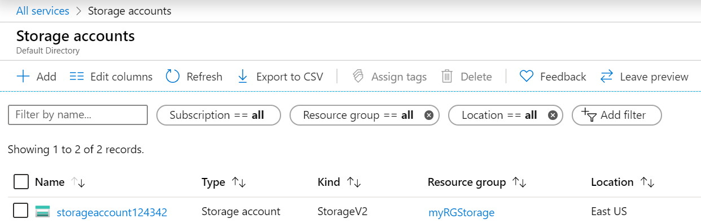
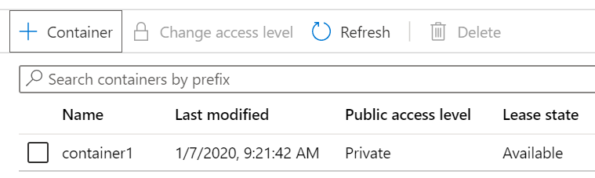
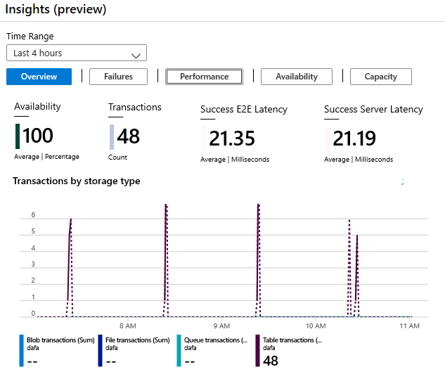

## Exercise - Blob storage

> [!NOTE]
> A Sandbox is provided to allow you to complete this lab.  Or, this Lab requires an Azure subscription. 

## Lab - Create blob storage

In this walkthrough, we will create a storage account, and then work with blob storage files.

### Task 1: Create a storage account

In this task, we will create a new storage account. 

1. Sign in to the Azure portal at [Azure portal (https://portal.azure.com)](https://portal.azure.com?azure-portal=true).

2. From the **All services** blade, search for and select **Storage accounts**, and then click **+ Add**. 

3. On the **Basics** tab of the **Create storage account** blade, fill in the following information (replace **xxxx** in the name of the storage account with letters and digits so that the name is globally unique). Leave the defaults for everything else.

    | Setting | Value | 
    | --- | --- |
    | Subscription | **Choose Concierge Subscription** |
    | Resource group | **<rgn>[sandbox resource group name]</rgn>** |
    | Storage account name | **storageaccountxxxx** |
    | Location | **(US) East US**  |
    | Performance | **Standard** |
    | Account kind | **StorageV2 (general purpose v2)** |
    | Replication | **Locally redundant storage (LRS)** |
    | Access tier (default) | **Hot** |
    | | |

5. Click **Review + Create** to review your storage account settings and allow Azure to validate the configuration. 

6. Once validated, click **Create**. Wait for the notification that the account was successfully created. 

7. From the Home page, search for and select **Storage accounts** and ensure your new storage account is listed.

    

### Task 2: Work with blob storage

In this task, we will create a Blob container and upload a blob file. 

1. Click the name of the new storage account, scroll to the **Blob service** section, and then click **Containers**.

2. Click **+ Container** and complete the information. Use the Information icons to learn more. When done click **Create**.

    | Setting | Value |
    | --- | --- |
    | Name | **container1**  |
    | Public access level| **Private (no anonymous access)** |
    | | |

    

3. Click the **container1** container, and then click **Upload**.

4. Browse to a file on your local computer. 

    > [!NOTE]
    > You can create an empty `.txt` file or use any existing file. Consider chooosing a file of a small size to minimize the upload time.

5. Click the **Advanced** arrow, leave the default values (but review the available options), and then click **Upload**.

    > [!NOTE]
    > You can upload as many blobs as you like in this way. New blobs will be listed within the container.

6. Once the file is uploaded, right-click on the file and notice the options (including View/edit, Download, Properties, and Delete). 

7. If you have the free time, review the options on the storage account blade for Files, Tables, and Queues.

### Task 3: Monitor the storage account

1. If needed, return to the storage account blade and click **Diagnose and solve problems**. 

2. Explore some of the most common storage problems. Notice there are multiple troubleshooters.

3. On the storage account blade, scroll down to the **Monitoring** section and click **Insights (preview)**. Notice there is information on Failures, Performance, Availability, and Capacity. Your information will be different.

    

Congratulations! You have created a storage account, and then worked with storage blobs.

> [!NOTE]
> This lab is using the **Azure Sandbox**, so all you need to do is close your Azure Portal to shutdown all the resources created in this lab.  Please do not delete the resource group provided.
> 
> To avoid additional costs, you can remove this resource group. Search for resource groups, click your resource group, and then click **Delete resource group**. Verify the name of the resource group and then click **Delete**. Monitor the **Notifications** to see how the delete is proceeding.
