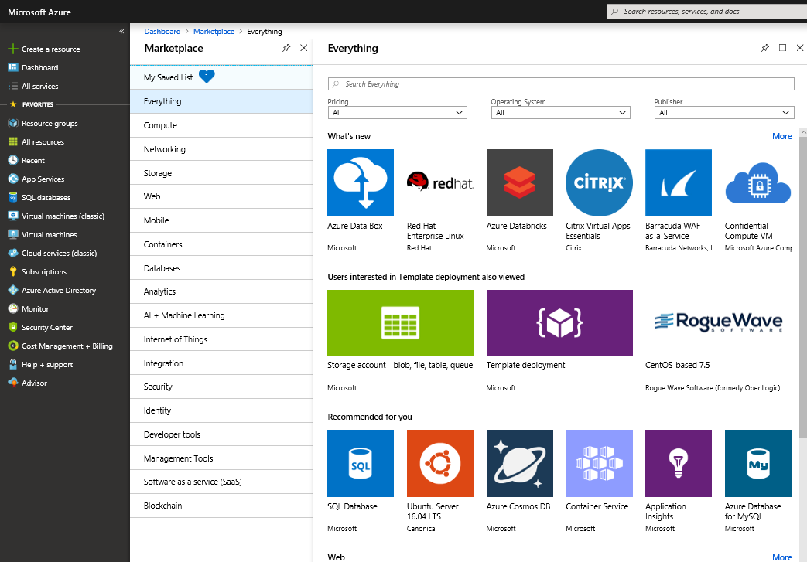

[Azure Marketplace](https://azuremarketplace.microsoft.com?azure-portal=true) is a service on Azure that helps connect end users with Microsoft partners, independent software vendors (ISVs), and start-ups that are offering their solutions and services, which are optimized to run on Azure. Azure Marketplace allows customers—mostly IT professionals and cloud developers—to find, try, purchase, and provision applications and services from hundreds of leading service providers, all certified to run on Azure.

The solution catalog spans several industry categories, including but not limited to: open-source container platforms, virtual machine images, databases, application build and deployment software, developer tools, threat detection, and blockchain. Using Azure Marketplace, you can provision end-to-end solutions quickly and reliably, hosted in your own Azure environment. At the time of writing, this includes over 8,000 listings.

While Azure Marketplace is designed for IT professionals and cloud developers interested in commercial and IT software, Microsoft Partners also use it as a launch point for all joint Go-To-Market activities.

