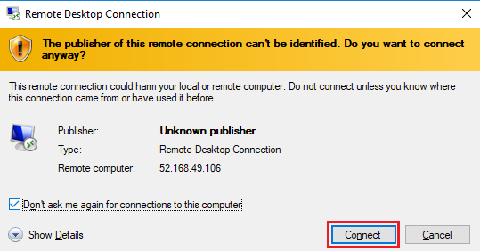
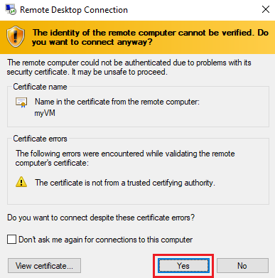
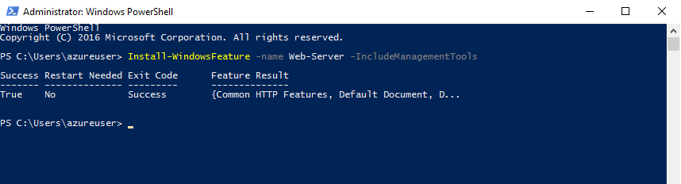

## Exercise - Create a virtual machine

> [!NOTE]
> A sandbox is provided for you to complete this lab.  Otherwise, this Lab requires an Azure subscription.

## Lab - Create a virtual machine in the portal

In this walkthrough, we will create a virtual machine in the Azure portal, connect to the virtual machine, install the web server role and test. 

> [!NOTE]
> Take time during this walk-through to click and read the Informational icons. 

### Task 1: Create the virtual machine

In this task, we will create a Windows Server 2019 Datacenter - Gen1 virtual machine. 

1. Sign in to the [Azure portal (https://portal.azure.com)](https://portal.azure.com?azure-portal=true).

2. From the **All services** blade, search for and select **Virtual machines**, and then click **+ Add**.

3. On the **Basics** tab, fill in the following information (leave the defaults for everything else):

    | Settings | Values |
    |  -- | -- |
    | Subscription | Ensure **Concierge Subscription** is selected |
    | Resource group | **<rgn>[sandbox resource group name]</rgn>** |
    | Virtual machine name | **myVM** |
    | Location | **(US) East US**|
    | Image | **Windows Server 2019 Datacenter - Gen1**|
    | Size | Standard D2s v3|
    | Administrator account username | **azureuser** |
    | Administrator account password | **Pa$$w0rd1234**|
    | Inbound port rules - Allow select ports | **RDP (3389)** and **HTTP (80)**|
    | | |

4. Switch to the Monitoring tab, and in its **Monitoring** section, select the following setting:

    | Settings | Values |
    | -- | -- |
    | Boot diagnostics | **Off**|
    | | |

5. Leave the remaining defaults and then click the **Review + create** button at the bottom of the page.

6. Once Validation is passed click the **Create** button. It can take anywhere from five to seven minutes to deploy the virtual machine.

7. You will receive updates on the deployment page and via the **Notifications** area (the bell icon in the top menu).

### Task 2: Connect to the virtual machine

In this task, we will connect to our new virtual machine using RDP. 

1. Search for **myVM** and select your new virtual machine.

    > [!NOTE]
    > You could also use the **Go to resource** link on the deployment page or the link to the resource in the **Notification** area.

2. On the virtual machine **Overview** blade, click the **Connect** button.

    :::image type="content" source="../media/virtual-machine-properties.png" alt-text="Screenshot of the virtual machine properties with the Connect button highlighted.":::

    > [!NOTE]
    > The following directions tell you how to connect to your virtual machine from a Windows computer. On a Mac, you need an RDP client such as [this Remote Desktop Client from the Mac App Store](https://apps.apple.com/us/app/microsoft-remote-desktop/id1295203466) and on a Linux computer you can use an open source RDP client.

2. In the **Connect to virtual machine** page, keep the default options to connect with the public IP address over port 3389 and click **Download RDP File**.

3. **Open** the downloaded RDP file and click **Connect** when prompted. 

    

4. In the **Windows Security** window, select **More choices** and then **Use a different account**. Provide the username (.\azureuser) and the password (Pa$$w0rd1234). Click **OK** to connect.

    

5. You may receive a certificate warning during the sign-in process. Click **Yes** or to create the connection and connect to your deployed virtual machine. You should connect successfully.

    

Congratulations! You have deployed and connected to a Windows Server virtual machine in Azure

### Task 3: Install the web server role and test

In this task, install the Web Server role on the server and ensure the default IIS welcome page can be displayed.

1. Open up a PowerShell command prompt on the virtual machine, by clicking the **Start** button, typing **PowerShell**, right clicking **Windows PowerShell**, and selecting **Run as administrator** in the right-click menu.

    

2. Install the **Web-Server** feature in the virtual machine by running the following command in the PowerShell command prompt. You can copy and paste this command.

    ```PowerShell
    Install-WindowsFeature -name Web-Server -IncludeManagementTools
    ```
  
3. When completed there will be a prompt stating **Success** with a value **True**. You do not need to restart the virtual machine to complete the installation. Close the RDP connection to the VM.

    

4. Back in the portal, navigate back to the **Overview** blade of myVM and, use the **Click to clipboard** button to copy the public IP address of myVM, open a new browser tab, paste the public IP address into the URL text box, and press the **Enter** key to browse to it.

    :::image type="content" source="../media/azure-portal-virtual-machine-property-pane.png" alt-text="Screenshot of the Azure portal virtual machine property pane with the IP address copied.":::

5. The default IIS Web Server welcome page will open.

    

Congratulations! You have created a web server that is accessible via its public IP address. If you had a web application to host, you could deploy application files to the virtual machine and host them for public access on the deployed virtual machine.


> [!NOTE]
> This lab is using the **Azure Sandbox**, so all you need to do is close your Azure Portal to shutdown all the resources created in this lab.  Please do not delete the resource group provided.
> 
> **Non Sandbox** To avoid additional costs, you can remove this resource group. Search for resource groups, click your resource group, and then click **Delete resource group**. Verify the name of the resource group and then click **Delete**. Monitor the **Notifications** to see how the delete is proceeding.
