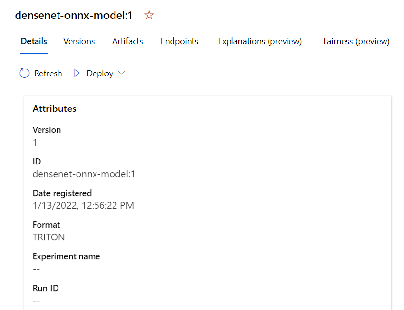

Choose the appropriate strategy for inferencing to make your model available for consumption.

Remember the manufacturing company you work for. To train a model that recognizes objects such as helmets and specific machinery, you'll need a large dataset.

The trained model you'll deploy should ingest camera images and process them in real time to return a prediction. As your model contains billions of parameters, CPU compute is likely to be insufficient for your deployment requirements.

You'll learn what you can do to optimize the inferencing of large-scale models on GPU compute.

## Model inferencing

With model inferencing, also known as model scoring, you want to use the previously trained model to generate predictions on new data.
When you deploy a compute-intensive model for real-time inferencing, it is crucial to configure both the hardware and software of the deployment in order to get the performance you need.

> [!NOTE]
> A model can be deployed for real-time or batch inferencing. Similar to model training, a compute cluster can be used for batch inferencing. The focus here lies on real-time inferencing, as that has shown to be more challenging because of the low latency requirements while working with a compute-intensive model.

When deploying a model for real-time inferencing with Azure Machine Learning, you can configure the necessary hardware by using GPU compute for deployment. Choose one of the NC-series VM sizes to use GPU compute when creating the endpoint in Azure Machine Learning. There are two options for online endpoints:

- **Managed online endpoint**: Compute will be created, managed, and maintained by Azure. 
- **Kubernetes**: Create and manage your own Azure Kubernetes Cluster and attach it to Azure Machine Learning. 

> [!TIP]
> Learn more about [Azure Machine Learning endpoints and how managed online endpoints and Kubernetes online endpoints compare.](/azure/machine-learning/concept-endpoints)

When deploying a model to GPU machines, you'll want to use the appropriate software to optimize model inferencing. By more efficiently deploying your model, you can save costs and reduce latency.

## Optimize model inferencing

When you deploy a large-scale model for inferencing, you're likely to face two main challenges: latency and costs. After you send an image to your online endpoint, you want to get the result back as quickly as possible. And preferably use a configuration that is the most cost-efficient. Next to latency and costs challenges, some models have so many parameters that they need more than the memory of a single GPU device.

There are two software options that can help you to optimize model inferencing:

- **DeepSpeed**: Optimizes the model's use of inference compute through parallelism, optimized resource allocation, and quantized models.
- **Triton Inference Server**: Optimizes the server for high throughput and combines well with ONNX for a high-performance runtime.

### DeepSpeed Inference

DeepSpeed is a library designed to speed up deep-learning model training and deployment. **DeepSpeed Inference** specifically, is designed to improve the performance of large-scale models with billions of parameters.

> [!NOTE]
> Learn more about [which models are compatible with DeepSpeed Inference.](https://github.com/microsoft/DeepSpeed/blob/master/deepspeed/module_inject/replace_policy.py)

The three main techniques that DeepSpeed Inference uses to optimize model inferencing are:

- **Parallelism**: DeepSpeed Inference automatically splits the model to process the batches in parallel across multiple GPUs. Parallelism can reduce both latency and costs, but often creates extra overhead. DeepSpeed Inference takes care of all management for you and you don't need to change your code.
- **Optimized compute**: DeepSpeed Inference optimizes the GPU usage by performing deep fusion during which operations are combined and computed on a single kernel. It also handles the small batches of data by maximizing the memory bandwidth utilization for loading the parameters.
- **Quantization**: Convert continuous data into a discrete number with a fixed range. Quantizing models can efficiently execute with low-precision such as 8-bit integer (INT 8) instead of 32-bit floating point (FP32) which results into memory savings and latency reductions.

> [!TIP]
> Learn more about [how DeepSpeed inferencing works.](https://www.microsoft.com/research/blog/deepspeed-accelerating-large-scale-model-inference-and-training-via-system-optimizations-and-compression/)

## Triton

The **Triton Inference server** is a framework created by NVIDIA, designed to deploy compute-intensive models of any framework on both CPU and GPU compute. 

When you use Triton Inference Server in Azure Machine Learning, Triton will optimize model performance for you by finding the optimal configuration of throughput, latency, and memory utilization.

Triton supports most machine-learning frameworks like TensorFlow, PyTorch, and ONNX Runtime. Triton does however, require a specific model repository structure to understand the necessary model details. 

A quick and easy way to deploy your model with Triton is by using the no-code deployment in Azure Machine Learning. If you use no-code deployment, you don't need to specify the scoring script or environment when creating the endpoint, as you'll use the Triton server after the model is deployed to help you with real-time inferencing. 

To use Triton for real-time inferencing, set `model_format` to Triton. You can configure the model format in the YAML file when using the `az ml model create` command when you work with the CLI (v2).

The YAML file may look like this:

```yml
name: densenet-onnx-model
version: 1
local_path: ./models
model_format: Triton
description: Registering my Triton format model.
```

The YAML file is then referenced when creating the model:

```
az ml model create -f create-triton-model.yaml
```

As a result, the model stored in the `models` folder (with the necessary repository structure), is registered in the Azure Machine Learning workspace and will show in the Studio

 

> [!TIP]
> Read the announcement for [Triton On Azure Machine Learning](https://techcommunity.microsoft.com/t5/azure-ai-blog/real-time-inference-on-nvidia-gpus-in-azure-machine-learning/ba-p/1737522), and learn more about [high-performance serving with Triton Inference Server in Azure Machine Learning](/azure/machine-learning/how-to-deploy-with-triton?tabs=endpoint).

