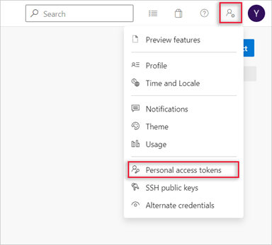

In this guided project, you configure Azure resources and other tools to demonstrate the suitability of Azure Container Apps as a deployment option.

> [!IMPORTANT]
> An Azure subscription and GitHub account are required for this guided project. For your Azure subscription, we recommend that you have the Owner, Azure account administrator, or Azure co-administrator role. The Contributor role does not provide the permissions required to complete all tasks in this guided project module.

## Project overview

You work on a devops team for a technology company named Fabrikam Inc. The team is looking into using Azure Container Apps to run containerized cloud-native apps. Fabrikam has been using Azure Kubernetes Service (AKS) to run containers. Although the team is obtaining the benefits of running apps as containers and from using Kubernetes as a host, they've discovered that they're not using advanced AKS features. For example, they're not using the custom service mesh or autoscaling features. The team believes they can both simplify and improve efficiency of their devops implementation by switching to Azure Container Apps. The team believes that switching to Azure Container Apps will:

- Improve their ability to publish and run containerized apps at scale.
- Reduce the complexity of their current devops implementation.
- Save resources by using scale-to-zero and built-in autoscaling capabilities.

You have been tasked with developing a proof-of-concept solution. The solution must demonstrate the team's ability to:

1. Configure a secure connection between Azure Container Registry and Azure Container Apps.
1. Create and configure a container app in Azure Container Apps.
1. Configure continuous integration by using Azure Pipelines.
1. Scale a deployed app in Azure Container Apps.
1. Manage revisions in Azure Container Apps.

Your goal for this module is to implement a solution that demonstrates the deployment of cloud-native apps using Azure Container Apps. To achieve this goal, you complete the following activities:

1. Set up the host environment and deployment resources.
1. Configure Azure Container Registry for a secure connection with Azure Container Apps.
1. Create and configure a container app in Azure Container Apps.
1. Configure continuous integration using an Azure pipeline.
1. Configure traffic-splitting and revision management.

## Setup

To set up the host environment and deployment resources, you complete the following tasks:

1. Configure host environment tools.

    - Install Docker Desktop.
    - Install Visual Studio Code with Docker and Azure App Service extensions.
    - Install Azure CLI with `containerapp` extension.
    - Install Windows PowerShell.

1. Configure Azure resources that support the container apps solution.

    - Configure a Resource Group.
    - Configure a Virtual Network and subnets.
    - Configure Service Bus.
    - Configure Azure Container Registry.

1. Configure app and deployment resources that support the container apps solution.

    - Create a WebAPI app and publish to a GitHub repository.
    - Create Docker image and push to Azure Container Registry.
    - Configure an Azure DevOps project and starter pipeline.
    - Deploy a self-hosted Windows agent.

### Install Docker Desktop

Complete the following steps to install Docker Desktop.

1. Open a browser window, and then navigate to the Docker Desktop install page: [https://docs.docker.com/desktop/install/windows-install/](https://docs.docker.com/desktop/install/windows-install/)

    Links to instructions for Mac and Linux installs are available on this page.

1. Ensure that you're working on a computer that meets system requirements.

1. Follow the online instructions to install Docker Desktop.

### Install the .NET Software Development Kit

Complete the following steps to install the .NET Software Development Kit (SDK).

1. Open a browser window, and then navigate to the .NET download page: [https://dotnet.microsoft.com/download](https://dotnet.microsoft.com/download)

1. On the **Download .NET** page, select the *recommended* version of the .NET SDK.

1. Wait for the installer file to finish downloading, and then run the .NET SDK installer file.

    On a Windows PC, you can find your Downloads folder using File Explorer. Double-click the installation file to begin the installation process.

1. On the .NET SDK Installer window, select **Install**.

### Install Visual Studio Code with Docker and Azure App Service extensions

Complete the following steps to install Visual Studio Code with Docker and Azure App Service extensions.

1. Open a browser window, and then navigate to: [https://code.visualstudio.com](https://code.visualstudio.com).

1. In the browser window, select **Download for Windows**.

    > [!NOTE]
    > The Download page for Visual Studio Code automatically detects your operating system. It displays the version to download for your operating system, such as Linux, macOS, or Windows.
  
1. Wait for the installer file to finish downloading, and then use a file explorer application to navigate to your computer’s downloads folder.

1. In your file explorer application, select and run the Visual Studio Code installer file.

    > [!NOTE]
    > You can install Visual Studio Code using either the User Installer or System Installer. The User Installer installs Visual Studio Code just for the current user, while the System Installer installs Visual Studio Code for all users. The User Installer is the recommended option for most users.

1. Select **I accept the license agreement**, and then continue following the online instructions to complete the installation.

    Accept the default options during the remainder of the installation.

1. Ensure that you have Visual Studio Code open.

1. On the **Activity bar**, select **Extensions**.

1. In the **Search Extensions in Marketplace** textbox, enter **C#**

    Entering "C#" filters the list of extensions to show only the extensions that have something to do with C# coding.

1. In the filtered list of available extensions, select the extension labeled "**C# Dev Kit** - Official C# extension from Microsoft" that's published by Microsoft.

1. To install the extension, select **Install**.

1. Wait for the installation to complete.

1. On the **EXTENSIONS** view, replace **C#** with **docker**.

1. In the filtered list of available extensions, select the extension labeled **Docker**  that's published by Microsoft.

1. To install the extension, select **Install**.

1. Wait for the installation to complete.

1. On the **EXTENSIONS** view, replace **docker** with **azure app service**.

1. In the filtered list of available extensions, select the extension labeled **Azure App Service**  that's published by Microsoft.

1. To install the extension, select **Install**.

1. Wait for the installation to complete.

1. Close Visual Studio Code.

### Install Azure CLI and the `containerapp` extension

Complete the following steps install Azure CLI and the `containerapp` extension.

1. Open a browser window, and then navigate to: [/cli/azure/install-azure-cli](/cli/azure/install-azure-cli).

    You can use any browser, such as the Microsoft Edge browser or the Chrome browser.

1. In the browser window, follow the instructions for installing/updating Azure CLI for your computer's operating system.

    The current version of the Azure CLI is 2.53.0. For information about the latest release, see the release notes. To find your installed version and see if you need to update, run `az version`. You can run `az upgrade` to install the latest version.

1. Open a command line or terminal application, such as Windows Command Prompt.

1. Sign in to Azure using the `az login` command.

1. Follow the prompts to complete the authentication process.

1. Install the Azure Container Apps extension using the `az extension add --name containerapp --upgrade` command.

### Install Microsoft PowerShell

Complete the following steps to install Microsoft PowerShell.

1. Open a browser window, and then navigate to: [/powershell/scripting/install/installing-powershell](/powershell/scripting/install/installing-powershell).

1. In the browser window, follow the instructions for installing/updating PowerShell for your computer's operating system.

### Configure a Resource Group for your Azure resources

Complete the following steps to configure a resource group for your Azure resources.

1. Open a browser window, and then navigate to the Azure portal: [https://portal.azure.com/](https://portal.azure.com/)

1. Ensure that your Azure account has permission to create resources and assign RBAC permissions. Check the RBAC role(s) assigned to your account before you continue.

    The Contributor role isn't able to assign Azure RBAC permissions. We recommend using an account that has been assigned the Owner, Azure account administrator, or Azure co-administrator role for your Azure subscription. Other role combinations could provide sufficient access to complete this guided project module but have not been tested.

1. On the top search bar of the Azure portal, in the Search textbox, enter **resource group**

1. In the search results, select **Resource groups**, and then select **+ Create**.

1. On the Basics tab, configure the resource group as follows:

    - Subscription: Specify the Azure subscription that you're using to complete the guided project.

    - Resource group: Enter **RG1**

    - Region: Select **Central US**.

1. Select **Review + create**.

1. Once validation has passed, select **Create**.

### Configure a Virtual Network and subnets

Complete the following steps to configure a Virtual Network and subnets.

1. Ensure that you have your Azure portal open in a browser window.

1. On the top search bar of the Azure portal, in the Search textbox, enter **virtual network**

1. In the search results, select **Virtual networks**.

1. Select **Create virtual network**.

1. On the Basics tab, configure your virtual network as follows:

    - Subscription: Ensure that the Azure subscription that you're using for this guided project is selected.
    - Resource group name: Select **RG1**
    - Virtual network name: Enter **VNET1**
    - Region: Ensure that Central US is selected.

1. Select the **IP addresses** tab.

1. On the IP addresses tab, under **Subnets**, select **default**.

1. On the Edit subnet page, configure the subnet as follows:

    - Name: Enter **`PESubnet`**
    - Starting address: Ensure that **10.0.0.0** is specified.
    - Subnet size: Ensure that **/24 (256 addresses)** is specified.

1. Select **Save**.

1. On the IP addresses tab, select **+ Add a subnet**.

1. On the Add a subnet page, configure the subnet as follows:

    - Name: Enter **`ACASubnet`**
    - Starting address: Ensure that **10.0.4.0** is specified.
    - Subnet size: Ensure that **/23 (512 addresses)** is specified.

1. Select **Add**.

1. Select **Review + create**.

1. Once validation has passed, select **Create**.

1. Wait for the deployment to complete.

### Configure Service Bus

Complete the following steps to configure a Service Bus instance.

1. Ensure that you have your Azure portal open in a browser window.

1. On the top search bar of the Azure portal, in the Search textbox, enter **service bus**

1. In the search results, select **Service Bus**.

1. Select **Create service bus namespace**.

1. On the Basics tab, configure your Service bus namespace as follows:

    - Subscription: Ensure that the Azure subscription that you're using for this guided project is selected.
    - Resource group name: Select **RG1**
    - Namespace name: Enter **sb-apl2003-** followed by your name or initials. For example: **sb-apl2003-cah**.
    - Location: Ensure that **Central US** is selected.
    - Pricing tier: Select **Basic**.

1. Select **Review + create**.

1. Once the Validation succeeded message appears, select **Create**.

1. Wait for the deployment to complete.

### Configure Azure Container Registry

Complete the following steps to configure a Container Registry instance.

1. Ensure that you have your Azure portal open in a browser window.

1. On the top search bar of the Azure portal, in the Search textbox, enter **container registry**

1. In the search results, select **Container registries**.

1. On the Container registries page, select **Create container registry** or **+ Create**.

1. On the Basic tab of the Create container registry page, specify the following information:

    > [!NOTE]
    > The name of your Registry must be unique. Also, the Premium tier is required for private link with private endpoints.

    - Subscription: Ensure that the Azure subscription that you're using for this guided project is selected.
    - Resource group: Select **RG1**.
    - Registry name: Enter **acrapl2003** followed by your initials and date. For example: **acrapl2003cah12oct**
    - Location: Ensure that **Central US** is selected.
    - SKU: Select **Premium**.

1. Select **Review + create**.

1. Select **Create**.

1. After the deployment has completed, open the deployed resource.

1. On the left-side menu, under Settings, select **Networking**.

1. On the Networking page, on the Public access tab, ensure that **All networks** is selected.

1. On the left-side menu, under Settings, select **Properties**.

1. On the Properties page, select **Admin user**, and then select **Save**.

### Create a WebAPI app and publish to a GitHub repository

Complete the following steps to create a WebAPI app and publish to a GitHub repository.

1. Open Visual Studio Code.

1. On the File menu, select **Open Folder**.

1. Create a new folder named **APL2003** in a location that is easy to find.

    For example, create a folder named **APL2003** on the Windows Desktop.

1. On the Terminal menu, select **New Terminal**.

1. At the terminal command prompt, to create a new ASP.NET Web API project, enter the following command:

    ```dotnetcli
    dotnet new webapi --no-https
    ```

1. At the terminal command prompt, run the following dotnet CLI command:

    ```dotnetcli
    dotnet build
    ```

1. On the View menu, select **Command Palette**, and then run the following command: **.NET: Generate Assets for Build and Debug**.

    If the command generates an error message, select **OK**, and then run the command again.

1. In the root project folder, create a .gitignore file that contains the following information:

    ```gitignore
    [Bb]in/
    [Oo]bj/
    ```

1. On the File menu, select **Save All**.

1. Open the Source Control view.

1. Select **Publish to GitHub**.

1. If prompted, to enable the GitHub extension to sign in using GitHub, select **Allow**, and then provide authorization in GitHub.

1. In Visual Studio Code, select **Publish to GitHub public repository**.

### Create Docker image and push to Azure Container Registry

Complete the following steps to create a Docker image and push the image to your Azure Container Registry.

1. Ensure that you have your APL2003 code project open in Visual Studio Code.

1. To create a Dockerfile, run the following command in the Command Palette: **Docker: Add Docker Files to Workspace**.

1. When prompted, specify the following information:

    - Application Platform: **.NET ASP.NET Core**.
    - Operating System: **Linux**.
    - Ports: **5000**.
    - Docker Compose files: **No**.

1. At a terminal command prompt, run the following docker CLI command:

    ```azurecli
    docker build --tag aspnetcorecontainer:latest .
    ```

    The syntax for the build command is: `docker build --tag <image name>:<image tag> .`

    This command builds a container image that is hosted by Docker and accessible using the Docker extension for VS Code.

1. Open the Visual Studio Code Command Palette, and then run the following command: **Docker Images: Push**.

1. When the command runs, enter the following information:

    - Select the docker image name that you created: `aspnetcorecontainer`

    - Select the image tag that you created: `latest`

1. If you see a message stating that no registry is connected, select **Connect Registry**, and then enter the following information:

    - Registry provider: Select **Azure**. Follow the online instructions to verify your Azure account if needed.

    - Azure subscription: Select the Azure Subscription that you're using for this guided project.

    - Select your Azure Container Registry resource. For example: **acrapl2003cah12oct**

        An image tag is generated. For example: `acrapl2003cah12oct.azurecr.io/aspnetcorecontainer:latest`

    - To push the image to your Container Registry, press Enter.

    The following Docker command is executed:

    ```azurecli
    docker image push acrapl2003cah12oct.azurecr.io/aspnetcorecontainer:latest
    ```

1. Open the Source Control view, and then **Commit** and **Sync Changes**.

### Configure Azure DevOps and a starter Pipeline

Complete the following steps to configure Azure DevOps and a starter Pipeline:

1. Open the Azure portal.

1. On the top search bar, in the Search textbox, enter **devops**

1. In the search results, select **Azure DevOps organizations**.

1. Select **My Azure DevOps Organizations**.

1. If you haven’t created an organization, select **Free**.

1. To create a new project, select **New project**.

1. On the Create new project page, enter the following information:

    - Project name: **Project1**
    - Description: **APL-2003 project**
    - Visibility: **Public**

1. On the Create new project page, select **Create**.

1. On the left-side menu, select **Repos**.

1. Under Import a repository, select **Import**.

1. On the Import a Git repository page, enter the URL for the GitHub repository you created for your code project, and then select **Import**.

    Your repository URL should be similar to the following example:

    `https://github.com/<your account>/APL2003`

1. On the left-side menu, select **Pipelines**.

1. Select **Create Pipeline**.

1. Select **Azure Repos Git**.

1. On the Select a repository page, select **Project1**.

1. Select **Starter pipeline**.

1. Under Save and Run, select **Save**, and then select **Save**.

1. To rename the pipeline to `Pipeline1`, complete the following steps:

    1. On the left-side menu, select **Pipelines**.

    1. To the right of the Project1 pipeline, select **More options**, and then select **Rename/move**.

    1. In the Rename/move pipeline dialog, under Name, enter **Pipeline1** and then select **Save**.

### Deploy a self-hosted Windows agent

For an Azure Pipeline to build and deploy Windows, Azure, and other Visual Studio solutions you need at least one Windows agent in the host environment.

Complete the following steps to deploy a self-hosted Windows agent:

1. Ensure that you're signed-in to Azure DevOps with the user account you're using for your Azure DevOps organization.

    For example: `https://dev.azure.com/{your organization}`

1. From the home page of your organization, open your user settings, and then select **Personal access tokens**.

    

1. To create a personal access token, select **+ New Token**.

1. Under Name, enter **APL2003**.

1. At the bottom of the Create a new personal access token window, to see the complete list of scopes, select **Show all scopes**.

1. For the scope, select **Agent Pools (read, manage)** and **Deployment group (read, manage)**.

    Ensure that all the other boxes are cleared.

1. Select **Create**.

1. On the Success page, to copy the token, select **Copy to clipboard**.

    You use this token when you configure the agent.

1. Ensure that you’re signed into Azure DevOps as the Azure DevOps organization owner.

1. Select your DevOps organization, and then select **Organization settings**.

1. On the left side menu under Pipelines, select **Agent pools**.

1. If the **Get the agent** dialog box opens, skip to the next step.

    If a list of Agent pools is displayed, complete the following steps:

    1. To select the default pool, select **default**.

        If the **default** pool doesn't exist, select **Add pool**, and then enter the following information:

        1. Under Pool type, select **Self-hosted**.

        1. Under Name, enter **default**

        1. Select **Create**.

        1. To open the pool that you just created, select **default**.

    1. Select **Agents**, and then select **New agent**.

1. On the **Get the agent** dialog box, complete the following steps:

    1. Select the **Windows** tab.

    1. On the left pane, select the processor architecture of the installed Windows OS version on your machine.

        The x64 agent version is intended for 64-bit Windows, whereas the x86 version is intended for 32-bit Windows.

    1. On the right pane, select **Download**.

    1. Follow the instructions to download the agent.

1. Use File Explorer to create the following folder location for the agent:

    ```dos
    C:\agents
    ```

1. Unpack the agent zip file into the directory you created.

1. Open PowerShell as an Administrator, and then enter the following PowerShell command:

    `.\config`

1. Respond to the configuration prompts as follows:

    - Enter server URL >: enter the URL for your DevOps organization. Such as: `https://dev.azure.com/<your organization>`
    - Enter authentication type (press enter for PAT) >: press Enter.
    - Enter personal access token >: Paste-in the personal access token that you copied to the clipboard earlier.
    - Enter agent pool (press enter for default) >: press Enter.
    - Enter agent name (press enter for YOUR-PC-NAME) > enter **apl2003-agent**
    - Enter work folder (press enter for _work) >: press Enter.
    - Enter run agent as service? (Y/N) (press enter for N) >: enter **Y**
    - Enter enable SERVICE_SID_TYPE_UNRESTRICTED for agent service (Y/N) (press enter for N) >: enter **Y**
    - Enter User account to use for the service (press enter for NT AUTHORITY\NETWORK SERVICE) >: press Enter.
    - Enter whether to prevent service starting immediately after configuration is finished? (Y/N) (press enter for N) >: press Enter.

    A message informing you that the agent started successfully is displayed.

    For extra help, see the following documentation: [/azure/devops/pipelines/agents/windows-agent](/azure/devops/pipelines/agents/windows-agent)

You're now ready to begin the Guided project exercises. Good luck!
