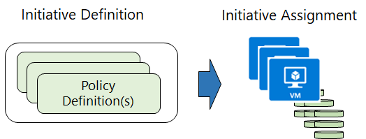

**Policy Initiatives** work with Azure Policies. 

## Initiative definitions

An initiative definition is a set of policy definitions to help track your compliance state for a larger goal. Initiative assignments reduce the need to make several initiative definitions for each scope.

For example, you could create an initiative named *Enable Monitoring in Azure Security Center*, with a goal to monitor all the available security recommendations in your Azure Security Center.

Under this initiative, you would have the following policy definitions:

+ *Monitor unencrypted SQL Database in Security Center* – For monitoring unencrypted SQL databases and servers.
+ *Monitor OS vulnerabilities in Security Center* – For monitoring servers that do not satisfy the configured baseline.
+ *Monitor missing Endpoint Protection in Security Center* – For monitoring servers without an installed endpoint protection agent.

## Initiative assignments

Like a policy assignment, an initiative assignment is an initiative definition assigned to a specific scope. Initiative assignments reduce the need to make several initiative definitions for each scope. This scope could also range from a management group to a resource group.

You can define initiatives using the Azure portal, or command-line tools. In the portal, you use the "Authoring" section.

Even if you have a single policy, we recommend using initiatives if you anticipate increasing the number of policies over time.

