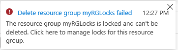
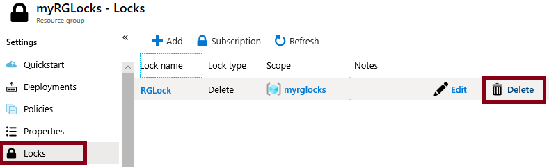

## Exercise - Manage resource locks

In this walkthrough, we will create a resource group, add a lock to resource group and test deletion, test deleting a resource in the resource group, and remove the resource lock. 

## Task 1: Create a resource group

In this task, we will create a resource group for this exercise. 

1. Sign in to the [Azure portal (https://portal.azure.com)](https://portal.azure.com?azure-portal=true).

2. From the **All services** blade, search for and select **Resource groups**, then select **+ Add**.

3. Create a new resource group. When you are done, click **Review + create** and then **Create**. 

    | Setting | Value |
    | -- | -- |
    | Subscription | **Use your subscription** |
    | Name | **myRGLocks** |
    | Region | **(US) East US** |
    | | |

## Task 2:  Add a lock to the resource group and test deletion

In this task, we will add a resource lock to the resource group and test deleting the resource group. 

1. In the Azure portal, navigate to the newly created resource group **myRGLocks**.

2. You can apply a lock to a subscription, resource group, or individual resource to prevent accidental deletion or modification of critical resources. 

3. In the **Settings** section, click **Locks**, and then click **+ Add**. 

    > [!div class="mx-imgBorder"]
    > 

4. Configure the new lock. When you are done, click **OK**. 

    | Setting | Value |
    | -- | -- |
    | Lock name | **RGLock** |
    | Lock Type | **Delete** |
    | | |

5. Click **Overview** and click **Delete resource group**. Type the name of the resource group and click **OK**. You receive an error message stating the resource group is locked and can't be deleted.

    

## Task 3: Test deleting a member of the resource group

In this task, we will test if the resource lock protects a storage account in the resource group. 

1. From the **All services** blade, search for and select **Storage accounts**, and then click **+ Add**. 

2. On the **Basics** tab of the **Create storage account** blade, fill in the following information (replace **xxxx** in the name of the storage account with letters and digits such that the name is globally unique). Leave the defaults for everything else.

    | Setting | Value | 
    | --- | --- |
    | Subscription | **Select your subscription** |
    | Resource group | **myRGLocks** |
    | Storage account name | **storageaccountxxxx** |
    | Location | **(US) East US**  |
    | Performance | **Standard** |
    | Account kind | **StorageV2 (general purpose v2)** |
    | Replication | **Locally redundant storage (LRS)** |
    | Access tier (default) | **Hot** |
    | | |

3. Click **Review + Create** to review your storage account settings and allow Azure to validate the configuration. 

4. Once validated, click **Create**. Wait for the notification that the account was successfully created. 

5.  Wait for the notification that the storage account was successfully created. 

6. Access your new storage account and from the **Overview** pane, click **Delete**. You receive an error message stating the resource or its parent has a delete lock. 

    

    > [!NOTE]
    > Although we did not create a lock specifically for the storage account, we did create a lock at the resource group level, which contains the storage account. As such, this *parent* level lock prevents us from deleting the resource and the storage account inherits the lock from the parent.

## Task 4: Remove the resource lock

In this task, we will remove the resource lock and test. 

1. Return to the **myRGLocks** resource group blade and, in the **Settings** section, click **Locks**.
    
2. Click **Delete** link to the right of the **RGLock** entry.

    > [!div class="mx-imgBorder"]
    > 

3. Return to the storage account blade and confirm you can now delete the resource.

Congratulations! You created a resource group, added a lock to resource group and tested deletion, tested deleting a resource in the resource group, and removed the resource lock. 

> [!NOTE]
> To avoid additional costs, you can remove this resource group. Search for resource groups, click your resource group, and then click **Delete resource group**. Verify the name of the resource group and then click **Delete**. Monitor the **Notifications** to see how the delete is proceeding.
