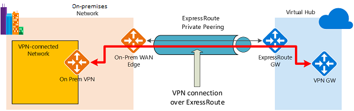

ExpressRoute lets you extend your on-premises networks into the Microsoft cloud over a private connection with the help of a connectivity provider. With ExpressRoute, you can establish connections to various Microsoft cloud services, such as Microsoft Azure and Microsoft 365. Connectivity can be from an any-to-any (IP VPN) network, a point-to-point Ethernet network, or a virtual cross-connection through a connectivity provider at a colocation facility. Since ExpressRoute connections do not go over the public Internet, this approach allows ExpressRoute connections to offer more reliability, faster speeds, consistent latencies, and higher security.

## ExpressRoute capabilities

Some key benefits of ExpressRoute are:

- Layer 3 connectivity between your on-premises network and the Microsoft Cloud through a connectivity provider
- Connectivity can be from an any-to-any (IPVPN) network, a point-to-point Ethernet connection, or through a virtual cross-connection via an Ethernet exchange
- Connectivity to Microsoft cloud services across all regions in the geopolitical region
- Global connectivity to Microsoft services across all regions with the ExpressRoute premium add-on
- Built-in redundancy in every peering location for higher reliability

Azure ExpressRoute is used to create private connections between Azure datacenters and infrastructure on your premises or in a colocation environment. ExpressRoute connections do not go over the public Internet, and they offer more reliability, faster speeds, and lower latencies than typical Internet connections.

## Understand use cases for Azure ExpressRoute

**Faster and Reliable connection to Azure services** - Organizations leveraging Azure services look for reliable connections to Azure services and data centers. Public internet is dependent upon many factors and may not be suitable for a business. Azure ExpressRoute is used to create private connections between Azure data centers and infrastructure on your premises or in a colocation environment. Using ExpressRoute connections to transfer data between on-premises systems and Azure can also give significant cost benefits.

**Storage, backup, and Recovery** - Backup and Recovery are important for an organization for business continuity and recovering from outages. ExpressRoute gives you a fast and reliable connection to Azure with bandwidths up to 100 Gbps, which makes it excellent for scenarios such as periodic data migration, replication for business continuity, disaster recovery and other high-availability strategies. 

**Extends Data center capabilities** - ExpressRoute can be used to connect and add compute and storage capacity to your existing data centers. With high throughput and fast latencies, Azure will feel like a natural extension to or between your data centers, so you enjoy the scale and economics of the public cloud without having to compromise on network performance. 

**Predictable, reliable, and high-throughput connections -** With predictable, reliable, and high-throughput connections offered by ExpressRoute, enterprises can build applications that span on-premises infrastructure and Azure without compromising privacy or performance. For example, run a corporate intranet application in Azure that authenticates your customers with an on-premises Active Directory service, and serve all your corporate customers without traffic ever routing through the public Internet.

## ExpressRoute connectivity models

You can create a connection between your on-premises network and the Microsoft cloud in four different ways, CloudExchange Co-location, Point-to-point Ethernet Connection, Any-to-any (IPVPN) Connection, and ExpressRoute Direct. Connectivity providers may offer one or more connectivity models. 


**Co-located at a cloud exchange**

If you are co-located in a facility with a cloud exchange, you can order virtual cross-connections to the Microsoft cloud through the co-location provider’s Ethernet exchange. Co-location providers can offer either Layer 2 cross-connections, or managed Layer 3 cross-connections between your infrastructure in the co-location facility and the Microsoft cloud.

**Point-to-point Ethernet connections**

You can connect your on-premises datacenters/offices to the Microsoft cloud through point-to-point Ethernet links. Point-to-point Ethernet providers can offer Layer 2 connections, or managed Layer 3 connections between your site and the Microsoft cloud.

**Any-to-any (IPVPN) networks**

You can integrate your WAN with the Microsoft cloud. IPVPN providers (typically MPLS VPN) offer any-to-any connectivity between your branch offices and datacenters. The Microsoft cloud can be interconnected to your WAN to make it look just like any other branch office. WAN providers typically offer managed Layer 3 connectivity. 

**Direct from ExpressRoute sites**

You can connect directly into the Microsoft's global network at a peering location strategically distributed across the world. ExpressRoute Direct provides dual 100 Gbps or 10-Gbps connectivity, which supports Active/Active connectivity at scale.

 

## Design considerations for ExpressRoute deployments

When planning an ExpressRoute deployment, there many decisions to make. This section discusses a few key areas that you must consider as you design your deployment.

### Choose between provider and direct model (ExpressRoute Direct)

**ExpressRoute Direct**

ExpressRoute Direct gives you the ability to connect directly into Microsoft’s global network at peering locations strategically distributed around the world. ExpressRoute Direct provides dual 100 Gbps or 10-Gbps connectivity, which supports Active/Active connectivity at scale. You can work with any service provider for ExpressRoute Direct.

Key features that ExpressRoute Direct provides includes:

- Massive Data Ingestion into services like Storage and Cosmos DB
- Physical isolation for industries that are regulated and require dedicated and isolated connectivity like: Banking, Government, and Retail
- Granular control of circuit distribution based on business unit

**Using ExpressRoute direct vs using a Service Provider**


| **ExpressRoute using a  Service Provider** | **ExpressRoute Direct**                  |
| - | - |
| Uses service providers to enable fast  onboarding and connectivity into existing infrastructure | Requires 100 Gbps/10 Gbps infrastructure  and full management of all layers |
| Integrates with hundreds of providers  including Ethernet and MPLS | Direct/Dedicated capacity for regulated  industries and massive data ingestion |
| Circuits SKUs from 50 Mbps to 10 Gbps    | Customer may select a combination of the  following circuit SKUs on 100-Gbps ExpressRoute Direct:   5 Gbps  10 Gbps  40 Gbps  100 Gbps  Customer may select a combination of the  following circuit SKUs on 10-Gbps ExpressRoute Direct:  1 Gbps  2 Gbps  5 Gbps  10 Gbps |
| Optimized for single tenant              | Optimized for single tenant with multiple  business units and multiple work environments |


### Recommend a route advertisement configuration

When Microsoft peering gets configured on your ExpressRoute circuit, the Microsoft edge routers establish a pair of Border Gateway Protocol (BGP) sessions with your edge routers through your connectivity provider. No routes are advertised to your network. To enable route advertisements to your network, you must associate a route filter.

**Prerequisites**

- Review the prerequisites and workflows before you begin configuration.
- You must have an active ExpressRoute circuit that has Microsoft peering provisioned. You can use the following instructions to accomplish these tasks:
- Create an ExpressRoute circuit and have the circuit enabled by your connectivity provider before you continue. The ExpressRoute circuit must be in a provisioned and enabled state.
- Create Microsoft peering if you manage the BGP session directly. Or, have your connectivity provider provision Microsoft peering for your circuit.

**Get a list of BGP community values**

BGP community values associated with services accessible through Microsoft peering is available in the [ExpressRoute routing requirements](/azure/expressroute/expressroute-routing) page.

**Make a list of the values that you want to use**

Make a list of [BGP community values](/azure/expressroute/expressroute-routing) you want to use in the route filter.

## Bidirectional Forwarding Detection

ExpressRoute supports Bidirectional Forwarding Detection (BFD) both over private and Microsoft peering. When you enable BFD over ExpressRoute, you can speed up the link failure detection between Microsoft Enterprise edge (MSEE) devices and the routers that your ExpressRoute circuit gets configured (CE/PE). You can configure ExpressRoute over your edge routing devices or your Partner Edge routing devices (if you went with managed Layer 3 connection service). This section walks you through the need for BFD, and how to enable BFD over ExpressRoute.

You can enable ExpressRoute circuit either by Layer 2 connections or managed Layer 3 connections. In both cases, if there are more than one Layer-2 devices in the ExpressRoute connection path, the responsibility of detecting any link failures in the path lies with the overlying BGP session.

On the MSEE devices, BGP keep-alive and hold-time are typically configured as 60 and 180 seconds, respectively. For that reason, when a link failure happens it can take up to three minutes to detect any link failure and switch traffic to alternate connection.

You can control the BGP timers by configuring a lower BGP keep-alive and hold-time on your edge peering device. If the BGP timers are not the same between the two peering devices, the BGP session will establish using the lower time value. The BGP keep-alive can be set as low as three seconds, and the hold-time as low as 10 seconds. However, setting a very aggressive BGP timer is not recommended because the protocol is process intensive.

In this scenario, BFD can help. BFD provides low-overhead link failure detection in a sub second time interval.

The following diagram shows the benefit of enabling BFD over an ExpressRoute circuit:


 

**Enabling BFD**

BFD is configured by default under all the newly created ExpressRoute private peering interfaces on the MSEEs. As such, to enable BFD, you only need to configure BFD on both your primary and secondary devices. Configuring BFD is two-step process. You configure the BFD on the interface and then link it to the BGP session.

When you disable a peering, the Border Gateway Protocol (BGP) session for both the primary and the secondary connection of your ExpressRoute circuit is shut down. When you enable a peering, the BGP session on both the primary and the secondary connection of your ExpressRoute circuit is restored.

> [!Note] 
>
> The first time you configure the peering on your ExpressRoute circuit, the Peerings are enabled by default.

Resetting your ExpressRoute Peerings might be helpful in the following scenarios:

You are testing your disaster recovery design and implementation. For example, assume that you have two ExpressRoute circuits. You can disable the Peerings of one circuit and force your network traffic to use the other circuit.

You want to enable Bidirectional Forwarding Detection (BFD) on Azure private peering or Microsoft peering. If your ExpressRoute circuit was created before August 1, 2018, on Azure private peering or before January 10, 2020, on Microsoft peering, BFD was not enabled by default. Reset the peering to enable BFD.

## Configure encryption over ExpressRoute

This section shows you how to use Azure Virtual WAN to establish an IPsec/IKE VPN connection from your on-premises network to Azure over the private peering of an Azure ExpressRoute circuit. This technique can provide an encrypted transit between the on-premises networks and Azure virtual networks over ExpressRoute, without going over the public internet or using public IP addresses.

**Topology and routing**

The following diagram shows an example of VPN connectivity over ExpressRoute private peering:



 

The diagram shows a network within the on-premises network connected to the Azure hub VPN gateway over ExpressRoute private peering. The connectivity establishment is straightforward:

- Establish ExpressRoute connectivity with an ExpressRoute circuit and private peering.
- Establish the VPN connectivity.

An important aspect of this configuration is routing between the on-premises networks and Azure over both the ExpressRoute and VPN paths.

**Traffic from on-premises networks to Azure**

For traffic from on-premises networks to Azure, the Azure prefixes (including the virtual hub and all the spoke virtual networks connected to the hub) are advertised via both the ExpressRoute private peering BGP and the VPN BGP. This results in two network routes (paths) toward Azure from the on-premises networks:

- One over the IPsec-protected path
- One directly over ExpressRoute without IPsec protection

To apply encryption to the communication, you must make sure that for the VPN-connected network in the diagram, the Azure routes via on-premises VPN gateway are preferred over the direct ExpressRoute path.

**Traffic from Azure to on-premises networks**

The same requirement applies to the traffic from Azure to on-premises networks. To ensure that the IPsec path is preferred over the direct ExpressRoute path (without IPsec), you have two options:

- Advertise more specific prefixes on the VPN BGP session for the VPN-connected network. You can advertise a larger range that encompasses the VPN-connected network over ExpressRoute private peering, then more specific ranges in the VPN BGP session. For example, advertise 10.0.0.0/16 over ExpressRoute, and 10.0.1.0/24 over VPN.
- Advertise disjoint prefixes for VPN and ExpressRoute. If the VPN-connected network ranges are disjoint from other ExpressRoute connected networks, you can advertise the prefixes in the VPN and ExpressRoute BGP sessions, respectively. For example, advertise 10.0.0.0/24 over ExpressRoute, and 10.0.1.0/24 over VPN.

In both examples, Azure will send traffic to 10.0.1.0/24 over the VPN connection rather than directly over ExpressRoute without VPN protection.

> [!Warning] 
>
> If you advertise the same prefixes over both ExpressRoute and VPN connections, Azure will use the ExpressRoute path directly without VPN protection.

Before you start your configuration, verify that you meet the following criteria:

If you already have virtual network that you want to connect to, verify that none of the subnets of your on-premises network overlap with it. Your virtual network does not require a gateway subnet and cannot have any virtual network gateways.

Obtain an IP address range for your hub region. The hub is a virtual network, and the address range that you specify for the hub region cannot overlap with an existing virtual network that you connect to. It also cannot overlap with the address ranges that you connect to on-premises. If you are unfamiliar with the IP address ranges located in your on-premises network configuration, coordinate with someone who can provide those details for you.

**Create a virtual WAN and hub with gateways**

The following Azure resources and the corresponding on-premises configurations must be in place before you proceed:

- An Azure virtual WAN
- A virtual WAN hub with an ExpressRoute gateway and a VPN gateway

**Create a site for the on-premises network**

The site resource is the same as the non-ExpressRoute VPN sites for a virtual WAN. The IP address of the on-premises VPN device can now be either a private IP address, or a public IP address in the on-premises network reachable via ExpressRoute private peering created in step 1.

> [!Note] 
>
> The IP address for the on-premises VPN device must be part of the address prefixes advertised to the virtual WAN hub via Azure ExpressRoute private peering.

- Go to the Azure portal in your browser.
- Select the hub that you created. On the virtual WAN hub page, under **Connectivity**, select **VPN sites**.
- On the **VPN sites** page, select **+Create site**.
- On the **Create site** page, fill in the following fields:
  - **Subscription**: Verify the subscription.
  - **Resource Group**: Select or create the resource group that you want to use.
  - **Region**: Enter the Azure region for the VPN site resource.
  - **Name**: Enter the name by which you want to refer to your on-premises site.
  - **Device vendor**: Enter the vendor of the on-premises VPN device.
  - **Border Gateway Protocol**: Select "Enable" if your on-premises network uses BGP.
  - **Private address space**: Enter the IP address space that is located on your on-premises site. Traffic destined for this address space is routed to the on-premises network via the VPN gateway.
  - **Hubs**: Select one or more hubs to connect this VPN site. The selected hubs must have VPN gateways already created.
- Select **Next: Links &gt;** for the VPN link settings:
  - **Link Name**: The name by which you want to refer to this connection.
  - **Provider Name**: The name of the internet service provider for this site. For an ExpressRoute on-premises network, it is the name of the ExpressRoute service provider.
  - **Speed**: The speed of the internet service link or ExpressRoute circuit.
  - **IP address**: The public IP address of the VPN device that resides on your on-premises site. Or, for ExpressRoute on-premises, it is the private IP address of the VPN device via ExpressRoute.

If BGP is enabled, it will apply to all connections created for this site in Azure. Configuring BGP on a virtual WAN is equivalent to configuring BGP on an Azure VPN gateway.

Your on-premises BGP peer address must not be the same as the IP address of your VPN to the device or the virtual network address space of the VPN site. Use a different IP address on the VPN device for your BGP peer IP. It can be an address assigned to the loopback interface on the device. However, it cannot be an APIPA (169.254.x.x) address. Specify this address in the corresponding VPN site that represents the location. 

- Select **Next: Review + create &gt;** to check the setting values and create the VPN site. If you selected **Hubs** to connect, the connection will be established between the on-premises network and the hub VPN gateway.

**Update the VPN connection setting to use ExpressRoute**

After you create the VPN site and connect to the hub, use the following steps to configure the connection to use ExpressRoute private peering:

- Go back to the virtual WAN resource page and select the hub resource. Or navigate from the VPN site to the connected hub.


- Under **Connectivity**, select **VPN (Site-to-Site)**.


 

- Select the ellipsis (**...**) on the VPN site over ExpressRoute and select **Edit VPN connection to this hub**.


- For **Use Azure Private IP Address**, select **Yes**. The setting configures the hub VPN gateway to use private IP addresses within the hub address range on the gateway for this connection, instead of the public IP addresses. This will ensure that the traffic from the on-premises network traverses the ExpressRoute private peering paths rather than using the public internet for this VPN connection. The following screenshot shows the setting:


- Select **Save**.

After you save your changes, the hub VPN gateway will use the private IP addresses on the VPN gateway to establish the IPsec/IKE connections with the on-premises VPN device over ExpressRoute.

**Get the private IP addresses for the hub VPN gateway**

Download the VPN device configuration to get the private IP addresses of the hub VPN gateway. You need these addresses to configure the on-premises VPN device.

- On the page for your hub, select **VPN (Site-to-Site)** under **Connectivity**.
- At the top of the **Overview** page, select **Download VPN Config**.
- Azure creates a storage account in the resource group "microsoft-network-[location]," where location is the location of the WAN. After you apply the configuration to your VPN devices, you can delete this storage account.
- After the file is created, select the link to download it.
- Apply the configuration to your VPN device.

**VPN device configuration file**

The device configuration file contains the settings to use when you are configuring your on-premises VPN device. When you view this file, notice the following information:

- **vpnSiteConfiguration**: This section denotes the device details set up as a site that is connecting to the virtual WAN. It includes the name and public IP address of the branch device.
- **vpnSiteConnections**: This section provides information about the following settings:
  - Address space of the virtual hub's virtual network.  
    ‎Example: "AddressSpace":"10.51.230.0/24"
  - Address space of the virtual networks that are connected to the hub.  
    ‎Example: "ConnectedSubnets": ["10.51.231.0/24"]
  - IP addresses of the virtual hub's VPN gateway. Because each connection of the VPN gateway is composed of two tunnels in active-active configuration, you will see both IP addresses listed in this file. In this example, you see Instance0 and Instance1 for each site, and they are private IP addresses instead of public IP addresses.  
    ‎Example: "Instance0":"10.51.230.4" "Instance1":"10.51.230.5"
  - Configuration details for the VPN gateway connection, such as BGP and pre-shared key. The pre-shared key is automatically generated for you. You can always edit the connection on the **Overview** page for a custom pre-shared key.

**Example device configuration file**

```JSON

[{
      "configurationVersion":{
        "LastUpdatedTime":"2019-10-11T05:57:35.1803187Z",
        "Version":"5b096293-edc3-42f1-8f73-68c14a7c4db3"
      },
      "vpnSiteConfiguration":{
        "Name":"VPN-over-ER-site",
        "IPAddress":"172.24.127.211",
        "LinkName":"VPN-over-ER"
      },
      "vpnSiteConnections":[{
        "hubConfiguration":{
          "AddressSpace":"10.51.230.0/24",
          "Region":"West US 2",
          "ConnectedSubnets":["10.51.231.0/24"]
        },
        "gatewayConfiguration":{
          "IpAddresses":{
            "Instance0":"10.51.230.4",
            "Instance1":"10.51.230.5"
          }
        },
        "connectionConfiguration":{
          "IsBgpEnabled":false,
          "PSK":"abc123",
          "IPsecParameters":{"SADataSizeInKilobytes":102400000,"SALifeTimeInSeconds":3600}
        }
      }]
    },
    {
      "configurationVersion":{
        "LastUpdatedTime":"2019-10-11T05:57:35.1803187Z",
        "Version":"fbdb34ea-45f8-425b-9bc2-4751c2c4fee0"
      },
      "vpnSiteConfiguration":{
        "Name":"VPN-over-INet-site",
        "IPAddress":"13.75.195.234",
        "LinkName":"VPN-over-INet"
      },
      "vpnSiteConnections":[{
        "hubConfiguration":{
          "AddressSpace":"10.51.230.0/24",
          "Region":"West US 2",
          "ConnectedSubnets":["10.51.231.0/24"]
        },
        "gatewayConfiguration":{
          "IpAddresses":{
            "Instance0":"51.143.63.104",
            "Instance1":"52.137.90.89"
          }
        },
        "connectionConfiguration":{
          "IsBgpEnabled":false,
          "PSK":"abc123",
          "IPsecParameters":{"SADataSizeInKilobytes":102400000,"SALifeTimeInSeconds":3600}
        }
      }]
}]
```
**Configuring your VPN device**

If you need instructions to configure your device, you can use the instructions on the [VPN device configuration scripts page](/azure/vpn-gateway/vpn-gateway-about-vpn-devices) with the following caveats:

- The instructions on the VPN device page are not written for a virtual WAN. But you can use the virtual WAN values from the configuration file to manually configure your VPN device.
- The downloadable device configuration scripts that are for the VPN gateway do not work for the virtual WAN, because the configuration is different.
- A new virtual WAN can support both IKEv1 and IKEv2.
- A virtual WAN can use only route-based VPN devices and device instructions.

**View your virtual WAN**

- Go to the virtual WAN.
- On the **Overview** page, each point on the map represents a hub.
- In the **Hubs and connections** section, you can view hub, site, region, and VPN connection status. You can also view bytes in and out.

**Monitor a connection**

Create a connection to monitor communication between an Azure virtual machine (VM) and a remote site. The source field is the VM IP in Azure, and the destination IP is the site IP.

**Clean up resources**

When you no longer need these resources, you can use Remove-AzResourceGroup to remove the resource group and all the resources that it contains. Run the following PowerShell command, and replace myResourceGroup with the name of your resource group:

| PowerShell                               |
| - |
| Remove-AzResourceGroup -Name myResourceGroup -Force |


## Design redundancy for an ExpressRoute deployment

There are 2 ways in which redundancy can be planned for an ExpressRoute deployment.

- Configure ExpressRoute and site to site coexisting connections
- Create a zone redundant VNET gateway in Azure Availability zones

### Configure ExpressRoute and site to site coexisting connections

This section helps you configure ExpressRoute and Site-to-Site VPN connections that coexist. Having the ability to configure Site-to-Site VPN and ExpressRoute has several advantages. You can configure Site-to-Site VPN as a secure failover path for ExpressRoute or use Site-to-Site VPNs to connect to sites that are not connected through ExpressRoute. 

Configuring Site-to-Site VPN and ExpressRoute coexisting connections has several advantages:

- You can configure a Site-to-Site VPN as a secure failover path for ExpressRoute.
- Alternatively, you can use Site-to-Site VPNs to connect to sites that are not connected through ExpressRoute.

You can configure either gateway first. Typically, you will incur no downtime when adding a new gateway or gateway connection.

Network Limits and limitations

- **Only route-based VPN gateway is supported.** You must use a route-based VPN gateway. You also can use a route-based VPN gateway with a VPN connection configured for 'policy-based traffic selectors'.
- **The ASN of Azure VPN Gateway must be set to 65515.** Azure VPN Gateway supports the BGP routing protocol. For ExpressRoute and Azure VPN to work together, you must keep the Autonomous System Number of your Azure VPN gateway at its default value, 65515. If you previously selected an ASN other than 65515 and you change the setting to 65515, you must reset the VPN gateway for the setting to take effect.
- **The gateway subnet must be /27 or a shorter prefix**, (such as /26, /25), or you will receive an error message when you add the ExpressRoute virtual network gateway.
- **Coexistence in a dual stack VNet is not supported.** If you are using ExpressRoute IPv6 support and a dual-stack ExpressRoute gateway, coexistence with VPN Gateway will not be possible.

### Create a zone redundant VNET gateway in Azure Availability zones

You can deploy VPN and ExpressRoute gateways in Azure Availability Zones. This brings resiliency, scalability, and higher availability to virtual network gateways. Deploying gateways in Azure Availability Zones physically and logically separates gateways within a region, while protecting your on-premises network connectivity to Azure from zone-level failures.

You can deploy VPN and ExpressRoute gateways in [Azure Availability Zones](/azure/availability-zones/az-overview). This brings resiliency, scalability, and higher availability to virtual network gateways. Deploying gateways in Azure Availability Zones physically and logically separates gateways within a region, while protecting your on-premises network connectivity to Azure from zone-level failures.

Zone-redundant gateways

To automatically deploy your virtual network gateways across availability zones, you can use zone-redundant virtual network gateways. With zone-redundant gateways, you can benefit from zone-resiliency to access your mission-critical, scalable services on Azure.


 

**Zonal gateways**

To deploy gateways in a specific zone, you can use zonal gateways. When you deploy a zonal gateway, all instances of the gateway are deployed in the same Availability Zone.


Gateway SKUs

Zone-redundant and zonal gateways are available as gateway SKUs. There is a new virtual network gateway SKUs in Azure AZ regions. These SKUs are like the corresponding existing SKUs for ExpressRoute and VPN Gateway, except that they are specific to zone-redundant and zonal gateways. You can identify these SKUs by the "AZ" in the SKU name.

Public IP SKUs

Zone-redundant gateways and zonal gateways both rely on the Azure public IP resource Standard SKU. The configuration of the Azure public IP resource determines whether the gateway that you deploy is zone-redundant, or zonal. If you create a public IP resource with a Basic SKU, the gateway will not have any zone redundancy, and the gateway resources will be regional.

Zone-redundant gateways

When you create a public IP address using the **Standard** public IP SKU without specifying a zone, the behavior differs depending on whether the gateway is a VPN gateway, or an ExpressRoute gateway.

For a VPN gateway, the two gateway instances will be deployed in any 2 out of these three zones to provide zone-redundancy.

For an ExpressRoute gateway, since there can be more than two instances, the gateway can span across all the three zones.

Zonal gateways

When you create a public IP address using the **Standard** public IP SKU and specify the Zone (1, 2, or 3), all the gateway instances will be deployed in the same zone.

Regional gateways

When you create a public IP address using the **Basic** public IP SKU, the gateway is deployed as a regional gateway and does not have any zone-redundancy built into the gateway.

 

## Configuration designs

When you are designing an ExpressRoute deployment, you have several design options to choose from, depending on the specific needs of your organization.

### Configure a Site-to-Site VPN as a failover path for ExpressRoute

You can configure a Site-to-Site VPN connection as a backup for ExpressRoute. This connection applies only to virtual networks linked to the Azure private peering path. There is no VPN-based failover solution for services accessible through Azure Microsoft peering. The ExpressRoute circuit is always the primary link. Data flows through the Site-to-Site VPN path only if the ExpressRoute circuit fails. To avoid asymmetrical routing, your local network configuration should also prefer the ExpressRoute circuit over the Site-to-Site VPN. You can prefer the ExpressRoute path by setting higher local preference for the routes received the ExpressRoute.

> [!Note] 
>
> If you have ExpressRoute Microsoft Peering enabled, you can receive the public IP address of your Azure VPN gateway on the ExpressRoute connection. To set up your site-to-site VPN connection as a backup, you must configure your on-premises network so that the VPN connection is routed to the Internet.

> [!Note] 
>
> While ExpressRoute circuit is preferred over Site-to-Site VPN when both routes are the same, Azure will use the longest prefix match to choose the route towards the packet's destination.

### Selecting the steps to use

There are two different sets of procedures to choose from. The configuration procedure that you select depends on whether you have an existing virtual network that you want to connect to, or you want to create a new virtual network.

Need to create a new VNet 

If you do not already have a virtual network, this procedure walks you through creating a new virtual network using Resource Manager deployment model and creating new ExpressRoute and Site-to-Site VPN connections. 

Resource Manager deployment model VNet exists

You may already have a virtual network in place with an existing Site-to-Site VPN connection or ExpressRoute connection. In this scenario if the gateway subnet mask is /28 or smaller (/28, /29, etc.), you must delete the existing gateway. If you delete and recreate your gateway, you will have downtime for your cross-premises connections. However, your VMs and services will still be able to communicate out through the load balancer while you configure your gateway if they are configured to do so.

## Use cross-region connectivity to link multiple ExpressRoute locations

There are various ways of designing and implementing ExpressRoute based on specific organizational requirements. 

ExpressRoute connections enable access to the following services:

- Microsoft Azure services
- Microsoft 365 services

**Connectivity to all regions within a geopolitical region**

You can connect to Microsoft in one of the peering locations and access regions within the geopolitical region.

For example, if you connect to Microsoft in Amsterdam through ExpressRoute, you will have access to all Microsoft cloud services hosted in Northern and Western Europe. 

**Global connectivity with ExpressRoute Premium**

You can enable ExpressRoute Premium to extend connectivity across geopolitical boundaries. For example, if you connect to Microsoft in Amsterdam through ExpressRoute, you will have access to all Microsoft cloud services hosted in all regions across the world. You can also access services deployed in South America or Australia the same way you access North and West Europe regions. National clouds are excluded.

**Local connectivity with ExpressRoute Local**

You can transfer data cost-effectively by enabling the Local SKU. With Local SKU, you can bring your data to an ExpressRoute location near the Azure region you want. With Local, Data transfer is included in the ExpressRoute port charge.

**Across on-premises connectivity with ExpressRoute Global Reach**

You can enable ExpressRoute Global Reach to exchange data across your on-premises sites by connecting your ExpressRoute circuits. For example, if you have a private data center in California connected to an ExpressRoute circuit in Silicon Valley and another private data center in Texas connected to an ExpressRoute circuit in Dallas. With ExpressRoute Global Reach, you can connect your private data centers together through these two ExpressRoute circuits. Your cross-data-center traffic will traverse through Microsoft's network.

**Rich connectivity partner ecosystem**

ExpressRoute has a constantly growing ecosystem of connectivity providers and systems integrator partners. You can refer to [ExpressRoute partners and peering locations](/azure/expressroute/expressroute-locations).

**Connectivity to national clouds**

Microsoft operates isolated cloud environments for special geopolitical regions and customer segments. 

**ExpressRoute Direct**

ExpressRoute Direct provides customers the opportunity to connect directly into Microsoft’s global network at peering locations strategically distributed across the world. ExpressRoute Direct provides dual 100-Gbps connectivity, which supports Active/Active connectivity at scale.