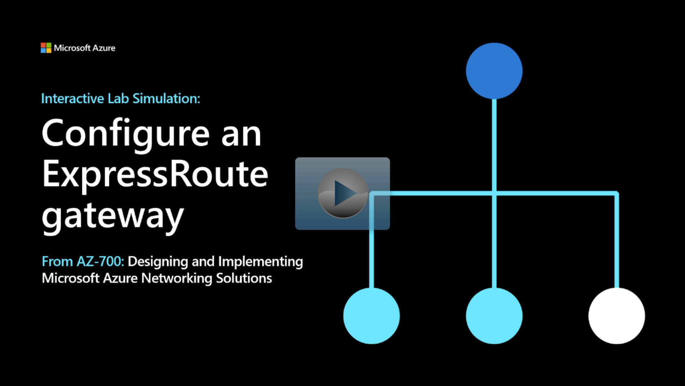

## Lab scenario

In this lab, you'll create a virtual network gateway for ExpressRoute. 

## Architecture diagram

:::image type="content" source="../media/4-exercise-configure-expressroute-gateway.png" alt-text="Diagram of virtual network gateway.":::

## Objectives

 -  Task 1: Create the VNet and gateway subnet
 -  Task 2: Create the virtual network gateway

> [!NOTE]
> Select the thumbnail image to start the lab simulation. When you're done, be sure to return to this page so you can continue learning. 

> [!NOTE]
>You may find slight differences between the interactive simulation and the hosted lab, but the core concepts and ideas being demonstrated are the same.

  
