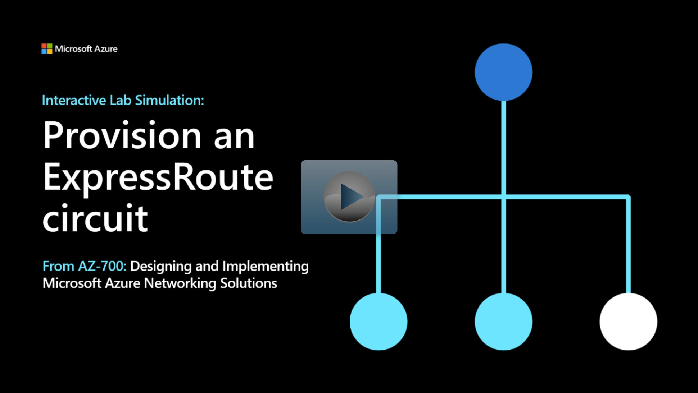

## Lab scenario

In this exercise, you will create an ExpressRoute circuit using the Azure portal and the Azure Resource Manager deployment model.

## Architecture diagram

:::image type="content" source="../media/5-exercise-provision-expressroute-circuit.png" alt-text="Diagram of ExpressRoute circuit layout for exercise.":::

## Objectives

 -  **Task 1**: Create and provision an ExpressRoute circuit
 -  **Task 2**: Retrieve your Service key
 -  **Task 3**: Deprovisioning an ExpressRoute circuit

> [!NOTE]
> Click on the thumbnail image to start the lab simulation. When you're done, be sure to return to this page so you can continue learning. 

> [!NOTE]
> You may find slight differences between the interactive simulation and the hosted lab, but the core concepts and ideas being demonstrated are the same.

