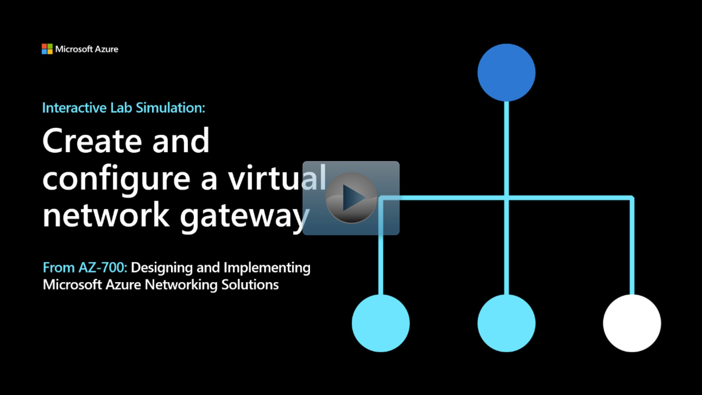

## Lab scenario

In this exercise you will configure a virtual network gateway to connect the Contoso Core Services VNet and Manufacturing VNet.

## Architecture diagram

:::image type="content" source="../media/3-exercise-create-configure-local-network-gateway.png" alt-text="Diagram of virtual network gateway.":::

## Objectives

 -  **Task 1**: Create CoreServicesVnet and ManufacturingVnet
    - Use a template to create the virtual networks. You can review the [lab template](https://github.com/MicrosoftLearning/AZ-700-Designing-and-Implementing-Microsoft-Azure-Networking-Solutions/blob/master/Allfiles/Exercises/M02/azuredeploy.json).
    - Use Azure PowerShell to deploy the template. 
 -  **Task 2**: Create CoreServicesTestVM
    - Use a template to create the virtual machines. You can review the [lab template](https://github.com/MicrosoftLearning/AZ-700-Designing-and-Implementing-Microsoft-Azure-Networking-Solutions/blob/master/Allfiles/Exercises/M02/CoreServicesVMazuredeploy.json).
    - Use Azure PowerShell to deploy the template. 
 -  **Task 3**: Create ManufacturingTestVM
    - Use a template to create the virtual machines. You can review the [lab template](https://github.com/MicrosoftLearning/AZ-700-Designing-and-Implementing-Microsoft-Azure-Networking-Solutions/blob/master/Allfiles/Exercises/M02/ManufacturingVMazuredeploy.json).
    - Use Azure PowerShell to deploy the template. 
 -  **Task 4**: Connect to the Test VMs using RDP
 -  **Task 5**: Test the connection between the VMs
 -  **Task 6**: Create CoreServicesVnet Gateway
 -  **Task 7**: Create ManufacturingVnet Gateway
 -  **Task 8**: CoreServicesVnet to ManufacturingVnet
 -  **Task 9**: Connect ManufacturingVnet to CoreServicesVnet
 -  **Task 10**: Verify that the connections connect
 -  **Task 11**: Test the connection between the VMs

> [!NOTE]
> Click on the thumbnail image to start the lab simulation. When you're done, be sure to return to this page so you can continue learning. 

> [!NOTE]
> You may find slight differences between the interactive simulation and the hosted lab, but the core concepts and ideas being demonstrated are the same.

