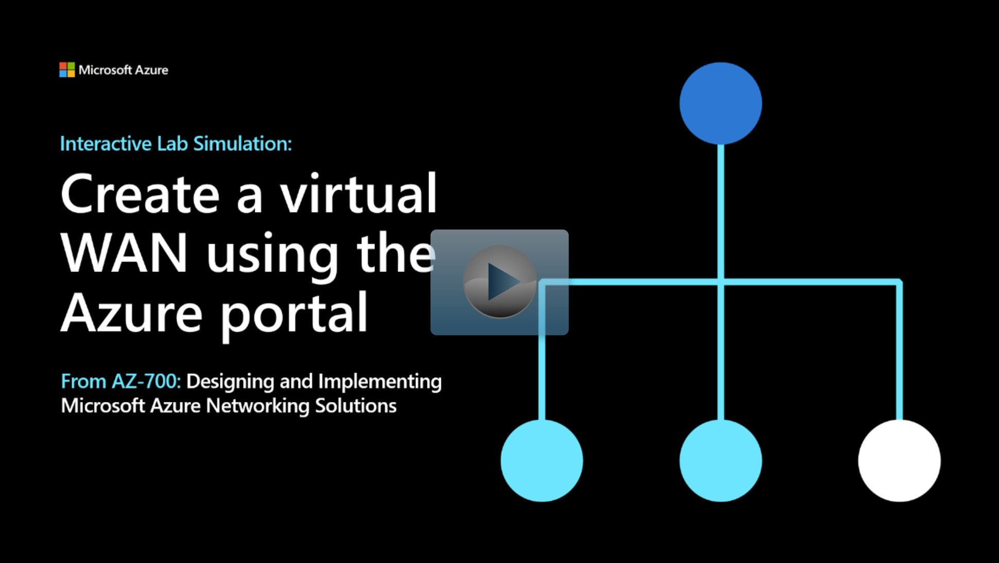

## Lab scenario

In this lab, you'll create a Virtual WAN for Contoso.

## Architecture diagram

:::image type="content" source="../media/7-exercise-create-virtual-wan-by-using-azure-portal.png" alt-text="Diagram of virtual network WAN architecture":::

## Objectives

 -  **Task 1**: Create a Virtual WAN
 -  **Task 2**: Create a hub by using Azure portal
 -  **Task 3**: Connect a VNet to the Virtual Hub

> [!NOTE]
> Select the thumbnail image to start the lab simulation. When you're done, be sure to return to this page so you can continue learning. 

> [!NOTE]
>You may find slight differences between the interactive simulation and the hosted lab, but the core concepts and ideas being demonstrated are the same.

