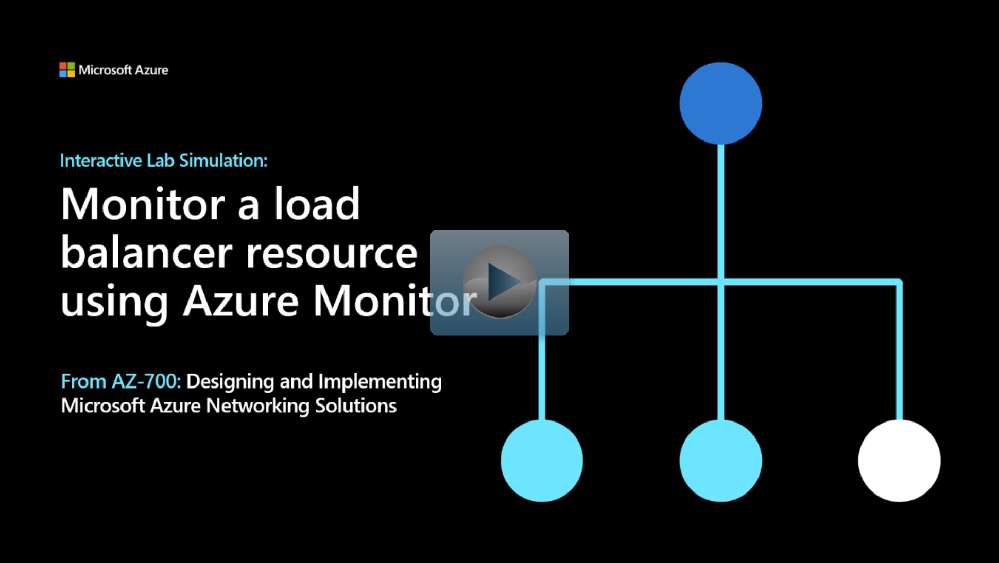

## Lab scenario
In this exercise, you create an internal load balancer for the fictional Contoso Ltd organization. Then you create a Log Analytics workspace, and use Azure Monitor Insights to view information about your internal load balancer. Finally, you configure the load balancer's diagnostic settings to send metrics to the Log Analytics workspace you created.

## Architecture diagram

:::image type="content" source="../media/3-exercise-monitor-load-balancer-resource-using-azure-monitor.png" alt-text="Diagram illustrating the load balancer architecture that will be created in the exercise - includes load balancer, VNet, subnet, Bastionsubnet, and VMs.":::

## Objectives

 -  **Task 1**: Create the virtual network
 -  **Task 2**: Create the load balancer
 -  **Task 3**: Create a backend pool
 -  **Task 4**: Create a health probe
 -  **Task 5**: Create a load balancer rule
 -  **Task 6**: Create backend servers
    - Use a template to create the virtual machines. You can review the [lab template](https://github.com/MicrosoftLearning/AZ-700-Designing-and-Implementing-Microsoft-Azure-Networking-Solutions/blob/master/Allfiles/Exercises/M08/azuredeploy.json).
    - Use Azure PowerShell to deploy the template. 
 -  **Task 7**: Add VMs to the backend pool
 -  **Task 8**: Install IIS on the VMs
 -  **Task 9**: Test the load balancer
 -  **Task 10**: Create a Log Analytics Workspace
 -  **Task 11**: Use Functional Dependency View
 -  **Task 12**: View detailed metrics
 -  **Task 13**: View resource health
 -  **Task 14**: Configure diagnostic settings
 -  **Task 15**: Clean up resources

> [!NOTE]
> Select the thumbnail image to start the lab simulation. When you're done, be sure to return to this page so you can continue learning. 

> [!NOTE]
>You may find slight differences between the interactive simulation and the hosted lab, but the core concepts and ideas being demonstrated are the same.

