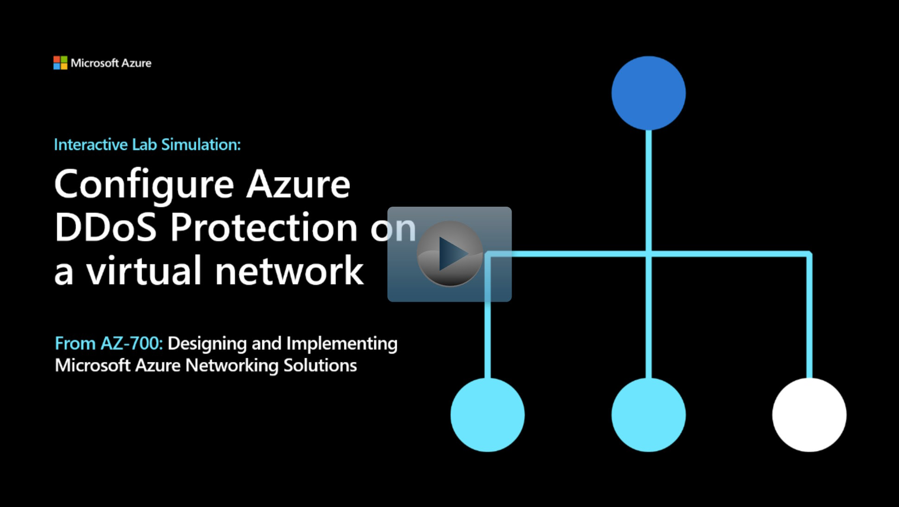

## Lab scenario

In this lab, you're going to run a mock DDoS attack on the virtual network. The following steps walk you through creating a virtual network, configuring DDoS Protection, and creating an attack which you can observe and monitor with the help of telemetry and metrics.

## Architecture diagram

:::image type="content" source="../media/4-exercise-configure-ddos-protection-virtual-network-using-azure-portal.png" alt-text="Diagram of DDoS architecture.":::

## Objectives

 -  **Task 1**: Create a DDoS Protection plan
 -  **Task 2**: Enable DDoS Protection on a new virtual network
 -  **Task 3**: Configure DDoS telemetry
 -  **Task 4**: Configure DDoS diagnostic logs
 -  **Task 5**: Configure DDoS alerts
 -  **Task 6**: Monitor a DDos test attack

> [!NOTE]
> Click on the thumbnail image to start the lab simulation. When you're done, be sure to return to this page so you can continue learning. 

> [!NOTE]
> You may find slight differences between the interactive simulation and the hosted lab, but the core concepts and ideas being demonstrated are the same.

