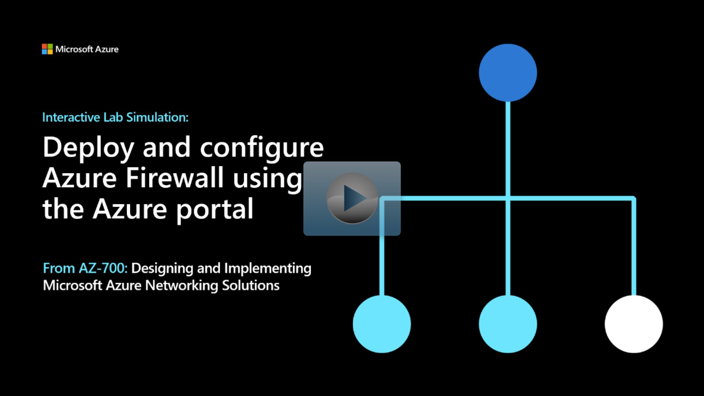

## Lab scenario
Being part of the Network Security team at Contoso, your next task is to create firewall rules to allow/deny access to certain websites. The following steps walk you through creating a resource group, a virtual network and subnets, and a virtual machine as environment preparation tasks, and then deploying a firewall and firewall policy, configuring default routes and application, network and DNAT rules, and finally testing the firewall.

## Architecture diagram

:::image type="content" source="../media/7-exercise-deploy-configure-azure-firewall-using-azure-portal.png" alt-text="Diagram of virtual network with Azure Firewall architecture.":::

## Objectives

 -  **Task 1**: Create a virtual network and subnets
 -  **Task 2**: Create a virtual machine
    - Use a template to create the virtual machines. You can review the [lab template](https://github.com/MicrosoftLearning/AZ-700-Designing-and-Implementing-Microsoft-Azure-Networking-Solutions/blob/master/Allfiles/Exercises/M06/firewall.json).
    - Use Azure PowerShell to deploy the template. 
 -  **Task 3**: Deploy the firewall and firewall policy
 -  **Task 4**: Create a default route
 -  **Task 5**: Configure an application rule
 -  **Task 6**: Configure a network rule
 -  **Task 7**: Configure a Destination NAT (DNAT) rule
 -  **Task 8**: Change the primary and secondary DNS address for the server's network interface
 -  **Task 9**: Test the firewall

> [!NOTE]
> Click on the thumbnail image to start the lab simulation. When you're done, be sure to return to this page so you can continue learning. 

> [!NOTE]
> You may find slight differences between the interactive simulation and the hosted lab, but the core concepts and ideas being demonstrated are the same.

