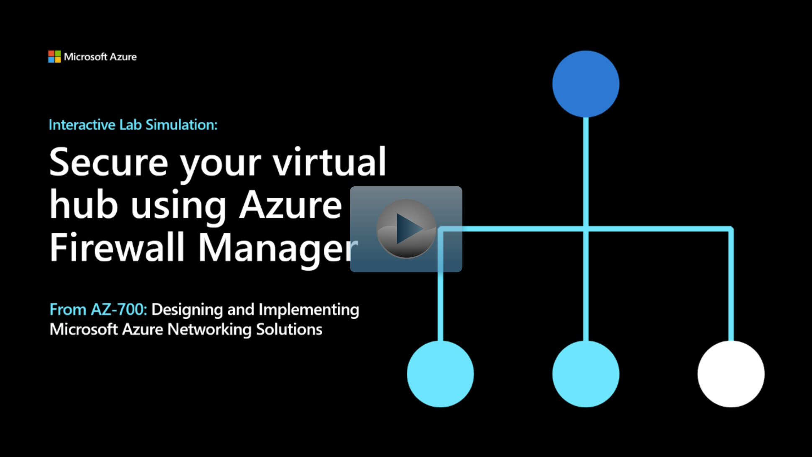

## Lab scenario

In this lab, you will secure your virtual hub with Azure Firewall Manager. 

## Architecture diagram

:::image type="content" source="../media/9-exercise-secure-your-virtual-hub-using-azure-firewall-manager.png" alt-text="Diagram of virtual network architecture with a secure hub.":::

## Objectives

 -  **Task 1**: Create two spoke virtual networks and subnets
 -  **Task 2**: Create the secured virtual hub
 -  **Task 3**: Connect the hub and spoke virtual networks
 -  **Task 4**: Deploy the servers
    - Use a template to create the virtual machines. You can review the [lab template](https://github.com/MicrosoftLearning/AZ-700-Designing-and-Implementing-Microsoft-Azure-Networking-Solutions/blob/master/Allfiles/Exercises/M06/FirewallManager.json).
    - Use Azure PowerShell to deploy the template. 
 -  **Task 5**: Create a firewall policy and secure your hub
 -  **Task 6**: Associate the firewall policy
 -  **Task 7**: Route traffic to your hub
 -  **Task 8**: Test the application rule
 -  **Task 9**: Test the network rule

> [!NOTE]
> Click on the thumbnail image to start the lab simulation. When you're done, be sure to return to this page so you can continue learning. 

> [!NOTE]
> You may find slight differences between the interactive simulation and the hosted lab, but the core concepts and ideas being demonstrated are the same.

