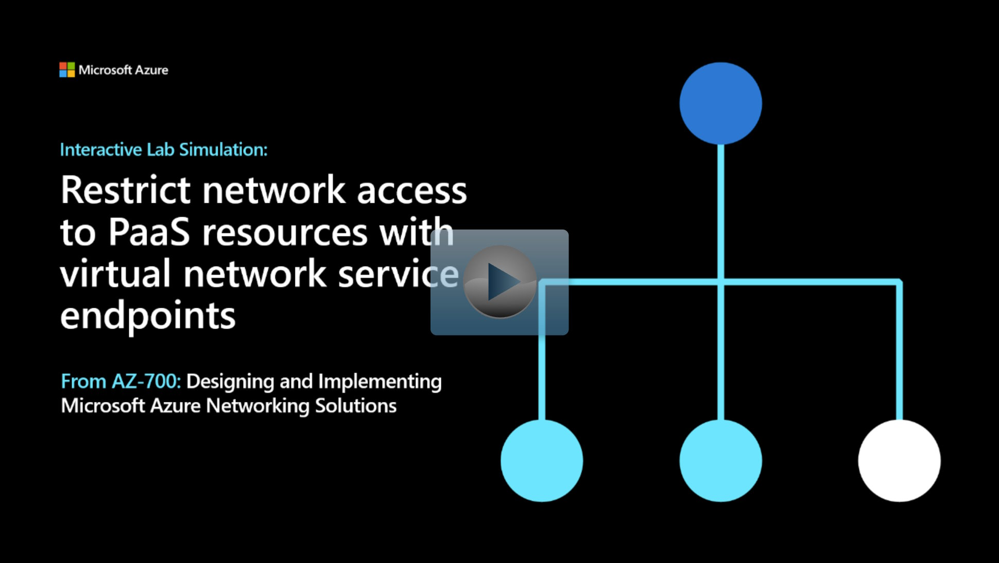

## Lab scenario

Virtual network service endpoints enable you to limit network access to some Azure service resources to a virtual network subnet. You can also remove internet access to the resources. Service endpoints provide direct connection from your virtual network to supported Azure services, allowing you to use your virtual network's private address space to access the Azure services. Traffic destined to Azure resources through service endpoints always stays on the Microsoft Azure backbone network.

## Architecture diagram

:::image type="content" source="../media/5-exercise-restrict-network-paas-resources-virtual-network-service-endpoints.png" alt-text="Diagram of loadbalancer architecture.":::

## Objectives

 -  **Task 1**: Create a virtual network
 -  **Task 2**: Enable a service endpoint
 -  **Task 3**: Restrict network access for a subnet
 -  **Task 4**: Add additional outbound rules
 -  **Task 5**: Allow access for RDP connections
 -  **Task 6**: Restrict network access to a resource
 -  **Task 7**: Create a file share in the storage account
 -  **Task 8**: Restrict network access to a subnet
 -  **Task 9**: Create virtual machines
    - Use a template to create the virtual machines. You can review the [lab template](https://github.com/MicrosoftLearning/AZ-700-Designing-and-Implementing-Microsoft-Azure-Networking-Solutions/blob/master/Allfiles/Exercises/M07/VMs.json).
    - Use Azure PowerShell to deploy the template. 
 -  **Task 10**: Confirm access to storage account

> [!NOTE]
> Click on the thumbnail image to start the lab simulation. When you're done, be sure to return to this page so you can continue learning. 

> [!NOTE]
> You may find slight differences between the interactive simulation and the hosted lab, but the core concepts and ideas being demonstrated are the same.

