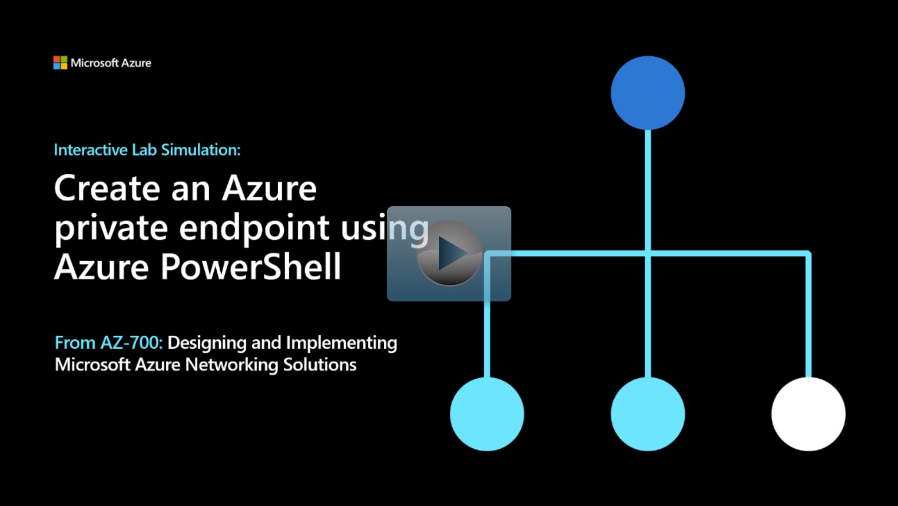

## Lab scenario

In this lab, you'll create a Private Endpoint for an Azure web app and deploy a virtual machine to test the private connection.

## Architecture diagram

:::image type="content" source="../media/6-exercise-create-azure-private-endpoint-using-azure-powershell.png" alt-text="Diagram of private endpoint architecture.":::

## Objectives

 -  **Task 1**: Create a resource group and deploy the Prerequisite web app
    - Use a template to create the virtual machines. You can review the [lab template](https://github.com/MicrosoftLearning/AZ-700-Designing-and-Implementing-Microsoft-Azure-Networking-Solutions/blob/master/Allfiles/Exercises/M07/template.json).
    - Use Azure PowerShell to deploy the template. 
 -  **Task 2**: Create a virtual network and bastion host
 -  **Task 3**: Create a test virtual machine
 -  **Task 4**: Create a private endpoint
 -  **Task 5**: Configure the private DNS zone
 -  **Task 6**: Test connectivity across the private endpoint

> [!NOTE]
> Click on the thumbnail image to start the lab simulation. When you're done, be sure to return to this page so you can continue learning. 

> [!NOTE]
> You may find slight differences between the interactive simulation and the hosted lab, but the core concepts and ideas being demonstrated are the same.

