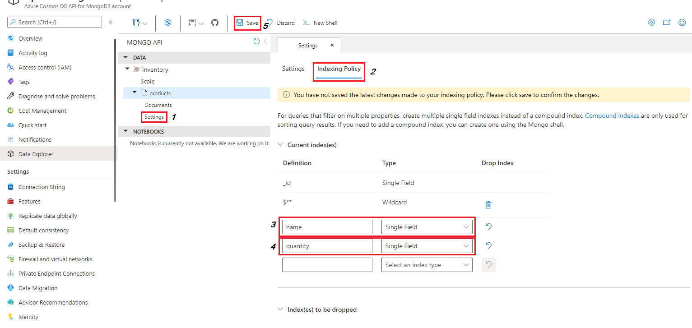

Indexes are data structures that allow queries faster access to your documents. Azure Cosmos DB API for MongoDB takes advantage of the core index-management capabilities of Azure Cosmos DB. In this unit, we'll introduce different types of indexes and how to to set them up from the Azure portal Data Explorer or programmatically using collection commands. Indexes are set at the collection level.

By default, Azure Cosmos DB API for MongoDB automatically indexes the ***_id*** field. Uniqueness is automatically enforced by the ***_id*** field per shard key.

Let's review the different types of indexes supported by the Azure Cosmos DB API for MongoDB.

## Index types

### Single field indexes

As the name implies, single field indexes are those created on a single field. For single field indexes, the order (ascending/descending) doesn't matter. A query can use multiple single field indexes when available. There's a limit of 500 single field indexes per collection.

Let's look at a couple of ways to create a single field index. Let's assume that on the database *inventory* we'll have a collection named *products*, and we want to create a single field index for the column *name* and a separate single field index for the column *quantity*.

#### Create a single field index using the Azure portal Index Policy tab

Under your Azure Cosmos DB API for MongoDB database in the Azure portal, select Data Explorer.

1. Expand *Inventory* then *products* and select **Settings**.
1. Select the **Indexing Policy** tab. Notice that by default you should already have two indexes pre-created, the ***_id*** single field index discussed earlier and the ***`$**`*** wildcard index we'll discuss later. For now, ignore those indexes.
1. Under the first textbox, input **name** and select **Single Field** from the dropdown.
1. Under the next textbox, input **quantity** and select **Single Field** from the dropdown.
1. Select on the Save icon.

  > [!div class="mx-imgBorder"]
  > [](../media/3-add-index-policy-azure-portal-index-policy-tab.png#lightbox)

#### Create a single field index using the MongoDB Shell

Open Mongo Shell, make sure it's pointing to your Azure Cosmos DB API for MongoDB account using the account's connection string.

Run the following commands to add the two indexes.

```javascript
// change to the inventory database
use inventory
// add name, and quantity indexes to the products collection 
db.products.createIndex({name:1})
db.products.createIndex({quantity:1})
// look at the list of indexes to see the two new indexes
db.products.getIndexes()
```

This ***getIndexes*** collection function should return a similar result as the one below:

```json
[
  { v: 1, key: { _id: 1 }, name: '_id_', ns: 'inventory.products' },
  { v: 1, key: { '$**': 1 }, name: '$**_1', ns: 'inventory.products' },
  { v: 1, key: { name: 1 }, name: 'name_1', ns: 'inventory.products' },
  { v: 1, key: { quantity: 1 }, name: 'quantity_1', ns: 'inventory.products' }
]
```

#### Create a single field index programmatically

The following script will create a single field index.

::: zone pivot="node"
  ***Node.js***

  ```javascript
    // connect to the database "inventory"
    var InventoryDatabase = mongoClient.db("inventory");
    
    // connect to the collection "products"
    var productscollection = InventoryDatabase.collection('products');
    
    // add name, and quantity indexes to the products collection
    var resultn = await productscollection.createIndex({ name: 1 });
    var resultq = await productscollection.createIndex({ quantity: 1 });
  ```

::: zone-end

::: zone pivot="java"
  ***Java***

  ```java
    // connect to the database "inventory"
    MongoDatabase InventoryDatabase = mongo.getDatabase("inventory");

    // connect to the collection "products"
    MongoCollection productscollection = InventoryDatabase.getCollection("products");

    // add name, and quantity indexes to the products collection
    productscollection.createIndex(Indexes.ascending("name"));
    productscollection.createIndex(Indexes.ascending("quantity"));
  ```

::: zone-end

::: zone pivot="python"
  ***Python***

  ```Python
    # connect to the database "inventory"
    InventoryDatabase = client["inventory"]

    # connect to the collection "products"
    productscollection = InventoryDatabase["products"]

    # add name, and quantity indexes to the products collection
    productscollection.create_index([ ("name", 1) ])
    productscollection.create_index([ ("quantity", 1) ])
  ```

::: zone-end

::: zone pivot="csharp"
  ***C#***

  ```C#
    // connect to the database "inventory"
    var InventoryDatabase = mongoClient.GetDatabase("inventory");

    // connect to the collection "products"
    var productscollection = InventoryDatabase.GetCollection<Products>("products");

    // add name, and quantity indexes to the products collection
    productscollection.Indexes.CreateOneAsync(Builders<Products>.IndexKeys.Ascending(_ => _.name));
    productscollection.Indexes.CreateOneAsync(Builders<Products>.IndexKeys.Ascending(_ => _.quantity));
  ```

::: zone-end

### Compound indexes

Compound indexes are needed any time your queries need to sort on multiple fields at once. If you need to filter on multiple fields, then just create a single field index for each field in the filter since it saves on *indexing cost*. That said, if a compound index contains the filtering fields of a query, *filtering cost* would be the same if you use the compound index than if you use single field indexes for each field in the filter.

Compound indexes can't be created on nested properties or arrays.

Unlike single field indexes where the order of the index was irrelevant, compound index must match the same sequence of fields as the query.  Suppose you create the following compound index sorting the *doctors* by first name and then last name.

```javascript
db.doctors.createIndex({firstName:1,lastName:1})
```

Now suppose you want to return all doctors by last name and then first name.

```javascript
db.doctors.find().sort({lastName:1,firstName:1})
```

The previous compound index wouldn't work, you'll need the following index.

```javascript
db.doctors.createIndex({lastName:1,firstName:1})
```

One more interesting note about compound indexes, they can be used for reversed sorts too, so the previous index will also work to return all doctors by last name descending and then first name descending (notice the ***-1*** representing descending).

```javascript
db.doctors.find().sort({lastName:-1,firstName:-1})
```

> [!NOTE] 
> You can't create a compound index using the Azure Portal.

Let's suppose we want to add a compound index by ***lastName*** descending and ***firstName*** descending for the *doctors* collection in the *employees* database.

#### Create a compound index using the MongoDB Shell

Open Mongo Shell, make sure it's pointing to your Azure Cosmos DB API for MongoDB account using the account's connection string.

Run the following commands to add the two indexes.

```javascript
// change to the employees database
use inventory
// add the lastName, firstName compound index to the doctors collection 
db.doctors.createIndex({lastName:-1,firstName:-1})
// look at the list of indexes to see the new compound indexes
db.products.getIndexes()
```

This ***getIndexes*** collection function should return a similar result as the one below:

```json
[
  { v: 1, key: { _id: 1 }, name: '_id_', ns: 'employees.doctors' },
  { v: 1, key: { '$**': 1 }, name: '$**_1', ns: 'employees.doctors' },
  { v: 1, key: { lastName: -1, firstName: -1 }, name: 'lastName_-1_firstName_-1',ns: 'employees.doctors' }
]
```

#### Create a compound index programmatically

The following script will create a single field index.

::: zone pivot="node"
  ***Node.js***

  ```javascript
    // connect to the database "employees"
    var EmployeeDatabase = mongoClient.db("employees");
    
    // connect to the collection "doctors"
    var doctorscollection = EmployeeDatabase.collection('doctors');
    
    // add the lastName, firstName compound indexes to the doctors collection
    var resultd = await doctorscollection.createIndex({lastName:-1,firstName:-1});
  ```

::: zone-end

::: zone pivot="java"
  ***Java***

  ```java
    // connect to the database "employees"
    MongoDatabase EmployeeDatabase = mongo.getDatabase("employees");

    // connect to the collection "doctors"
    MongoCollection doctorscollection = EmployeeDatabase.getCollection("doctors");

    // add the lastName, firstName compound indexes to the doctors collection
    doctorscollection.createIndex(Indexes.descending("lastName","firstName"));
  ```

::: zone-end

::: zone pivot="python"
  ***Python***

  ```Python
    # connect to the database "employees"
    EmployeeDatabase = client["employees"]

    # connect to the collection "doctors"
    doctorscollection = EmployeeDatabase["doctors"]

    # add the lastName, firstName compound indexes to the doctors collection
    doctorscollection.create_index([ ("lastName",-1), ("firstName",-1) ])
  ```

::: zone-end

::: zone pivot="csharp"
  ***C#***

  ```C#
    // connect to the database "employees"
    var EmployeeDatabase = mongoClient.GetDatabase("employees");

    // connect to the collection "doctors"
    var doctorscollection = EmployeeDatabase.GetCollection<Employees>("doctors");

    // add the lastName, firstName compound indexes to the doctors collection
    doctorscollection.Indexes.CreateOneAsync(Builders<Employees>.IndexKeys
                                    .Descending(_ => _.lastName)
                                    .Descending(_ => _.firstName));
  ```

::: zone-end

### Wildcard indexes

One of the NoSQL properties is being schema-less. This means that you might not always know all fields in your documents beforehand. Wildcard indexes allow you to support queries with unknown fields or when your documents have many different possible properties. Let's review two documents below in a collection called *school*.

```json
"Students": 
[
    {
        "StudentName": "John Smith",
        "Mayor": "Undefined",
        "Classes": 
        [
            {
                "ClassName": "History",
                "Level":100,
                "Teacher": "Mike Michael"
            },
            {
                "ClassName": "Chemistry",
                "Level": 101,
                "Teacher": "Yi Yan",
                "Lab": "Chem Lab 101"
            }
        ]
    }
]
```

```json
"Students": 
[
    {
        "FirstName": "John",
        "LastName": "Smith",
        "GPA": 3.85,
        "FavoriteClasses": 
        [
            { 
                "ClassName": "Music"
            },
            {
                "ClassName": "Math",
                "Level": 101
            }
        ]
    }
]
```

While both documents have the ***Students*** property, the subproperties are all different.  So in this case we might want to index all the ***Students*** subproperties. To do so in Mongo Shell, you would run the following command.

```javascript
db.school.createIndex({"Students.$**" : 1})
```

We actually saw a wildcard index earlier, the index ***`$**`*** in the screenshot at the top of this unit. The index ***`$**`*** wildcard index will index *all* fields in the collection. We recommend using this index at the start of your database app development, or at least until you know how your collection will be queried. However, if your documents have many fields, keeping this wildcard index might create a large number of RU charges for writes and updates. Consider using individual indexes instead of this composite index in write-heavy workload environments.

## Index properties

Azure Cosmos DB API for MongoDB supports several index properties depending on the version. We'll look a couple of them here, to learn more, please review the [supported indexes and indexed properties](/azure/cosmos-db/mongodb/feature-support-40#indexes-and-index-properties) article.

### Unique indexes

To enforce uniqueness in your documents, you'll need to set the **unique** property to ***true*** when defining your index. Let's assume we want to make sure the *deviceId* is unique in our *IOT* collection. Using Mongo Shell we would run the following command to ensure uniqueness.

```javascript
db.IOT.createIndex( { "deviceId" : 1 }, {unique:true} )
```

If our collection is sharded, we'll also need to provide the partition key to create the unique index. This means our unique index will actually end up being a compound index. Let's assume that our shard key is ***locationId*** in our previous example, to create the unique index we would run the following command.

```javascript
db.IOT.createIndex( {"locationId": 1, "deviceId" : 1 }, {unique:true} )
```

> [!NOTE] 
> You can only create a unique index on an empty collection.

### Unique partial indexes

Azure Cosmos DB API for MongoDB gives us the ability to create unique indexes on a subset of the documents in our collection that meet a criteria defined by the ***partialFilterExpression*** property. This will enforce uniqueness on any document that meets the Filter criteria preventing any duplicates from being inserted. However, this filter won't prevent any document that doesn't meet the criteria from also being inserted.

To create a partial index, use the *db.collection.createIndex()* method with the *partialFilterExpression* option and *unique* constraint. The *partialFilterExpression* option accepts a document that specifies the filter condition using:

- equality expressions (that is, field: value or using the $eq operator)
- $exists: true expression
- $gt, $gte, $lt, $lte expressions
- $type expressions
- $and operator at the top-level only

Let's revisit our *IOT* example above. Let's assume that we have several years of IOT log data in this collection. Since IOT devices wouldn't insert data in the past, we might only care to check uniqueness in the current year. In Mongo Shell, we would run the following command to create this unique index.

```javascript
db.IOT.createIndex( { "deviceId" : 1 }, {unique:true, partialFilterExpression:{logYear:{$gte:2022}}} )
```

## Background index updates

All index updates are always done in the background. Index updates consume Request Units at a lower priority than other database operations, so they'll cause no downtime to your writes, updates or deletes.

Adding a new index doesn't affect read availability. While the index is being created Azure Cosmos DB will use the existing indexes to support queries. No inconsistency of query results will happen when new indexes are being built or added.

For more information on MongoDB indexes please review the [Manage indexing in Azure Cosmos DB API for MongoDB](/azure/cosmos-db/mongodb/mongodb-indexing) document.
