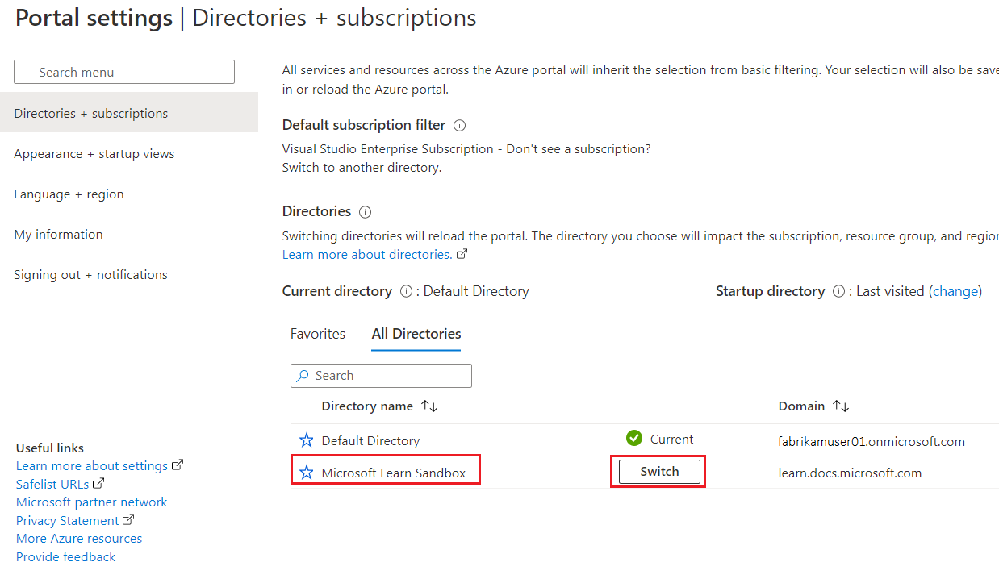

We will use the Azure Portal to take a closer look at indexes and aggregation pipelines.

This exercise can be completed using a Microsoft Learn *sandbox*, which provides a temporary Azure subscription. To activate the sandbox subscription, you must sign in using a Microsoft account. The sandbox subscription will be automatically deleted when you complete this module. After the sandbox has been activated, [sign into the Azure portal using the credentials for your sandbox subscription](https://portal.azure.com/learn.docs.microsoft.com?azure-portal=true). Ensure you're working in the **Microsoft Learn Sandbox** directory - indicated at the top right of the portal under your user ID. If not, select the user icon and switch directory.

> [!TIP]
> If you prefer, you can use your own Azure subscription. To do so, [sign into the Azure portal using credentials for your subscription](https://portal.azure.com?azure-portal=true). Ensure you are working in the directory containing your subscription - indicated at the top right under your user ID. If not, select the user icon and switch directory.

## Indexes and pipeline aggregations

In this exercise, we'll use the Azure portal to see some examples on how indexes influence the cost of our queries.  We'll use both the *db.collection.find* and *db.collection.aggregation* functions.  Let's start by using the Azure portal to create our Azure Cosmos DB API for MongoDB account if it doesn't already exist.

### Prepare your development environment

If you haven't already prepared the Azure Cosmos DB account and environment where you're working on this lab, follow these steps to do so. Otherwise, go to the **Indexes and their impact** section.

1. In Azure Cloud Shell, copy and paste the following commands.

    1. *If you are using the Sandbox*, a resource group has already been created for you so run the following script.

    > ```bash
    > # Create an Azure Cosmos DB API for MongoDB account and add the customer collection
    > git clone https://github.com/MicrosoftLearning/mslearn-cosmosdb.git
    > GitRepositoryRoot=$(pwd)
    > bash $GitRepositoryRoot/mslearn-cosmosdb/api-for-mongodb/02-indexes-and-aggregation-pipelines/init.sh
    > ```

    1. If you already have a resource group you want to use in your environment, replace the string ***YOURRESOURCEGROUPNAMEHERE*** below for the name of your resource group. *Note if you are not using the Sandbox, you will need to run the ***az login*** command before running the ***init*** bash script below*..

    > ```bash
    > # Create an Azure Cosmos DB API for MongoDB account and add the customer collection
    > git clone https://github.com/MicrosoftLearning/mslearn-cosmosdb.git
    > GitRepositoryRoot=$(pwd)
    > # Replace YOURRESOURCEGROUPNAMEHERE for the name of your Resource Group
    > bash $GitRepositoryRoot/mslearn-cosmosdb/api-for-mongodb/02-indexes-and-aggregation-pipelines/init.sh -r YOURRESOURCEGROUPNAMEHERE
    > ```

   > [!NOTE]
    > This bash script will create the Azure Cosmos DB API for MongoDB account and copy the customer collection into that account. *It can take 5-10 minutes to create this account* so it might be a good time to get a cup of coffee or tea.

1. Since we'll be using the Azure portal with the Sandbox, don't forget to switch the directory on the Azure portal to use the Resource Group created by the Sandbox.

1. ***Don't close out of the sandbox***. On a *different* browser window or *tab*, sign in to the Azure portal using the same account you connected to the sandbox with.

1. On the upper right hand corner of the Azure portal, verify the directory you're logged in to, if it points to the **Default Directory** or something different than the **Microsoft Learn Sandbox** directory continue to the next step, otherwise continue to the next section.

1. Select the user icon on the upper right hand corner besides your sign-in name.  Select **Switch Directory**.
    > [](../media/5-switch-directory-login.png#lightbox)

1. Select the **Switch** button.  You'll notice in the upper right hand corner that you should now be in the Microsoft Learn Sandbox directory.

    > [](../media/5-switch-directory.png#lightbox)

Let's continue with the lab.  

### Indexes and their impact

We'll use the Azure portal to run a few queries and review their impact.

1. On the Azure portal, go to your Azure Cosmos DB API for Mongo DB account.

1. Under Data Explorer, select the **database-v1** database and the **customer** collection.

1. On the right hand side of the collection menu, select ***>_ New Shell***.

1. Time to run a simple query to return all the documents for customers with the last name ***Benson***. To do so, on the Shell prompt run the query below.

    > ```javascript
    > db.customer.find({lastName: "Benson"})
    > ```

    This query will first return a message like Operation consumed **337.38 RUs**, you might get a slightly different cost value. Then it should have returned the following documents.

    > ```javascript
    > [
    >  {
    >    _id: ObjectId("62b9125f0a967b00dc936a3f"),
    >    id: '277EB18F-2886-4E2A-BF92-C3A8A87F27FC',
    >    title: 'Ms.',
    >    firstName: 'Edna',
    >    lastName: 'Benson',
    >    emailAddress: 'edna0@adventure-works.com',
    >    phoneNumber: '789-555-0189',
    >    creationDate: '2013-07-31T00:00:00'
    >  },
    >  {
    >    _id: ObjectId("62b9125f0a967b00dc9391ae"),
    >    id: '45758735-8AB4-4B4E-B161-26F073FB2CA4',
    >    title: 'Mr.',
    >    firstName: 'Max',
    >    lastName: 'Benson',
    >    emailAddress: 'max0@adventure-works.com',
    >    phoneNumber: '599-555-0160',
    >    creationDate: '2011-10-01T00:00:00'
    >  },
    >  {
    >    _id: ObjectId("62b9125f0a967b00dc939852"),
    >    id: 'A1AC6260-F902-472D-8CB3-C9955635DABF',
    >    title: 'Mr.',
    >    firstName: 'Payton',
    >    lastName: 'Benson',
    >    emailAddress: 'payton0@adventure-works.com',
    >    phoneNumber: '528-555-0183',
    >    creationDate: '2011-10-01T00:00:00'
    >  }
    >]
    >```

    This cost shouldn't look right, we currently have 19,119 documents in this collection, but this query should still have its cost in RUs in the single digits.

1. Let's make sure we have an index on the **lastName** field. On the database tree, expand the ***database-v1*** database then the ***customer*** collection and select **Settings**.

1. Select the ***Indexing Policy*** tab.

1. Notice that there's only one index for the ***_id*** field, which is always created for any collection in an Azure Cosmos DB API for MongoDB collection, but there are no extra indexes.  The lack of indexes perfectly explains our problem.  Because we have no index for the ***lastName*** column, we're scanning all the documents to find the three documents that met our criteria. Let's go ahead and add the needed index.

1. To add the index, just put the column name, **lastName** under the *Definition* column and select **Single Field** from the *Type* pulldown. Now select ***Save*** under the menu to create the index. You could also create multiple Single Field indexes at the same time.

    > [!NOTE] 
    > Once you select ***Save*** you can scroll up on the Indexing Policy tab to see the progress of the index creation. It should take 5-20 seconds to create this index. Note that for very large indexes this could take from many minutes to hours.

1. Let's go back to the Shell, if the connection timed out, just open a New Shell.

1. Rerun the query to return all customers with the last name ***Benson***.

    > ```javascript
    > db.customer.find({lastName: "Benson"})
    > ```

1. Now we should see a huge difference in cost. While this query returned the expected three documents we should have seen a message similar to **Operations consumed 4.98 RUs**, you might get a slightly different cost value.

1. Let's try one more thing. Let's look for all the customers who were created after 2011. We already know the performance will be very bad.

    > ```javascript
    > db.customer.find({creationDate: {$gte : "2012-01-01T00:00:00Z"}})
    > ```

    As expected, this cost us **524.73 RUs**.

1. Let's go ahead and create the index on the **creationDate** field as a **Single Field** type. And when it completed creating it, let's rerun the query.

    The results will still be in the hundreds of RUs so the query would still be very costly.  Let's find out why?

### Aggregated pipelines

So how many documents were returned by the previous query? For that we need a little more complex query. Let's use an aggregation pipeline to do the count.  First we need to create a match to our condition of our aggregation, then we need to count how many documents are returned.

1. The following aggregation should give us what we want. Our match condition is the same as the condition in our last query. We would then group it by the ***_id*** key since it's a unique column so it will give us the number of unique documents. In the group pipeline, we'll sum the number of documents meeting the filter. Finally we'll only project the *CountNumberOfDocuments* field and suppress the *_id* column that isn't relevant to our desired results.

    > ```javascript
    > db.customer.aggregate(
    >    [
    >        {
    >            $match: {creationDate: {$gte : "2012-01-01T00:00:00Z"}}
    >        },
    >        {
    >            $group: 
    >            {
    >                _id: "$_id_"
    >                , CountNumberOfDocuments: {$sum:1}
    >            }
    >        },
    >        {
    >            $project:
    >            {
    >                _id:0
    >                , CountNumberOfDocuments: 1
    >            }
    >        }
    >    ]
    >)
    >```

    Note a couple of things about this execution. First, it was really expensive, and second, the reason why our query's performance wasn't much different for that query is that we almost returned as many documents as there were in the collection.

1. If you change both queries to the customers that were created after 2014 (for example $gte 1/1/2015) both queries should be very cheap in cost since there are only 10 documents created after that date. Go ahead and do that test.

1. Lets do one final query. For this query, we would like the documents that are defined by the  following criteria. Which of our customer accounts have an international area code *1 (11)*. Additionally which of those accounts were opened after 2013 and has a title in their name (for example, Mr, Mrs, Ms., etc.). The documents should contain all original columns except for the *_id* column. The documents should also contain a field for how many days since of January 1, 2022 the customer accounts have been created.

1. Start by creating all the necessary indexes for the fields *title*, *phoneNumber* and *creationDate*. Go ahead and create those indexes now.

1. Let's look at our different pipelines and then we'll put them all together.

    First let's look at our match filters. We need a filter for the phone number, a filter for the creation date and a filter for the title.

    > ```javascript
    > [
    >    {
    >        $match:
    >        {
    >            creationDate: {$gte: "2014-01-01T00:00:00Z"}
    >            , $phoneNumber:{$regex: "1 \\(11\\)"}
    >            , title: {$ne:""}
    >        }
    >    }
    >]
    >```

    Next, we could use the group pipeline to calculate the number of days the account had been opened by *1/1/2022*. But since we aren't really grouping by any column in particular, and we just want to calculate the date difference for every account found, we can use the project pipeline instead.

    > ```javascript
    >[
    >    {
    >        $project:
    >        {
    >            title:1
    >            , firstName:1
    >            , lastName:1
    >            , emailAddress:1
    >            , phoneNumber:1
    >            , creationDate:1,
    >            "NumberOfDays":{$toInt: {$divide:[{"$subtract":[ {$toDate:"2022-01-01T00:00:00Z"},{$toDate:"$creationDate"}]},1000*60*60*24]}}
    >            , _id:0
    >        }
    >    }
    >]
    >```

    Noticed how I divided by *1000x60x60x24* that is because subtraction of dates is in milliseconds. Also noticed how I'm not retuning the **_id** field.  

1. Let's put it all together. Run the following command.

    > ```javascript
    > db.customer.aggregate(
    >    [
    >        {
    >            $match:
    >            {
    >                creationDate: {$gte: "2014-01-01T00:00:00Z"}
    >                , phoneNumber: {$regex: "1 \\(11\\)"}
    >                , title: {$ne:""}
    >            }
    >        },
    >        {
    >            $project:
    >            {
    >                title:1
    >                , firstName:1
    >                , lastName:1
    >                , emailAddress:1
    >                , phoneNumber:1
    >                , creationDate:1,
    >                "NumberOfDays":{$toInt: {$divide:[{"$subtract":[ {$toDate:"2022-01-01T00:00:00Z"},{$toDate:"$creationDate"}]},1000*60*60*24]}}
    >                , _id:0
    >            }
    >        }
    >    ]
    >)
    >```

    This should return the following three rows. If we hadn't created the three indexes, our cost would have been around 460 RUs, but with all our indexes our cost will be closer to 7 RUs.

    > ```javascript
    > [
    >  {
    >    title: 'Mr.',
    >    firstName: 'Jay',
    >    lastName: 'Fluegel',
    >    emailAddress: 'jay2@adventure-works.com',
    >    phoneNumber: '1 (11) 500 555-0119',
    >    creationDate: '2014-05-01T00:00:00',
    >    NumberOfDays: 2802
    >  },
    >  {
    >    title: 'Mrs.',
    >    firstName: 'Barbara',
    >    lastName: 'Nara',
    >    emailAddress: 'barbara45@adventure-works.com',
    >    phoneNumber: '1 (11) 500 555-0144',
    >    creationDate: '2014-01-08T00:00:00',
    >    NumberOfDays: 2915
    >  },
    >  {
    >    title: 'Sra.',
    >    firstName: 'Pilar',
    >    lastName: 'Ackerman',
    >    emailAddress: 'pilar1@adventure-works.com',
    >    phoneNumber: '1 (11) 500 555-0132',
    >    creationDate: '2015-04-15T16:33:33',
    >    NumberOfDays: 2452
    >  }
    >]
    >```

As with most database systems, having the proper indexing, optimizes the execution of our queries and significantly reduces cost. We have also introduced aggregation pipelines that have allowed us to create complex queries with ease. And while those pipelines could have a high cost to execute, again, with the proper indexing structure, you can also drastically reduce the aggregation pipeline costs.
