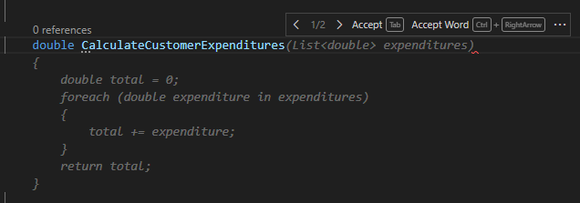
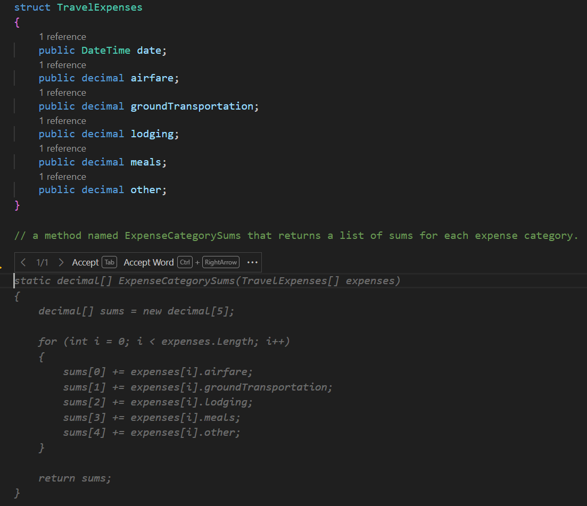
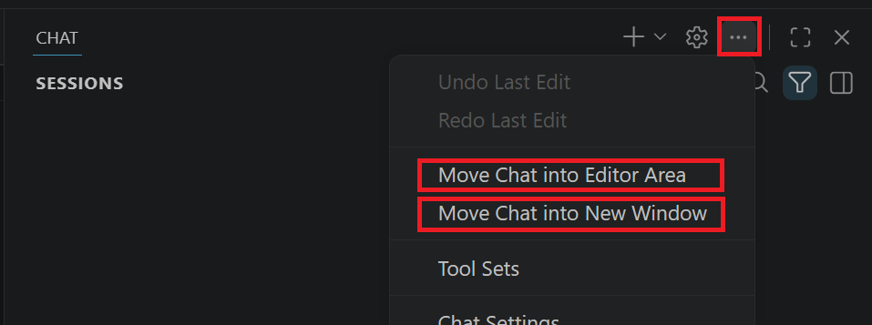
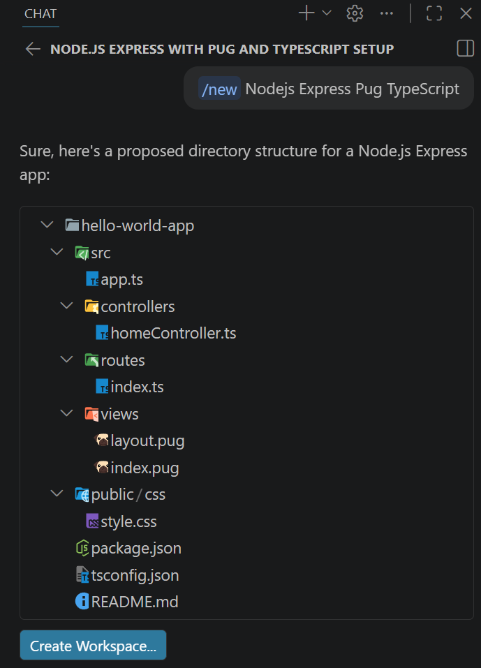
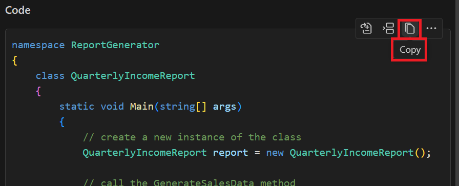
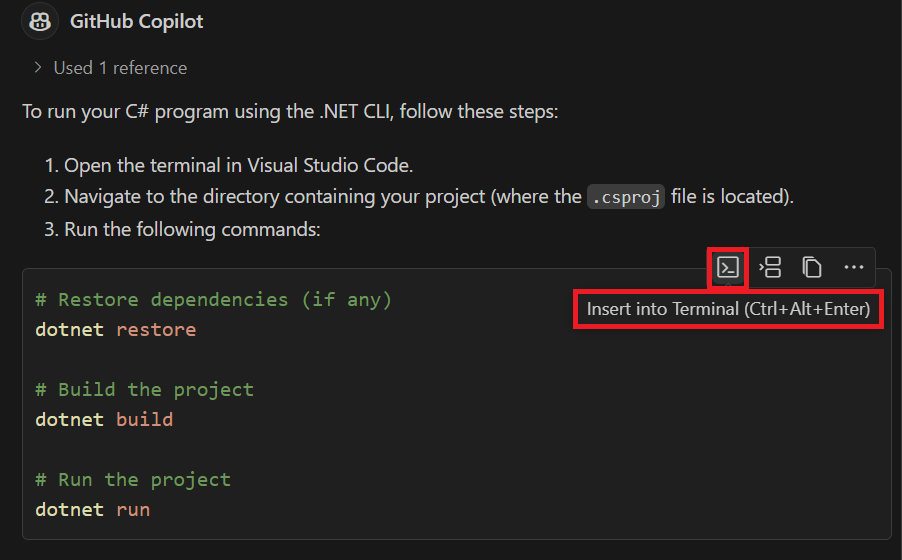

GitHub Copilot is built into Visual Studio Code, bringing AI-powered assistance directly into your development environment. GitHub Copilot increases developer productivity by generating suggestions that extend or improve your applications. GitHub Copilot provides two main ways to generate code suggestions:

- **Inline suggestions**: GitHub Copilot generates code completion suggestions using the code you enter in the editor or your code comments.
- **Chat interactions**: GitHub Copilot generates code suggestions based on chat interactions or smart actions that act on selected code.

> [!NOTE]
> In this module, you use GitHub Copilot to develop new code features and applications. There are separate modules that cover using GitHub Copilot to create unit tests and using GitHub Copilot to make improvements to existing code.

## GitHub Copilot tools in Visual Studio Code

Visual Studio Code provides easy access to the following GitHub Copilot and GitHub Copilot Chat features:

- **Code line completions**: Use code line completions to write code more efficiently. This includes *ghost text* suggestions at your cursor and *next edit suggestions* (NES) that predict where your next edit will be and what it should be.
- **Inline chat**: Start an inline chat conversation directly from the editor for help while you're coding.
- **Chat view**: Open an AI assistant on the side that can help you at any time. The Chat view uses an agent picker to select how GitHub Copilot operates: **Ask** for conversational help, **Plan** to research and design an implementation plan before writing code, or **Agent** to work autonomously across multiple files.
- **Quick Chat**: Ask a quick question and get back into what you're doing. Use the **Ctrl+Shift+Alt+L** keyboard shortcut to open Quick Chat, or select it from the Chat menu in the Visual Studio Code title bar.
- **Smart actions**: Run smart actions to complete certain tasks without even having to write a prompt.

GitHub Copilot brings the power of AI into the Visual Studio Code environment.

## Generate code using code line completions with GitHub Copilot

GitHub Copilot generates two kinds of inline suggestions as you write code.

**Ghost text suggestions** appear at your cursor position as you type. The code already in your application provides context that GitHub Copilot uses to generate accurate suggestions. For example, suppose you're working on a class that processes customer expenditures. The class uses a list that contains expenditures for all customers. You need to create a method that returns the sum of all expenditures. If you start entering the method signature, GitHub Copilot generates a suggestion that completes the code line.



If you're satisfied with the suggestion, press the Tab key or select **Accept**. Autocompletions save you time and help you to write code accurately by supplying the names of variables and other code elements.

You can also use code line completions to view different options for constructing your code. For example, if you start typing the call statement for a method, GitHub Copilot provides suggestions that implement the various method overloads. You can cycle through the suggestions and accept the option that matches your intent. You could also reject all of the suggestions. This process helps you to quickly explore different coding styles and techniques.

GitHub Copilot also generates code line completion suggestions from code comments. For example, if you type a comment that describes a method you want to create, GitHub Copilot generates a suggestion for the method signature and implementation.



Notice that the suggested code completion uses information from your existing code and the code comment that describes the method.

Developers use ghost text completions to accelerate the development of an initial code structure.

**Next edit suggestions (NES)** take inline suggestions further by predicting not just what comes next, but *where* your next edit needs to happen — even if it's elsewhere in the file. When you rename a variable, change a data type, or fix a logic error, NES suggests the follow-on edits that need to be made to keep your code consistent. A gutter arrow in the editor indicates that a suggestion is available. Press **Tab** to navigate to it, then press **Tab** again to accept it. You'll explore both ghost text completions and next edit suggestions in detail in the next unit.

## Generate code using GitHub Copilot Chat

GitHub Copilot Chat helps you create code using chat interfaces and smart actions. For example, if you enter a prompt asking GitHub Copilot Chat to create a new method, GitHub Copilot provides suggestions for one or more method signatures and implementations. Reviewing, and then accepting or discarding the suggestions helps you create an initial version of your code more quickly and accurately.

> [!NOTE]
> GitHub Copilot in Visual Studio Code includes a chat interface that processes user input. This training uses the terms *question* and *prompt* when referring to the input you provide during a chat session.

GitHub Copilot Chat is especially helpful when you need to develop code that implements unfamiliar resources, such as a new library, framework, or API. When you submit a prompt that describes your requirement, GitHub Copilot Chat generates suggestions that demonstrate how to achieve your goal. Reviewing the suggestions can also teach you how to implement the new resources.

Providing GitHub Copilot Chat with prompts or questions that include a clear scope and intent improves the generated responses. You can ask questions that provide context and describe your requirements in a conversational style. GitHub Copilot Chat uses the information you provide to generate code suggestions that meet your needs and match your coding style.

You can use chat participants, slash commands, and chat variables to clarify the context of your prompts.

- Chat participants, such as `@terminal`, help GitHub Copilot Chat understand the context of your question.
- Slash commands, such as `/explain` or `/new`, help GitHub Copilot Chat understand the intent or purpose of your question.
- Chat variables, such as `#file` or `#editor`, help Copilot Chat focus on something specific when considering the larger context of your question.

Using these specialized descriptors helps GitHub Copilot Chat generate more accurate and useful responses.

You can use slash commands to perform specific actions in Copilot Chat. For example, you could scaffold a new C# console application by using the following prompt:

```text
/new console application in C#
```

This prompt uses a slash command (/new) to help GitHub Copilot Chat perform the intended task.

GitHub Copilot can scaffold more complex projects. For example, the following prompt creates a workspace for a Node.js application that uses the Express framework, the Pug template engine, and TypeScript:

```text
/new Node.js Express Pug TypeScript
```

### Generate code with GitHub Copilot Chat using the Chat view

The Chat view in Visual Studio Code provides access to an AI assistant that helps you develop code. You can ask questions and get help from your AI assistant without leaving the Visual Studio Code environment. The Chat view provides assistance when you're developing code and when you're exploring approaches to solving difficult coding problems. You can also use the Chat view to ask questions about existing code, to get help with errors or coding logic, and to get information about using project resources. The Chat view can help you learn new coding techniques, explore different coding styles, and improve your coding skills.

The Chat view opens in its own panel to the right of Visual Studio Code's code editor. To open the Chat view, select **Chat** from the Visual Studio Code title bar or use the **Ctrl+Alt+I** keyboard shortcut.

If you need more screen space in Visual Studio Code, you can open the Chat view in a separate window by selecting **Move Chat into Editor Area** or **Move Chat into New Window** from the Chat view's context menu.



GitHub Copilot Chat provides rich and interactive results that include the following elements:

- Simple text. For example, to provide a natural language response to a question.
- Images. For example, to show a diagram or a screenshot.
- Buttons. For example, to trigger an action.
- References. For example, Uniform Resource Identifiers (URIs) where you can find more information.
- File trees. For example, to show a workspace preview when a chat participant proposes to create a new workspace.

The following example shows the response for a prompt that's used to create an Express app. GitHub Copilot Chat provides a simple text explanation, a tree view showing a suggested workspace structure, and a button that can be used to create the new workspace.



GitHub Copilot maintains a history of your conversation. The history is used to improve the responses and follow-up questions suggested by GitHub Copilot Chat.

#### Manage code blocks in the Chat view

Depending on your question, GitHub Copilot Chat may return source code in the response. Source code is displayed as a code block, and you can manage the code in a few different ways.

If you hover the mouse pointer over the code block, options for managing the code block are displayed. Your initial options are **Apply in Editor**, **Insert At Cursor (Ctrl+Enter)**, and **Copy**. The following image shows the Copy option selected.



The More Actions (...) button displays the options to **Insert into Terminal (Ctrl+Alt+Enter)** and **Insert into New File**.

If GitHub Copilot Chat detects that a code block contains a command, you can run it directly in the integrated terminal with **Insert into Terminal (Ctrl+Alt+Enter)**. This option creates or opens the active terminal and inserts the command text, ready for you to run.



### Generate code with GitHub Copilot Chat using inline chat

The inline chat interface provides access to powerful AI features while keeping you focused on your code. When you're working in the code editor, you can open the inline chat by pressing **Ctrl+I** on the keyboard.

You can use inline chat in the following ways:

- To ask questions about existing code.
- To modify or replace existing code.
- To generate new code.

#### Create a new feature using inline chat

The inline chat interface can be used to develop new code features. For example, you can use inline chat to create a new user interface component, a new API endpoint, or a new data processing pipeline.

To create a new code feature using inline chat:

1. Position your cursor in the editor where you want to insert the new code.

1. Open inline chat by pressing **Ctrl+I** on the keyboard.

1. Enter a prompt that describes the feature you want to create. For example:

    ```plaintext
    Create a method that reads a list of sales records and calculates the total revenue by product category.
    ```

1. Review the suggestion and refine your prompt if the result doesn't match your intent.

1. Select **Accept** to apply the suggestion.

#### Create regular expressions using inline chat

Regular expressions are patterns used to match character combinations in strings. Some developers find regular expressions challenging to write because they can be complex and difficult to understand.

The inline chat interface can be used to generate regular expressions quickly and accurately. For example, you can use inline chat to generate regular expressions for validating email addresses, phone numbers, postal codes, and other data patterns.

To create a regular expression using inline chat:

1. Select the code in the editor where you want to add the validation.

1. Open inline chat by pressing **Ctrl+I** on the keyboard.

1. Enter a prompt that describes the data pattern you need to validate. For example:

    ```plaintext
    I want to create a regular expression to validate email addresses.
    ```

1. Review the suggestion and select **Accept** once you're satisfied.

## Summary

GitHub Copilot helps developers write code faster and with fewer errors. It generates inline code completion suggestions using the code you enter in the editor or your code comments, and generates code suggestions based on chat interactions or smart actions that act on selected code.
