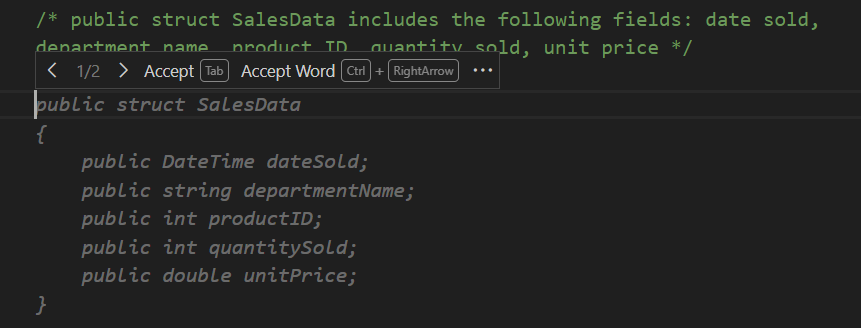
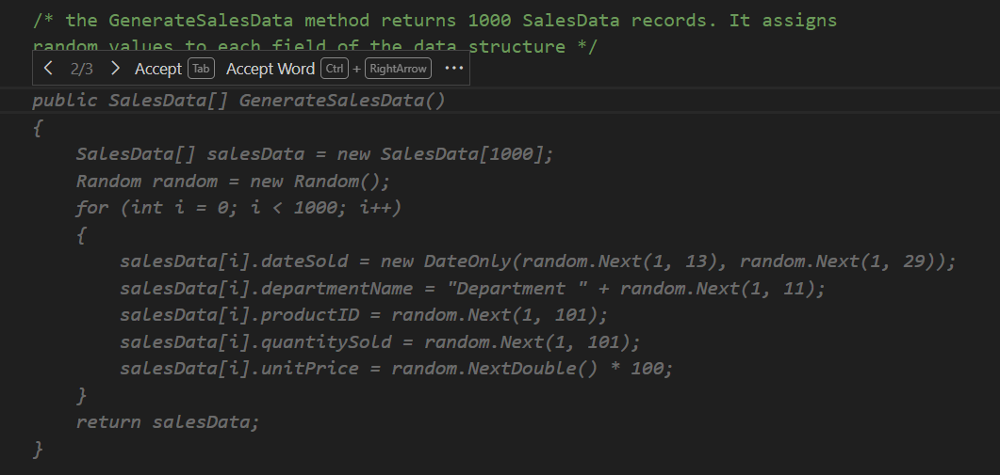
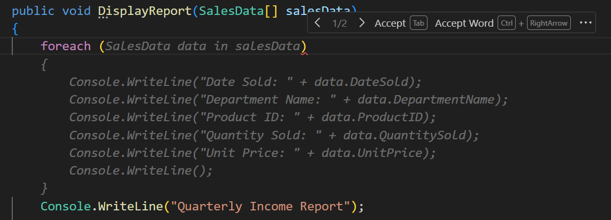
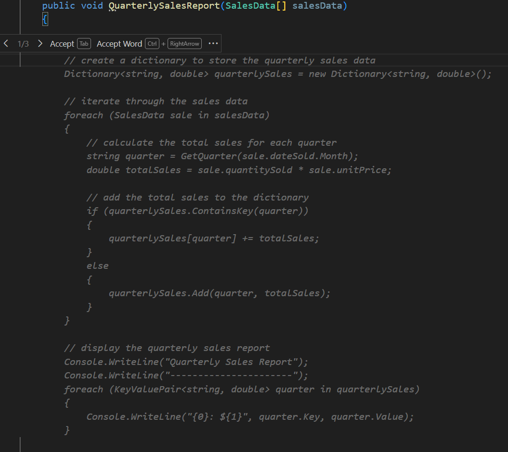

GitHub Copilot can provide code completion suggestions for numerous programming languages and a wide variety of frameworks, but works especially well for Python, JavaScript, TypeScript, Ruby, Go, C# and C++. Code line completions are generated based on the context of the code you're writing. You can accept, reject, or partially accept the suggestions provided by GitHub Copilot.

GitHub Copilot provides two ways to generate code line completions:

- **From a comment**: You can generate code line completions by writing a comment that describes the code you want to generate. GitHub Copilot provides code completion suggestions based on the comment you write.

- **From code**: You can generate code line completions by starting a code line, or by pressing Enter after a completed code line. GitHub Copilot provides code completion suggestions based on the code you write.

In this exercise, you use GitHub Copilot to generate code line completions in your Visual Studio Code environment.

> [!IMPORTANT]
> This module includes practice activities that use Visual Studio Code, the C# Dev Kit extension, and the two GitHub Copilot extensions. A GitHub account with an active subscription for GitHub Copilot are required. If you have not already installed Visual Studio Code and the required extensions, complete those installations before continuing.

### Prepare a sample app in your Visual Studio Code environment

1. Open Visual Studio Code, and then open the Chat view by selecting the Chat icon in the Activity Bar.

1. In the Chat view, enter the following prompt: `@workspace /new console application in C# NET8 named APL2007M3. Only .cs and .csproj files. Enable ImplicitUsings and Nullable`.

    GitHub Copilot uses this prompt to create a new C# console application named `APL2007M3`. The workspace includes `.cs` and `.csproj` files. The `.csproj` file specifies `.net8.0` as the target framework and the `ImplicitUsings` and `Nullable` features are enabled.

1. In the Chat view, select **Create Workspace**.

    You're prompted to select a parent folder for the workspace. Selecting the Desktop folder is a good choice for this exercise. The Desktop folder is easy to find and clean up once you have completed this training module.

1. In the Select Folder dialog, navigate to your Desktop folder, select **Desktop**, and then select **Select as Parent Folder**.

    After GitHub Copilot creates the application files, it opens your new application folder in the Explorer view.

1. In the Explorer view, select **Program.cs**.

1. Replace the contents of the Program.cs file with the following code:

    ```C#
    namespace ReportGenerator
    {
        class QuarterlyIncomeReport
        {
            static void Main(string[] args)
            {
                // create a new instance of the class
                QuarterlyIncomeReport report = new QuarterlyIncomeReport();

                // call the GenerateSalesData method

                // call the QuarterlySalesReport method
                
            }

            public void QuarterlySalesReport()
            {

                Console.WriteLine("Quarterly Sales Report");
            }
        }    
    }
    ```

That completes the setup requirements. You're ready to begin the exercise on code line completions using GitHub Copilot.

### Use GitHub Copilot to generate code line completions from a comment

To generate code completion suggestions from code comments, write a comment that describes the code you want to generate. GitHub Copilot generates code completion suggestions based on the comment and the existing context of your app. You can use comments to describe code snippets, methods, data structures, and other code elements.

1. In the **Program.cs** file, create a blank code line below the `Main` method.

1. To create a data structure that can be used to generate test data, create the following code comment, and then press Enter:

    ```C#
    /* public struct SalesData includes the following fields: date sold, department name, product ID, quantity sold, unit price */
    ```

    GitHub Copilot generates one or more code completion suggestions based on your code comment and any existing code that it finds in your app.

1. Take a minute to review the code completion suggestions provided by GitHub Copilot.

    Notice the data types used to declare the fields of the data structure. GitHub Copilot selects data types and variable names based on your existing code and the code comment. In this case it tries to anticipate your requirements. You can adjust the data types later to match the requirements of your application if needed.

    

    When GitHub Copilot generates more than one suggestion, you can cycle through the suggestions by selecting the left or right arrows (`>` or `<`) located to the left of the Accept button.

1. To accept a suggested code completion, either press the Tab key or select **Accept**.

    If GitHub Copilot generates suggestions that you don't want, you can press the Esc key to dismiss the suggestions.

    > [!NOTE]
    > GitHub Copilot can occasionally propose a suggestion in stages. If this happens, you can press Enter to see additional stages of the suggestion after the Tab key.

1. To modify the field data types, update your code as follows:

    ```C#
    public struct SalesData
    {
        public DateOnly dateSold;
        public string departmentName;
        public int productID;
        public int quantitySold;
        public double unitPrice;
    }
    ```

1. Create a blank code line below the `SalesData` data structure.

1. To create a method that generates test data using the `SalesData` data structure, write the following code comment and then press Enter:

    ```C#
    /* the GenerateSalesData method returns 1000 SalesData records. It assigns random values to each field of the data structure */
    ```

1. Take a minute to review the code completion suggestions provided by GitHub Copilot.

    

    Notice that the `GenerateSalesData` method is designed to return an array of `SalesData` objects. The method generates 1000 records of test data, with random values assigned to each field of the `SalesData` data structure.

    You may have also noticed that the code completion suggestion shown above includes a syntax error in the code used to generate the `DateSold` field (`DateOnly` accepts three integer values in the order: **Year**, **Month**, **Day**). You fix this issue after accepting the code completion.

1. To accept the code completion suggested, press the Tab key.

1. To specify a single year for the code used to generate the `DateSold` field, update the code line as follows:

    ```C#
    salesData[i].DateSold = new DateOnly(2023, random.Next(1, 13), random.Next(1, 29));
    ```

The ability to generate code from code comments is a powerful feature of GitHub Copilot. With just two comments, you were able to generate a data structure and a method that generates test data. Next, you'll use GitHub Copilot to generate code line completions based on the code you write in your app.

### Use GitHub Copilot to generate code line completions

GitHub Copilot can generate code line completions based on the code you enter. You can generate code line completions in two ways:

- Start entering a code line, and then wait for GitHub Copilot to suggest an autocompletion for your unfinished code line.
- Enter a complete code line, press the **Enter** key, and then wait for GitHub Copilot to suggest an autocompletion for the next code line or code snippet.

> [!NOTE]
> GitHub Copilot generates suggested code completions based on the code you enter and the context defined by the code within your app. The more code you have in your app, assuming it's good quality code, the more context GitHub Copilot has available. As the volume and quality of existing code increases, so does the quality and reliability of the code line completions suggested by GitHub Copilot. GitHub Copilot is very good at generating code line completions for common programming tasks and patterns, especially when a sequence of related components needs to be generated.

You've already made a good start on the `QuarterlyIncomeReport` class. Now it's time for you to start working on the `QuarterlySalesReport` method.

Here are the tasks that you to complete:

- Update the method constructor with a parameter that accepts your collection of `SalesData` objects.
- Use GitHub Copilot to generate code line completions that process sales data for the quarterly report.
- Run the app and observe the quarterly income report that's generated.

1. Update the method constructor for `QuarterlySalesReport` as follows:

    ```C#
    public void QuarterlySalesReport(SalesData[] salesData)
    ```

1. Take a minute to consider the code that you need to develop.

    The concept is straight forward. You want your code to calculate quarterly sales based on your sales data and then write a report. To do that, your code needs to:

    - iterate through the `salesData` collection.
    - calculate the value of each sale based on the quantity sold and the unit price.
    - use the sales date to determine which quarter a sale belongs to.
    - sum the sales for each quarter.
    - write a report of the sales by quarter.

    One option is to begin entering the code for a `foreach` loop and then see what GitHub Copilot suggests.

1. Inside the code block of the `QuarterlySalesReport` method, create a blank code line above the existing `Console.WriteLine` statement.

1. To generate a code line completion, type `foreach (` and then wait for GitHub Copilot to suggest code line completion options.

1. Review the code completion suggested by GitHub Copilot.

    

    Something has gone wrong. The suggested code completions aren't even close to what you want.

    Although GitHub Copilot suggests a `foreach` loop that iterates through the `salesData`, there's no analysis or calculations inside the loop. Both of the suggested options include `Console.WriteLine` statements that you don't want or need.

1. Take a minute to consider why GitHub Copilot is suggesting `Console.WriteLine` statements.

    Recall that GitHub Copilot generates code completion suggestions based on the context of your code. In this case, you don't really have much code for GitHub Copilot to consider. And it gets worse.

    The code that GitHub Copilot does see inside your method is a `Console.WriteLine` statement (it must have been left there by another developer). With no other context available within the method and not other similar methods to draw from, GitHub Copilot concludes that you may want `Console.WriteLine` statements inside the `foreach` loop.

    GitHub Copilot works best when your code is clean and focused. If you see superfluous code comments or even statements in your code, you may want to remove them before you try using GitHub Copilot code completions.

1. To clean up your code before giving GitHub Copilot another try, complete the following steps:

    - Cancel the suggested `foreach (` code completion.
    - Delete the partial `foreach (` statement that you entered.
    - Delete the `Console.WriteLine` statement from your `QuarterlySalesReport` method.

    Now you should be ready to try GitHub Copilot again.

1. Ensure that your `QuarterlySalesReport` method looks similar to the following code:

    ```C#
    public void QuarterlySalesReport(SalesData[] salesData)
    {


    }
    ```

1. Position the cursor on a blank code line inside the `QuarterlySalesReport` method, and then press Enter.

    It may take a moment for GitHub Copilot to generate the suggested code completion.

1. Take a minute to review the suggested code completions.

    > [!IMPORTANT]
    > The code completions that you receive are likely to be different from the suggestions shown in the following screenshot. Although GitHub Copilot only has a method name and parameter to work with, that may be enough to generate useful suggestions. You should see suggestions that calculate sales by quarter. Rejecting the suggestions and trying again can provide different results.

    

    You can cycle through the suggestions by selecting `>` or `<`>.

    Notice that the suggested code completion iterates through the sales data and performs quarterly sales calculations.

1. To accept the code completion suggested, press the Tab key.

    The suggested code completion calculates and displays the quarterly income based on sales data.

    ```csharp
    // create a dictionary to store the quarterly sales data
    Dictionary<string, double> quarterlySales = new Dictionary<string, double>();

    // iterate through the sales data
    foreach (SalesData data in salesData)
    {
        // calculate the total sales for each quarter
        string quarter = GetQuarter(data.dateSold.Month);
        double totalSales = data.quantitySold * data.unitPrice;

        if (quarterlySales.ContainsKey(quarter))
        {
            quarterlySales[quarter] += totalSales;
        }
        else
        {
            quarterlySales.Add(quarter, totalSales);
        }
    }

    // display the quarterly sales report
    Console.WriteLine("Quarterly Sales Report");
    Console.WriteLine("----------------------");
    foreach (KeyValuePair<string, double> quarter in quarterlySales)
    {
        Console.WriteLine("{0}: ${1}", quarter.Key, quarter.Value);
    }

    ```

1. Notice that the `GetQuarter` method is used to determine the quarter based on the month of the sale.

    This method isn't yet implemented in your code. You need to implement this method to complete the report generation logic.

1. Create a blank code line below the `QuarterlySalesReport` method.

1. Notice that GitHub Copilot suggests a code completion for the `GetQuarter` method.

    With the context provided by the `QuarterlySalesReport` method, GitHub Copilot can easily generate a code completion for the `GetQuarter` method that determines the quarter based on the month of the sale.

1. Take a minute to review the suggested code line completion for the `GetQuarter` method.

    

1. To accept the code completion suggested, press the Tab key.

    ```csharp
    public string GetQuarter(int month)
    {
        if (month >= 1 && month <= 3)
        {
            return "Q1";
        }
        else if (month >= 4 && month <= 6)
        {
            return "Q2";
        }
        else if (month >= 7 && month <= 9)
        {
            return "Q3";
        }
        else
        {
            return "Q4";
        }
    }
    ```

1. Notice that the `Main` method needs to be completed before you can run the code.

    You can use the comments in the `Main` method to update your code.

1. Position the cursor at the end of the `// call the GenerateSalesData method` code comment, and then press Enter.

    GitHub Copilot uses the comment to propose a calling statement for the method.

1. Review and then accept the code completion suggested by GitHub Copilot.

1. Repeat the process for the `// call the QuarterlySalesReport method` code comment.

1. Your `Main` method shouldn't contain the following code:

    ```C#
    static void Main(string[] args)
    {
        // create a new instance of the class
        QuarterlyIncomeReport report = new QuarterlyIncomeReport();

        // call the GenerateSalesData method
        SalesData[] salesData = report.GenerateSalesData();

        // call the DisplayReport method
        report.QuarterlySalesReport(salesData);
    }

    ```

1. Take a minute to review the code in your `QuarterlyIncomeReport` class.

    ```C#
    using System;
    using System.Collections.Generic;
    using System.Linq;
    using System.Text;
    using System.Threading.Tasks;
    
    namespace ReportGenerator
    {
        class QuarterlyIncomeReport
        {
            static void Main(string[] args)
            {
                // create a new instance of the class
                QuarterlyIncomeReport report = new QuarterlyIncomeReport();
    
                // call the GenerateSalesData method
                SalesData[] salesData = report.GenerateSalesData();
    
                // call the DisplayReport method
                report.QuarterlySalesReport(salesData);
            }
    
            /* public struct SalesData includes the following fields: date sold, department name, product ID, quantity sold, unit price */
            public struct SalesData
            {
                public DateOnly dateSold;
                public string departmentName;
                public int productID;
                public int quantitySold;
                public double unitPrice;
            }
    
            /* the GenerateSalesData method returns 1000 SalesData records. It assigns random values to each field of the data structure */
            public SalesData[] GenerateSalesData()
            {
                SalesData[] salesData = new SalesData[1000];
                Random random = new Random();
    
                for (int i = 0; i < 1000; i++)
                {
                    salesData[i].dateSold = new DateOnly(2023, random.Next(1, 13), random.Next(1, 29));
                    salesData[i].departmentName = "Department " + random.Next(1, 11);
                    salesData[i].productID = random.Next(1, 101);
                    salesData[i].quantitySold = random.Next(1, 101);
                    salesData[i].unitPrice = random.Next(1, 101) + random.NextDouble();
                }
    
                return salesData;
            }
    
            public void QuarterlySalesReport(SalesData[] salesData)
            {
                // create a dictionary to store the quarterly sales data
                Dictionary<string, double> quarterlySales = new Dictionary<string, double>();
    
                // iterate through the sales data
                foreach (SalesData data in salesData)
                {
                    // calculate the total sales for each quarter
                    string quarter = GetQuarter(data.dateSold.Month);
                    double totalSales = data.quantitySold * data.unitPrice;
    
                    if (quarterlySales.ContainsKey(quarter))
                    {
                        quarterlySales[quarter] += totalSales;
                    }
                    else
                    {
                        quarterlySales.Add(quarter, totalSales);
                    }
                }
    
                // display the quarterly sales report
                Console.WriteLine("Quarterly Sales Report");
                Console.WriteLine("----------------------");
                foreach (KeyValuePair<string, double> quarter in quarterlySales)
                {
                    Console.WriteLine("{0}: ${1}", quarter.Key, quarter.Value);
                }
            }
    
            public string GetQuarter(int month)
            {
                if (month >= 1 && month <= 3)
                {
                    return "Q1";
                }
                else if (month >= 4 && month <= 6)
                {
                    return "Q2";
                }
                else if (month >= 7 && month <= 9)
                {
                    return "Q3";
                }
                else
                {
                    return "Q4";
                }
            }
        }
    }
    
    ```

    Remember that this code was created, almost entirely, using code line completions generated by GitHub Copilot. You can now run the app and review the quarterly income report.

1. To review the report output, run the app.

    Open a Terminal window in Visual Studio Code, and then enter the following command:

    ```bash
    dotnet run
    ```

    The output should display the quarterly income report, showing the department name, quarter, and income for each department and quarter represented in the test data.

1. Review the output in the Terminal window.

    You should see output similar to the following output:

    ```output

    Quarterly Sales Report
    ----------------------
    Q3: $635637.5019563352
    Q4: $672247.315297204
    Q2: $667269.194630603
    Q1: $642769.2700531208

    ```

    There's still some work required to complete the `QuarterlyIncomeReport` class. In the next unit, you use GitHub Copilot Chat to extend and update your app.

In this exercise, you used GitHub Copilot to generate code line completions in your Visual Studio Code environment. You used code comments to generate a data structure and a method that generates test data. You also used code line completions to generate the code that processes sales data for a quarterly income report.
