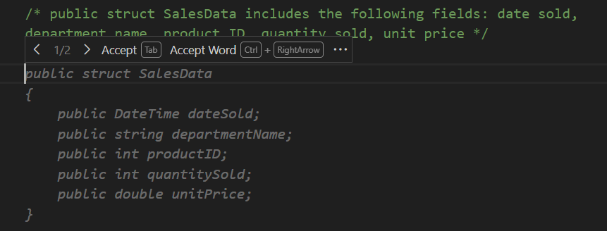

GitHub Copilot can provide code completion suggestions for numerous programming languages and a wide variety of frameworks, but works especially well for Python, JavaScript, TypeScript, Ruby, Go, C# and C++. Code line completions are generated based on the context of the code you're writing. You can accept, reject, or partially accept the suggestions provided by GitHub Copilot.

GitHub Copilot provides two ways to generate code line completions:

- **From a comment**: You can generate code line completions by writing a comment that describes the code you want to generate. GitHub Copilot provides code completion suggestions based on the comment you write.

- **From code**: You can generate code line completions by starting a code line, or by pressing Enter after a completed code line. GitHub Copilot provides code completion suggestions based on the code you write.

## Use GitHub Copilot to generate code line completions from a comment

GitHub Copilot generates code completion suggestions based on the comment and the existing context of your app.

You can use comments to describe code snippets, methods, data structures, and other code elements.

Suppose you have the following code snippet:

```C#

namespace ReportGenerator;

class QuarterlyIncomeReport
{
    static void Main(string[] args)
    {
        // create a new instance of the class
        QuarterlyIncomeReport report = new QuarterlyIncomeReport();

        // call the GenerateSalesData method

        // call the QuarterlySalesReport method
        
    }

    public void QuarterlySalesReport()
    {

        Console.WriteLine("Quarterly Sales Report");
    }
}    

```

For example, the following comment could be used to create a data structure:

```C#

/* public struct SalesData. Include the following fields: date sold, department name, product ID, quantity sold, unit price */

```

GitHub Copilot generates one or more code completion suggestions based on your code comment and the code files that are open in the editor.



Notice the data types used to declare the fields of the data structure. GitHub Copilot selects data types and variable names based on your existing code and the code comment. GitHub Copilot tries to determine how the application uses variables and defines the data types accordingly.

When GitHub Copilot generates more than one suggestion, you can cycle through the suggestions by selecting the left or right arrows (`>` or `<`) located to the left of the **Accept** button. This allows you to review and select the suggestion that best fits your needs.

It's okay to accept a code completion suggestion that isn't an exact match for what you want. However, the changes required to "fix" the suggestion should be clear. In this case, some of the data types aren't what you want, but you can adjust them after accepting the suggested autocompletion.

If none of the suggested options resemble what you need, there are two things you can try. To open a new editor tab containing a list of other suggestions, press the **Ctrl** + **Enter** keys. This hotkey combination opens a new tab containing up to 10 more suggestions. Each suggestion is followed by a button that you can use to accept the suggestion. The tab closes automatically after you accept a suggestion. Your other option is to press the **Esc** key to dismiss the suggestions and try again. You can adjust the code comment to provide more context for GitHub Copilot to work with.

> [!NOTE]
> GitHub Copilot can occasionally propose a suggestion in stages. If this happens, you can press Enter to see additional stages of the suggestion after pressing the Tab key.

To accept a suggested data structure, press the Tab key or select **Accept**.

To modify the field data types, update your code as follows:

```C#
public struct SalesData
{
    public DateOnly dateSold;
    public string departmentName;
    public int productID;
    public int quantitySold;
    public double unitPrice;
}
```

Making quick adjustments to code completion suggestions helps to ensure that you're building the code you want. It's especially important to make corrections early in your development process when large portions of your codebase still need to be developed. Subsequent code completions are based on the code you've already written, so it's important to ensure that your code is as accurate as possible.

### Use next edit suggestions to follow through code changes

Ghost text completions are great at filling in new code as you write it. But most day-to-day coding involves editing *existing* code — renaming a variable, updating a data type, or fixing a logic error. GitHub Copilot's next edit suggestions (NES) are designed for exactly this scenario.

When you make an edit, NES analyzes the change and predicts both where your *next* edit needs to happen and what that edit should be — even if it's on a different line or in a different part of the file. This keeps you in the flow without having to manually search for every location that requires updates.

To enable next edit suggestions, set the `github.copilot.nextEditSuggestions.enabled` setting to `true` in Visual Studio Code.

Once enabled, you can use NES in the following ways:

1. Make an edit in the editor — for example, rename a variable or change a method signature.

1. Look for the gutter arrow that appears to the left of the editor. The arrow points toward the location of the next suggested edit.

1. Press **Tab** to navigate to the suggested edit location.

1. Press **Tab** again to accept the suggestion, or press **Escape** to dismiss it.

Here are some common scenarios where NES is especially helpful:

- **Rename propagation**: Rename a variable once and NES suggests updating every other reference to it in the file.
- **Type changes**: Change a field's data type and NES suggests updating the downstream code that uses it.
- **Logic corrections**: Fix an inverted condition or a typo in a keyword and NES flags the related code section that requires updates.
- **Refactoring**: After copying-and-pasting a code block, NES suggests how to adapt it to match the surrounding code style.

> [!NOTE]
> Next edit suggestions predict the *most likely* next change based on your current edits. Always review each suggestion before accepting it, as the right fix for your specific scenario may differ.

## Summary

Code line completions are a powerful feature of GitHub Copilot that can help you generate code quickly and efficiently. By using comments to describe the code you want to generate, you can create data structures, methods, and other code elements with minimal effort. Additionally, GitHub Copilot can generate code line completions based on the code you enter, allowing you to build complex applications with ease.
