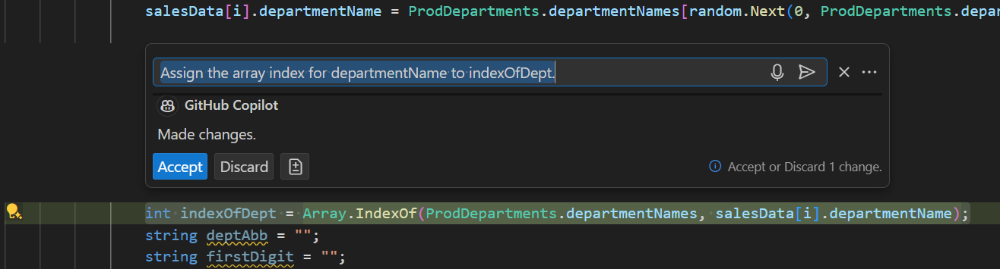
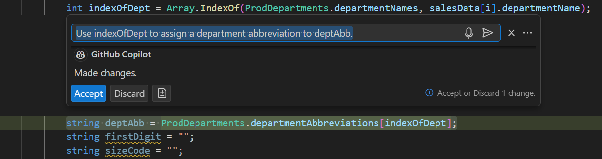
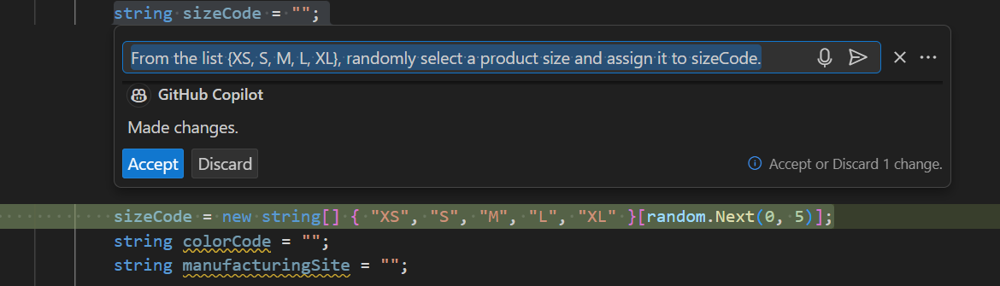
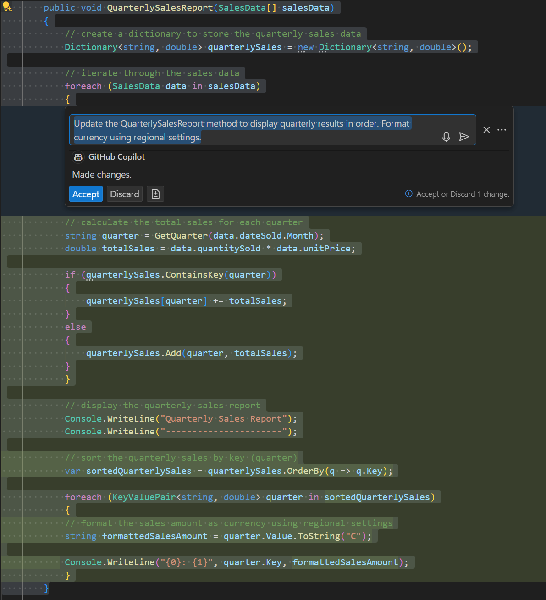
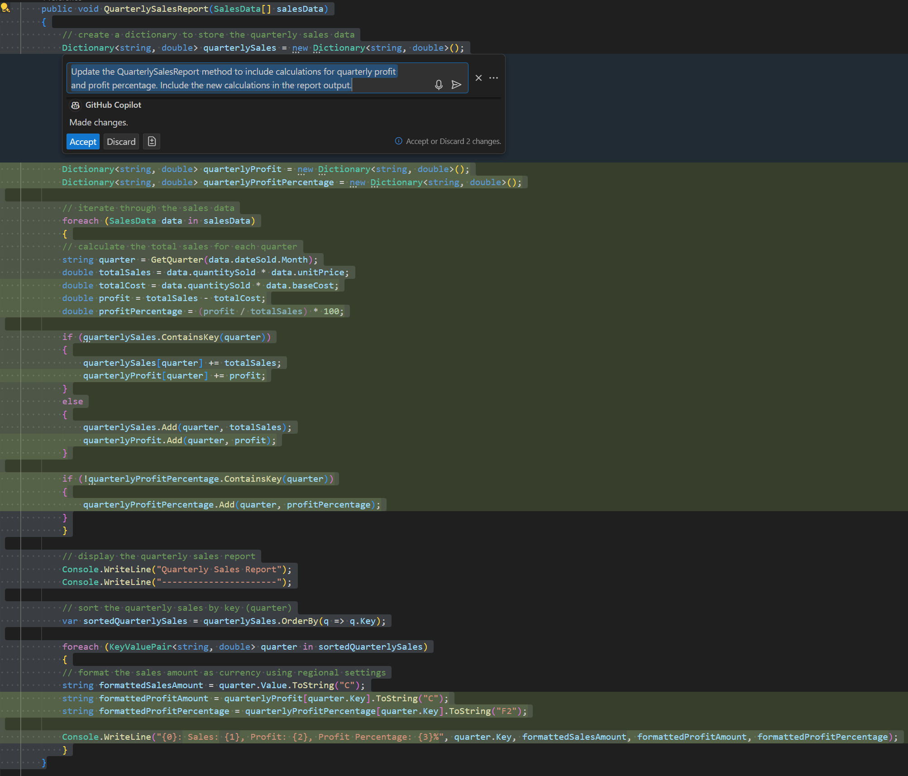
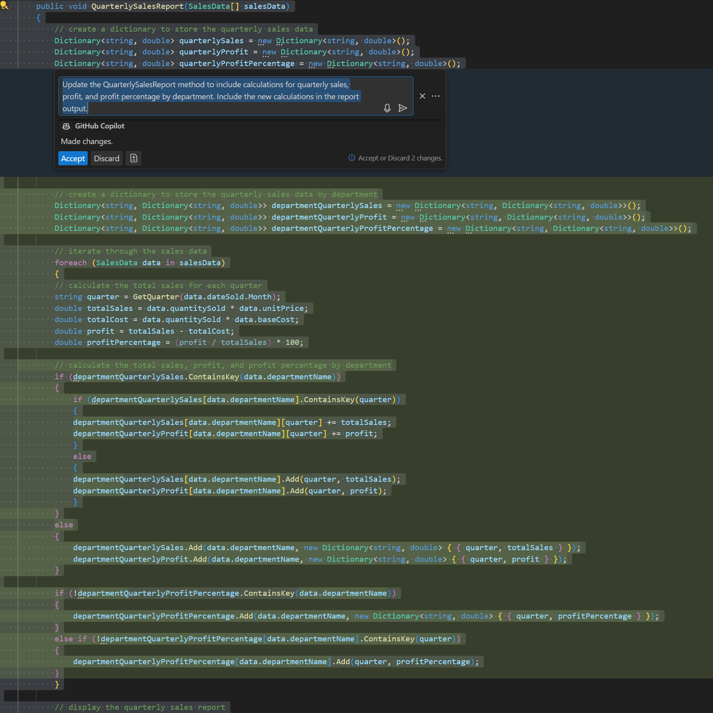
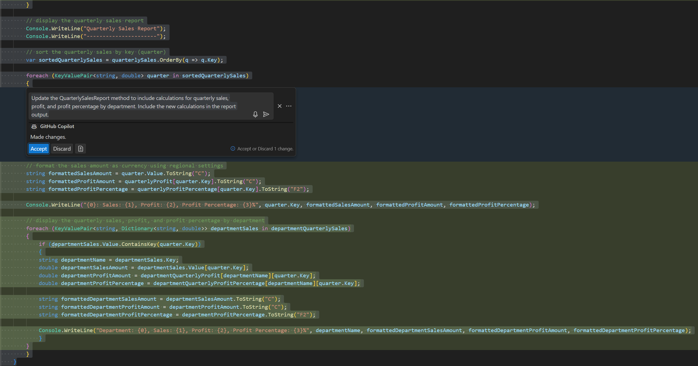

The GitHub Copilot Chat extension for Visual Studio Code includes three chat interfaces:

- The **Chat view** provides an AI assistant that's available to help you at any time.
- A **Quick Chat** window can be used to ask a quick question and then get back into what you're doing.
- The **inline chat** interface opens directly in the editor for contextual interactions while you're coding.

The Chat view and Quick Chat window enable interactive multi-turn conversations with the AI. Both of these interfaces provide a way to ask questions, get help with a coding problem, and generate code. During a conversation, GitHub Copilot responses include natural language text, code blocks, and other elements. When code blocks are provided in a response, you can copy them or inject them directly into your code editor.

The inline chat interface is designed to provide contextual help and code suggestions while you're coding.

In this exercise, you use GitHub Copilot's inline chat feature to update existing code and generate new code features.

### Prepare sample apps in your Visual Studio Code environment

A sample application is used in this exercise to ensure that exercise instructions align to the source code you're working on. The sample app for this exercise represents the code developed during the previous exercise.

To download the sample apps for this module and prepare the sample app for this exercise, complete the following steps:

1. To download a zip file containing the sample apps, select the following link: [SampleApps](https://raw.githubusercontent.com/MicrosoftLearning/APL-2007-Accelerate-app-development-by-using-GitHub-Copilot/master/LearnModuleExercises/Downloads/SampleApps.zip).

1. Unzip the download files.

    Unzip the files in your development environment. Consider using your PC as your development environment so that you have access to your code after completing this module. If you aren't using your PC as your development environment, you can unzip the files in a sandbox or hosted environment.

    1. On your local machine, navigate to your downloads folder.
    1. Right-click **SampleApps.zip**, and then select **Extract all**.
    1. Select **Show extracted files when complete**, and then select **Extract**.
    1. Make note of the extracted folder location.

1. Copy the extracted **SampleApps** folder to your Windows Desktop folder.

    The **SampleApps** folder contains a collection of sample apps, including the **APL2007M3SalesReport-InlineChat** code project that you use in this exercise.

1. Open the **APL2007M3SalesReport-InlineChat** folder in Visual Studio Code.

    1. Open Visual Studio Code on your PC.
    1. In Visual Studio Code, on the **File** menu, select **Open Folder**.
    1. Navigate to the Windows Desktop folder, open the **SampleApps** folder, and locate the **APL2007M3SalesReport-InlineChat** folder.
    1. Select **APL2007M3SalesReport-InlineChat** and then select **Select Folder**.

    The Visual Studio Code EXPLORER view should show a APL2007M3SalesReport-InlineChat code project containing the following files:

    - APL2007M3SalesReport-InlineChat.csproj
    - APL2007M3SalesReport-InlineChat.sln
    - Program.cs

You're now ready to continue this exercise.

### Review the coding tasks and project goals

This exercise focuses on the following tasks:

1. Update the `SalesData` data structure and `GenerateSalesData` method to produce a data sample that resembles "actual" data.

    - dateSold: no changes are required.
    - departmentName: The string values should be randomly selected from a list of 8 departments. For each department name, create a 4-character abbreviation that can be included in the productID.
    - productID: change from `int` to `string` data type. The productID values should be formatted using the pattern "`DDDD-###-SS-CC-MMM`" where the components of the ID are defined as follows:

        - a 4-character code representing the department.
        - a 3-digit number representing the product.
        - a 2-character code representing the product size.
        - a 2-character code representing the product color.
        - a 3-character code representing the manufacturing site (randomly selected from a list of 10 manufacturing sites). The codes should be a 2-letter ISO country code followed by a digit (e.g., US1, CA2, MX3, etc.).

    - quantitySold: no changes are required.
    - unitPrice: Raise the lower bound of the price range to 25 and the upper bound to 300.
    - baseCost: Add a field for the manufacturing cost of the item. The baseCost values should be generated using randomly generated discount off the unitPrice (5 to 20 percent).
    - volumeDiscount: Add a field for a volume discount percentage. The value assigned to volumeDiscount should be the integer component of 10 percent of the quantitySold (10% of 19 units = 1% volumeDiscount).
    - Increase the number of records generated to 10,000.

1. Update the `QuarterlySalesReport` method as follows:

    1. When displaying the sales results, list the results in a logical order. For example, when listing total sale by quarter, the quarters should be listed in order from Q1 to Q4.
    1. Display currency values using regional settings.
    1. Include calculations for quarterly profit and profit percentage
    1. Include calculations for quarterly sales, profit, and profit percentage by department.

### Consider your approach to developing prompts for GitHub Copilot Chat

GitHub Copilot's inline chat feature uses the prompt you submit to understand the task or problem you're trying to solve. The prompts should be specific and concise. Good prompts produce better responses.

When you develop prompts for GitHub Copilot, consider the following best practices:

- Be specific and keep it simple: Provide clear and concise prompts that describe the task or problem you're trying to solve. Avoid using complex language or jargon that could confuse the AI.
- Use natural language: Write prompts in a conversational tone. Use natural language that you would use when talking to a colleague or team member.
- Break down complex tasks: If the task is complex, break it down into smaller steps. Provide prompts for each step to help GitHub Copilot generate the correct code.
- Provide context: Include relevant information that helps GitHub Copilot understand the task or problem you're trying to solve. Include details about the data, variables, or code blocks that are relevant to the prompt.
- Use chat participants, slash commands, and chat variables: GitHub Copilot's inline chat feature supports chat participants, slash commands, and chat variables. Use these features to interact with GitHub Copilot and provide additional context for your prompts.

### Generate data structures using inline chat

Projects generally begin with the features or parameters that are either fixed or known. Selecting a data source or creating sample data is often a good place to start.

In this exercise, you use data structures to help you create simulated sales data. The data provides useful context for GitHub Copilot when you update the `QuarterlySalesReport` method.

> [!NOTE]
> In an actual business project, you'd probably use historical data rather generating simulated data. In this training, generating simulated data provides an opportunity to practice using the GitHub Copilot tools. Simulating data isn't suggested as a best practice for business projects.

Your project goals indicate that you need to work on the following data structures:

- You need a list of 8 department names. Each department name should be abbreviated using a 4-character string. Pick an industry for your fictional company such as Clothing or Sports Equipment, and then have GitHub Copilot generate a dictionary of department names and 4-char codes.
- You need a list of 10 manufacturing sites. Each site should be represented by a 3-character code. The codes can be a 2-letter ISO country code followed by a digit (e.g., US1, CA2, MX3, etc.). Have GitHub Copilot generate a dictionary of 10 manufacturing sites using 3-4 country codes.
- You need to update the `SalesData` data structure. You need to include the new fields for: department code, manufacturing site code. You also need to change the data type for productID from `int` to `string`.

To create and update the data structure, complete the following steps:

1. Locate the SampleApps folder that contains the sample apps for this training.

1. Open the **APL2007M3SalesReport-InlineChat** project folder in Visual Studio Code.

1. Ensure that the application runs and produces a report that resembles the following output:

    ```plaintext
    Quarterly Sales Report
    ----------------------
    Q3: $690095.7142725277
    Q4: $600536.3320750712
    Q2: $678194.7943550209
    Q1: $595963.0477790226
    ```

    Since the data is randomly generated, the numeric values will vary with each run.

1. Open the Program.cs file.

1. Position the cursor on a blank line below the `SalesData` data structure.

1. To open the inline chat interface, press **Ctrl** + **I** on the keyboard.

1. Enter the following prompt:

    ```output
    I need a public struct ProdDepartments that contains a static string array for 8 clothing industry departments. Create separate string array containing 4-character abbreviations for each department name. The abbreviation must be unique. The department names should represent real department names for the clothing industry.
    ```

    If you had a specific list of field names, you could provide them in the prompt. For example, actual company data could be used to specify the department names.

1. Review the suggestions provided by GitHub Copilot.

    As long as the prompt is clear and specific, GitHub Copilot should provide a useful suggestion. If the suggestion isn't what you expected, you can reject it and try again. In this case, the names of the departments aren't important, so you can probably accept the suggestion.

    Your data structure should resemble the following code:

    ```csharp
    public struct ProdDepartments
    {
        public static string[] DepartmentNames = { "Men's Clothing", "Women's Clothing", "Children's Clothing", "Accessories", "Footwear", "Outerwear", "Sportswear", "Undergarments" };
        public static string[] DepartmentAbbreviations = { "MENS", "WOMN", "CHLD", "ACCS", "FOOT", "OUTR", "SPRT", "UNDR" };
    }
    ```

1. To accept the suggestion, press the tab key or select **Accept**.

    You can also use the inline chat feature to document the new code. Select the code, press **Ctrl** + **I** to open inline chat, enter `/doc`, review the suggested inline documentation, and then accept the update.

1. Position the cursor on a blank line below the `ProdDepartments` data structure.

1. To open the inline chat interface, press **Ctrl** + **I** on the keyboard.

1. Enter the following prompt:

    ```output
    I need a public struct ManufacturingSites that contains a static string array for 10 manSites. Manufacturing sites should be represented by a 3-character code that includes a 2-letter ISO country code followed by a digit. Use 3 ISO country codes.
    ```

    If you had a specific list of field names, you could provide them in the prompt. For example, actual company data could be used to specify the field names.

1. Review the suggestions provided by GitHub Copilot.

    Your data structures should resemble the following code:

    ```csharp
    public struct ManufacturingSites
    {
        public static string[] manSites = { "US1", "US2", "US3", "UK1", "UK2", "UK3", "JP1", "JP2", "JP3", "CA1" };
    }
    ```

1. To accept the suggestion, press the tab key or select **Accept**.

1. Select the `SalesData` data structure, and then press **Ctrl** + **I** to open the inline chat interface.

    You need to add fields for `baseCost` and `volumeDiscount` to the `SalesData` data structure (a `double` and an `int`). You also need to change the data type for `productID` from `int` to `string`.

1. Enter the following prompt:

    ```output
    add double field baseCost and int field volumeDiscount to SalesData. Change productID from int to string.
    ```

    In practice, it may be easier to make these changes manually. However, using GitHub Copilot can help you learn how to structure your prompts for better results.

1. Review the suggestions provided by GitHub Copilot and then select **Accept**.

    Your updated SalesData data structures should resemble the following code:

    ```csharp
    public struct SalesData
    {
        public DateOnly dateSold;
        public string departmentName;
        public string productID;
        public int quantitySold;
        public double unitPrice;
        public double baseCost;
        public int volumeDiscount;
    }
    ```

With the new and updated data structures in place, you can now work on updating the `GenerateSalesData` method.

### Update the GenerateSalesData method using inline chat

Your project goals indicate that you need to update the `GenerateSalesData` method to produce a data sample that resembles "actual" data. You've already updated the `SalesData` data structure to include new fields for department code and manufacturing site code. You also changed the data type for `productID` from `int` to `string`. Now you need to update the `GenerateSalesData` method to generate data for the updated fields.

You need to implement the following updates:

- departmentName: Update the assigned value. Assign a randomly selected department name from the `ProdDepartments` data structure.
- productID: Update the assigned value. Format the productID using the pattern "`DDDD-###-SS-CC-MMM`" where the components of the ID are defined as follows:

    - a 4-character code representing the department. Use the abbreviation from the `ProdDepartments` data structure corresponding to the assigned department name.
    - a 3-digit number representing the product. The first digit should be the index number of the randomly selected department. The next two digits should be a random number from 1 to 99, but include leading 0s. For example, 1 should be formatted as 01.
    - a 2-character code representing the product size. Randomly select a product size from a list of 5 sizes: XS, S, M, L, XL.
    - a 2-character code representing the product color. Randomly select a product color from a list of 8 2-character color abbreviations: BK, BL, GR, RD, YL, OR, WT, GY.
    - a 3-character code representing the manufacturing site. Randomly select a manufacturing site from the `ManufacturingSites` data structure.

- unitPrice: Raise the lower bound of the price range to 25 and the upper bound to 300. Assume that size and color don't affect the unit price.
- baseCost: Assign a value to baseCost that represents manufacturing costs. Values can be generated using randomly generated discount off the unitPrice (5 to 20 percent). Not realistic, but acceptable for this exercise.
- volumeDiscount: Assign a value to volumeDiscount that represents a percentage discount awarded to the retail buyer. The value assigned to volumeDiscount should be the integer component of 10 percent of the quantitySold (10% of 19 units = 1% volumeDiscount).

To update the `GenerateSalesData` method, complete the following steps:

1. Locate the `GenerateSalesData` method in the Program.cs file.

1. Select the code line used to assign the `departmentName` value.

1. To open the inline chat interface, press **Ctrl** + **I** on the keyboard.

1. Enter the following prompt:

    ```output
    Update the departmentName assignment to randomly select a department name. Use the ProdDepartments data structure. 
    ```

1. Review the suggestions provided by GitHub Copilot, and then select **Accept**.

1. Create three blank code lines after the `departmentName` assignment.

1. Take a minute to consider how you want to construct the value assigned to `productID`.

    The productID values should be formatted as "`DDDD-###-SS-CC-MMM`" where the components of the ID are defined as follows:

    - `DDDD` is a 4-character code representing the department. Use the abbreviation from the `ProdDepartments` data structure corresponding to the assigned department name.
    - `###` is 3 numeric characters representing a product. The first digit is the index number of the department. Next is a random number 1-99 with a leading 0 (for example: "07").
    - `SS` is a 2-character code representing the product size. Randomly select a product size from a list of 5 sizes: XS, S, M, L, XL.
    - `CC` is a 2-character code representing the product color. Randomly select a product color from a list of 8 2-character color abbreviations: BK, BL, GR, RD, YL, OR, WT, GY.
    - `MMM` is a 3-character code representing the manufacturing site. Randomly select a manufacturing site from the `ManufacturingSites` data structure.

    This formatting specification is too complex to describe as a single prompt. It should be broken down into smaller steps.

    It's worth noting that the index number of the selected departmentName can be used to select the departmentAbbreviation and to calculate the first digit of the product number.

1. Copy the following variable declarations and paste them at the location of the second blank code line that you created.

    ```csharp
    int indexOfDept = 0;
    string deptAbb = "";
    string firstDigit = "";
    string nextTwoDigits = "";
    string sizeCode = "";
    string colorCode = "";
    string manufacturingSite = "";
    ```

    You should have a blank code line before and after the variable declarations.

    Variable declarations aren't required for inline chat to generate code update suggestion from a prompt, but they do help anchor GitHub Copilot to a specific line of code where the update belongs.

1. Select the `int indexOfDept = 0;` code line, open the inline chat, and then enter the following prompt:

    ```output
    Assign the array index for departmentName to indexOfDept.
    ```

1. Review the suggestions provided by GitHub Copilot.

    You should see a suggestion that assigns the array index number corresponding to the selected departmentName to indexOfDept.

    

    If you don't get the expected suggestion, you can select **Discard** to reject the suggestion and try again. The following prompt provides additional context for the assignment:

    ```output
    Create an int named indexOfDept. Assign the array index number corresponding to the selected departmentName to indexOfDept.
    ```

    This prompt specifies creating an integer variable named `indexOfDept` as well as how to assign a value. You could run this prompt without creating/selecting the variable declaration, but GitHub Copilot can occasionally lose its anchor point when you open the inline chat without any code selected.

    > [!NOTE]
    > The **Toggle Change** button (the +/- icon located to the right of the **Accept** and **Discard** buttons) can be used to show/hide the code deleted by the suggested update. This can be useful when you want to see the original code and the suggested code update.

1. To accept the suggestion provided by GitHub Copilot, select **Accept**.

1. Select the `string deptAbb = "";` code line, open the inline chat, and then enter the following prompt:

    ```output
    Use indexOfDept to assign a department abbreviation to deptAbb.
    ```

1. Review the suggestions provided by GitHub Copilot.

    You should see a suggestion that assigns the array index number corresponding to the selected departmentName to indexOfDept.

    

1. To accept the suggestion provided by GitHub Copilot, select **Accept**.

1. Select the `string firstDigit = "";` code line, open the inline chat, and then enter the following prompt:

    ```output
    Assign indexOfDept + 1 to firstDigit.
    ```

1. Review the suggestions provided by GitHub Copilot, and then select **Accept**.

1. Select the `string string nextTwoDigits = ""; = "";` code line, open the inline chat, and then enter the following prompt:

    ```output
    Assign a random number 1-99 to nextTwoDigits. Include a leading 0 for numbers less than 10.
    ```

1. Review the suggestions provided by GitHub Copilot, and then select **Accept**.

1. Select the `string sizeCode = "";` code line, open the inline chat, and then enter the following prompt:

    ```output
    From the list {XS, S, M, L, XL}, randomly select a product size and assign it to sizeCode.
    ```

1. Review the suggestions provided by GitHub Copilot, and then select **Accept**.

    In this case, you should see a suggestion that assigns a randomly selected product size to the `sizeCode` variable. GitHub Copilot could suggest creating either one or two code lines to satisfy this prompt. Either way, it will probably suggest creating a string array of product sizes and then use `random` to assign one of the sizes to `sizeCode`.

    

1. Select the `string colorCode = "";` code line, open the inline chat, and then enter the following prompt:

    ```output
    From the list {BK, BL, GR, RD, YL, OR, WT, GY}, randomly select a product color and assign it to colorCode.
    ```

1. Review the suggestions provided by GitHub Copilot, and then select **Accept**.

1. Select the `string manufacturingSite = "";` code line, open the inline chat, and then enter the following prompt:

    ```output
    Assign a randomly selected manufacturing site to manufacturingSite.
    ```

1. Review the suggestions provided by GitHub Copilot, and then select **Accept**.

1. Take a minute to review your code.

    You should have a series of code lines that assign values to the variables used to construct the productID. The next step is to construct the productID value.

    ```csharp
    int indexOfDept = Array.IndexOf(ProdDepartments.departmentNames, salesData[i].departmentName);
    string deptAbb = ProdDepartments.departmentAbbreviations[indexOfDept];
    string firstDigit = (indexOfDept + 1).ToString();
    string nextTwoDigits = random.Next(1, 100).ToString("D2");
    string sizeCode = new string[] { "XS", "S", "M", "L", "XL" }[random.Next(0, 5)];
    string colorCode = new string[] { "BK", "BL", "GR", "RD", "YL", "OR", "WT", "GY" }[random.Next(0, 8)];
    string manufacturingSite = ManufacturingSites.manufacturingSites[random.Next(0, ManufacturingSites.manufacturingSites.Length)];
    ```

1. Select the `salesData[i].productID = random.Next(1, 101);` code line, open the inline chat, and then enter the following prompt:

    ```output
    Add a "-" to deptAbb, nextTwoDigits, sizeCode, and colorCode. Combine deptAbb, firstDigit, nextTwoDigits, sizeCode, colorCode, and manufacturingSite to create the productID.
    ```

1. Review the suggestions provided by GitHub Copilot, and then select **Accept**.

    You should see a suggestion that constructs the productID value using the variables you assigned earlier. The suggestion should include the necessary code to format the productID as "`DDDD-###-SS-CC-MMM`".

    

1. Manually update the `unitPrice` assignment to use a range of 25 to 300 as follows:

    ```csharp
    salesData[i].unitPrice = random.Next(25, 300) + random.NextDouble();
    ```

1. Create a blank line after the `unitPrice` assignment.

1. Accept the code line completion that appears:

    GitHub Copilot should provide a suggestion that assigns a value to `baseCost` that appears similar to the following code line:

    ```csharp
    salesData[i].baseCost = random.Next(10, 100) + random.NextDouble();
    ```

1. Select the code line used to assign a value to `salesData[i].baseCost`, open the inline chat, and then enter the following prompt:

    ```output
    Discount the unitPrice by a random percentage between 5 and 20. Assign the result to baseCost.
    ```

1. Review the suggestions provided by GitHub Copilot, and then select **Accept**.

1. Create a blank line after the `baseCost` assignment and accept the code line completion that appears.

1. Select the code line used to assign a value to `salesData[i].volumeDiscount`, open the inline chat, and then enter the following prompt:

    ```output
    Assign 10 percent of quantitySold to volumeDiscount. Truncate any fractional values.
    ```

1. Review the suggestions provided by GitHub Copilot, and then select **Accept**.

1. Your updated GenerateSalesData method should now resemble the following snippet:

    ```csharp
    public SalesData[] GenerateSalesData()
    {
        SalesData[] salesData = new SalesData[1000];
        Random random = new Random();

        for (int i = 0; i < 1000; i++)
        {
            salesData[i].dateSold = new DateOnly(2023, random.Next(1, 13), random.Next(1, 29));
            salesData[i].departmentName = ProdDepartments.departmentNames[random.Next(0, ProdDepartments.departmentNames.Length)];

            int indexOfDept = Array.IndexOf(ProdDepartments.departmentNames, salesData[i].departmentName);
            string deptAbb = ProdDepartments.departmentAbbreviations[indexOfDept];
            string firstDigit = (indexOfDept + 1).ToString();
            string nextTwoDigits = random.Next(1, 100).ToString("D2");
            string sizeCode = new string[] { "XS", "S", "M", "L", "XL" }[random.Next(0, 5)];
            string colorCode = new string[] { "BK", "BL", "GR", "RD", "YL", "OR", "WT", "GY" }[random.Next(0, 8)];
            string manufacturingSite = ManufacturingSites.manufacturingSites[random.Next(0, ManufacturingSites.manufacturingSites.Length)];

            salesData[i].productID = $"{deptAbb}-{firstDigit}{nextTwoDigits}-{sizeCode}-{colorCode}-{manufacturingSite}";
            salesData[i].quantitySold = random.Next(1, 101);
            salesData[i].unitPrice = random.Next(25, 300) + random.NextDouble();
            salesData[i].baseCost = salesData[i].unitPrice * (1 - (random.Next(5, 21) / 100.0));
            salesData[i].volumeDiscount = (int)(salesData[i].quantitySold * 0.1);

        }

        return salesData;
    }
    ```

1. Save your changes.

### Update the QuarterlySalesReport method using inline chat

You need to update the `QuarterlySalesReport` method. Based on the project goals, you need to implement the following updates:

- When displaying the sales results, list the results in a logical order. For example, when listing total sale by quarter, the quarters should be listed in order from Q1 to Q4.
- Display currency values using regional settings.
- Add calculations for quarterly profit and profit percentage
- Add calculations specific to individual departments: quarterly sales, profit, and profit percentage.
- Add calculations for specific manufacturing locations: quarterly sales, profit, and profit percentage.

At this point, your `QuarterlySalesReport` method should resemble the following code snippet:

```csharp
public void QuarterlySalesReport(SalesData[] salesData)
{
    // create a dictionary to store the quarterly sales data
    Dictionary<string, double> quarterlySales = new Dictionary<string, double>();

    // iterate through the sales data
    foreach (SalesData data in salesData)
    {
        // calculate the total sales for each quarter
        string quarter = GetQuarter(data.dateSold.Month);
        double totalSales = data.quantitySold * data.unitPrice;

        if (quarterlySales.ContainsKey(quarter))
        {
            quarterlySales[quarter] += totalSales;
        }
        else
        {
            quarterlySales.Add(quarter, totalSales);
        }
    }

    // display the quarterly sales report
    Console.WriteLine("Quarterly Sales Report");
    Console.WriteLine("----------------------");
    foreach (KeyValuePair<string, double> quarter in quarterlySales)
    {
        Console.WriteLine("{0}: ${1}", quarter.Key, quarter.Value);
    }

}
```

To update the `QuarterlySalesReport` method, complete the following steps:

1. To verify the current quarterly sales report output, run the application.

    You should see a list of quarterly sales results displayed in the console window. Random values are used, so numeric data varies with every run.

    The quarterly sales report output should resemble the following:

    ```output
    Quarterly Sales Report
    ----------------------
    Q3: $2060165.1045630067
    Q2: $2000706.5521363618
    Q4: $2168920.603583816
    Q1: $2174302.3663762277
    ```

    Notice that the quarters aren't listed in order and the currency values aren't formatted properly.

    Your first task is to fix these issues.

1. Locate the `QuarterlySalesReport` method in the Program.cs file.

1. Select the entire method.

1. Open the inline chat interface, and then enter the following prompt:

    ```output
    Update the QuarterlySalesReport method to display quarterly results in order. Format currency using regional settings. 
    ```

1. Take a minute to review the suggestions provided by GitHub Copilot.

    You should see a suggestion that includes the necessary code to calculate quarterly profit and profit percentage. The suggestion should include the necessary code to calculate the profit and profit percentage for each quarter.

    

1. To accept the suggestion provided by GitHub Copilot, select **Accept**.

1. Save your changes.

1. Run the application and verify that the quarterly sales results are now displayed in order and that the currency values are formatted properly.

    Although the numeric values are different, the quarterly sales report output should now be formatted similar to the following output:

    ```output
    Quarterly Sales Report
    ----------------------
    Q1: $2,174,302.37
    Q2: $2,000,706.55
    Q3: $2,060,165.10
    Q4: $2,168,920.60

    ```

    Your next step is to add calculations for quarterly profit and profit percentage.

1. Locate the `QuarterlySalesReport` method in the Program.cs file.

1. Select the entire method.

1. Open the inline chat interface, and then enter the following prompt:

    ```output
    Update the QuarterlySalesReport method to include calculations for quarterly profit and profit percentage. Include the new calculations in the report output.
    ```

1. Take a minute to review the suggestions provided by GitHub Copilot.

    You should see a suggestion that includes the necessary code to calculate quarterly profit and profit percentage. The suggestion should include the necessary code to calculate the profit and profit percentage for each quarter.

    

1. To accept the suggestion provided by GitHub Copilot, select **Accept**.

1. Continue to select **Accept** for the remaining suggestions.

1. Save your changes.

1. Run the application and verify that the quarterly sales results now include calculations for profit and profit percentage.

    Although the numeric values are different, the quarterly sales report output should now be formatted similar to the following output:

    ```output
    Quarterly Sales Report
    ----------------------
    Q1: Sales: $1,881,091.17, Profit: $231,351.24, Profit Percentage: 12.00%
    Q2: Sales: $1,949,240.91, Profit: $244,649.35, Profit Percentage: 11.00%
    Q3: Sales: $2,298,017.35, Profit: $273,622.53, Profit Percentage: 5.00%
    Q4: Sales: $2,279,185.96, Profit: $272,548.80, Profit Percentage: 16.00%    

    ```

    Your next step is to add calculations for quarterly sales, profit, and profit percentage by department.

1. Select the entire method.

1. To open the inline chat interface, and then enter the following prompt:

    ```output
    Update the QuarterlySalesReport method to include calculations for quarterly sales, profit, and profit percentage by department. Include the new calculations in the report output. 
    ```

1. Take a minute to review the suggestions provided by GitHub Copilot.

    You should see a suggestion that includes the necessary code to calculate quarterly profit and profit percentage. The suggestion should include the necessary code to calculate the profit and profit percentage for each quarter.

    

    The code suggestion continues with the following information.

    

1. To accept the suggestion provided by GitHub Copilot, select **Accept**.

1. Continue to select **Accept** for the remaining suggestions.

1. Save your changes.

1. Run the application and verify that the quarterly sales results now include calculations for profit and profit percentage.

    Although the numeric values are different, the quarterly sales report output should now be formatted similar to the following output:

    ```output
    Quarterly Sales Report
    ----------------------
    Q1: Sales: $2,043,493.57, Profit: $262,571.72, Profit Percentage: 14.00%
    By Department:
    Department: Accessories, Sales: $188,977.90, Profit: $25,229.53, Profit Percentage: 14.00%
    Department: Children's Clothing, Sales: $186,552.49, Profit: $25,511.74, Profit Percentage: 13.00%
    Department: Footwear, Sales: $293,706.49, Profit: $39,224.99, Profit Percentage: 19.00%
    Department: Men's Clothing, Sales: $301,385.47, Profit: $36,756.06, Profit Percentage: 19.00%
    Department: Outerwear, Sales: $238,099.65, Profit: $24,371.92, Profit Percentage: 15.00%
    Department: Sportswear, Sales: $251,349.38, Profit: $34,142.40, Profit Percentage: 8.00%
    Department: Undergarments, Sales: $297,690.60, Profit: $35,305.13, Profit Percentage: 9.00%
    Department: Women's Clothing, Sales: $285,731.58, Profit: $42,029.95, Profit Percentage: 19.00%
    
    Q2: Sales: $1,925,948.90, Profit: $232,929.95, Profit Percentage: 17.00%
    By Department:
    Department: Accessories, Sales: $251,572.42, Profit: $33,250.17, Profit Percentage: 11.00%
    Department: Children's Clothing, Sales: $311,862.99, Profit: $36,537.33, Profit Percentage: 8.00%
    Department: Footwear, Sales: $203,148.87, Profit: $23,041.46, Profit Percentage: 11.00%
    Department: Men's Clothing, Sales: $229,781.14, Profit: $26,226.68, Profit Percentage: 9.00%
    Department: Outerwear, Sales: $211,610.47, Profit: $23,684.65, Profit Percentage: 9.00%
    Department: Sportswear, Sales: $204,083.63, Profit: $20,750.56, Profit Percentage: 8.00%
    Department: Undergarments, Sales: $264,733.26, Profit: $35,155.66, Profit Percentage: 15.00%
    Department: Women's Clothing, Sales: $249,156.13, Profit: $34,283.45, Profit Percentage: 17.00%
    
    Q3: Sales: $2,113,223.50, Profit: $256,591.16, Profit Percentage: 7.00%
    By Department:
    Department: Accessories, Sales: $288,161.91, Profit: $32,279.54, Profit Percentage: 10.00%
    Department: Children's Clothing, Sales: $198,313.55, Profit: $24,146.72, Profit Percentage: 7.00%
    Department: Footwear, Sales: $205,840.60, Profit: $27,630.49, Profit Percentage: 5.00%
    Department: Men's Clothing, Sales: $229,279.26, Profit: $26,618.62, Profit Percentage: 13.00%
    Department: Outerwear, Sales: $353,696.46, Profit: $44,634.82, Profit Percentage: 14.00%
    Department: Sportswear, Sales: $229,490.12, Profit: $27,697.91, Profit Percentage: 5.00%
    Department: Undergarments, Sales: $316,942.44, Profit: $40,518.71, Profit Percentage: 5.00%
    Department: Women's Clothing, Sales: $291,499.15, Profit: $33,064.35, Profit Percentage: 10.00%
    
    Q4: Sales: $1,896,279.88, Profit: $248,226.28, Profit Percentage: 15.00%
    By Department:
    Department: Accessories, Sales: $336,698.68, Profit: $44,714.55, Profit Percentage: 11.00%
    Department: Children's Clothing, Sales: $193,345.18, Profit: $23,261.33, Profit Percentage: 13.00%
    Department: Footwear, Sales: $215,183.23, Profit: $29,616.00, Profit Percentage: 15.00%
    Department: Men's Clothing, Sales: $171,663.38, Profit: $24,299.37, Profit Percentage: 5.00%
    Department: Outerwear, Sales: $229,791.52, Profit: $28,211.17, Profit Percentage: 15.00%
    Department: Sportswear, Sales: $230,031.90, Profit: $32,732.40, Profit Percentage: 8.00%
    Department: Undergarments, Sales: $300,824.19, Profit: $34,649.79, Profit Percentage: 6.00%
    Department: Women's Clothing, Sales: $218,741.80, Profit: $30,741.67, Profit Percentage: 20.00%

    ```

In this exercise, you used the inline chat feature to update the `GenerateSalesData` and `QuarterlySalesReport` methods. You added new fields to the `SalesData` data structure and then updated the `GenerateSalesData` method to generate data for the new fields. You also updated the `QuarterlySalesReport` method to include calculations for quarterly profit and profit percentage. You also added calculations for quarterly sales, profit, and profit percentage by department.
