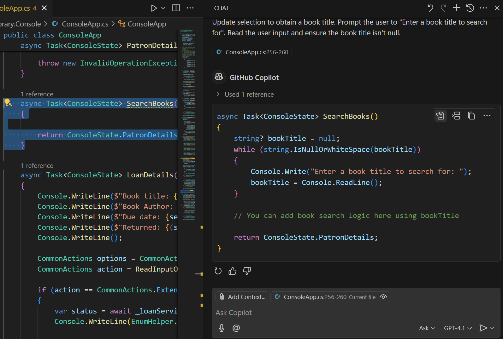
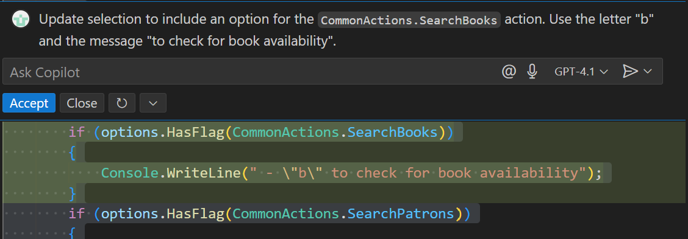

The GitHub Copilot Chat extension for Visual Studio Code supports the following chat interfaces:

- The **Chat View** provides an AI assistant that's available to help you at any time.

- The **Quick Chat** window can be used to ask a quick question and then get back into what you're doing.

- The **Inline Chat** interface opens directly in the editor for contextual interactions while you're coding.

The Chat view and Quick Chat window enable interactive multi-turn conversations with the AI. Both of these interfaces provide a way to ask questions, get help with a coding problem, and generate code. The Chat view is a more robust interface that provides a full chat experience, while the Quick Chat window is designed for quick interactions.

The Inline chat interface is designed to provide contextual help and code suggestions while you're coding. The inline chat interface is available in the editor, and it allows you to ask questions and get help with specific code snippets.

## Generate code using the Chat view

The Chat view provides a managed environment for conversations between you and the AI pair programmer. You can use the Chat view to ask questions, get help with coding problems, and generate code. The Chat view is designed to be a more interactive and conversational experience than the inline chat interface.

By default, the Chat view is located in the Secondary Side Bar on the right side of the Visual Studio Code window.

The Chat View supports three built-in agents: **Ask**, **Plan**, and **Agent**. You can select an agent from the agent picker in the Chat view.

### Use the Ask agent to generate code

The Ask agent is designed to help you analyze your code and investigate the options for new features before suggesting code implementations. When using the Ask agent, GitHub Copilot acts as a conversational assistant that can provide answers to your questions and help you with coding problems or new features.

1. Open the Chat view and select **Ask** from the agent picker.

1. Add context to the chat.

    The Ask agent supports chat participants, slash commands, and chat variables. You can add the `@workspace` chat participant or `#codebase` to the chat to provide context along with files or folders.

1. Ask questions that help you evaluate the new feature that you want to implement.

    For example, you might ask GitHub Copilot to help you understand how to implement a new feature or how to use a specific library.

    - How do I add a login page?
    - What are the best practices for using React?
    - How do I use the `@mui/material` library?

1. Construct a prompt that describes the code feature that you want to implement.

    Your prompt should include a description of the code feature you want to implement. For example:

    ```plaintext
    Create the code to obtain a book title. Prompt the user to "Enter a book title to search for". Read the user input and ensure the book title isn't null.
    ```

1. Review the suggested code in the Chat view.

    The response displayed in the Chat view should include a code snippet that you can use to implement the feature. You can enter more prompts to refine the code or ask for more details.

1. To implement suggested code, you can hover the mouse pointer over the code snippet and then select between the **Apply**, **Insert**, and **Copy** options.

    - **Apply**: Applies the code suggestion to the current file in the editor.
    - **Insert**: Inserts the code suggestion at the current cursor position in the editor.
    - **Copy**: Copies the code suggestion to the clipboard.

    

1. Continue to iterate and refine the new feature with more prompts if needed.

### Use the Plan agent to plan before coding

The Plan agent is designed to help you research and plan a task before writing any code. When you use the Plan agent, GitHub Copilot analyzes your codebase, asks clarifying questions, and creates a structured, step-by-step implementation plan. Once the plan is finalized, you can hand it off to an implementation agent.

1. Open the Chat view and select **Plan** from the agent picker.

1. Add context to the chat.

    The Plan agent uses read-only tools and codebase analysis to research your task. You can add files and folders to the chat to provide additional context.

1. Construct a prompt that describes the task you want to plan.

    Your prompt should include a description of the feature or task you want to implement. For example:

    ```plaintext

    Implement a user authentication system with OAuth2 and JWT.

    ```

1. Answer any clarifying questions that the Plan agent asks.

    The Plan agent researches your task and may ask questions to resolve ambiguities before drafting a plan.

1. Review the proposed plan.

    The Plan agent provides a high-level summary, a breakdown of implementation steps, verification criteria, and documented decisions. You can iterate on the plan by providing feedback.

1. Once the plan is finalized, use the buttons to start implementation or to open the plan in the editor for further review.

    You can choose to implement the plan in the same chat session, or start a background or cloud agent session to work on the implementation autonomously.

### Use the Agent to generate code

When you use GitHub Copilot in Agent mode, GitHub Copilot acts as an autonomous agent that can take actions on your behalf. You can ask GitHub Copilot to perform specific tasks, and it generates code based on your requests.

> [!IMPORTANT]
> When you use the Agent mode, GitHub Copilot may make multiple premium requests to complete a single task. Premium requests can be used by user-initiated prompts and follow-up actions GitHub Copilot takes on your behalf. The total premium requests used depends on the complexity of the task, the number of steps involved, and the model selected.

1. Open the Chat view and select **Agent** from the agent picker.

1. Construct a prompt that describes the task you want GitHub Copilot to perform.

    For example, you might ask GitHub Copilot to generate a new feature or create an entirely new app.

    - Create a meal-planning web app using React and Node.js
    - Add social media sharing functionality
    - Replace current auth with OAuth

1. The Agent might invoke multiple tools to accomplish different tasks. Optionally, select the Tools icon to configure which tools can be used for responding to your request.

1. Confirm tool invocations and terminal commands.

    Before GitHub Copilot runs a terminal command or a tool that isn't built in, it requests confirmation to continue. GitHub Copilot requests confirmation because tools might run locally on your machine and perform actions that modify files or data.

1. GitHub Copilot detects issues and problems in code edits and terminal commands and will iterate and perform actions to resolve them.

1. As GitHub Copilot processes your request, it streams the suggested code edits directly in the editor.

1. Review the suggested edits and accept or discard the suggested edits.

1. Continue to iterate and refine the new feature with more prompts if needed.

## Generate code using an inline chat session

Inline chat session can be used to analyze and generate code. The inline chat interface is only accessible when a file is open in the code editor. It can be used to analyze selected code or create new code based on a prompt.

1. Open a file in the editor.

1. Open an inline chat session by using the **Ctrl+I** keyboard shortcut or selecting **Open Inline Chat** from the Chat menu in the title bar.

    The inline chat session opens at your cursor position in the editor.

1. Select a block of code in the editor.

    The selected code is used as context for the prompt. If no code is selected, the prompt uses the entire file as context.

1. Enter your prompt in the chat input field.

    For example:

    ```plaintext
    Update selection to include an option for the `CommonActions.SearchBooks` action. Use the letter "b" and the message "to check for book availability".
    ```

1. Code update suggestions are displayed as a diff in the editor.

1. Review the suggested code updates, and then accept or discard the changes.

    

1. Continue to iterate and refine the new feature with more prompts if needed.

### Summary

GitHub Copilot Chat provides a powerful set of tools for generating code and assisting with coding tasks. The Chat view, Quick Chat window, and inline chat session all offer different ways to interact with the AI pair programmer and get help with coding problems. By using these tools effectively, you can improve your coding productivity and efficiency.
