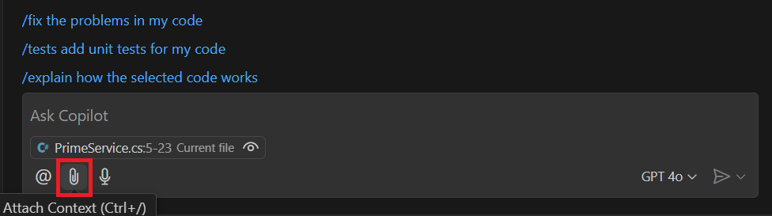
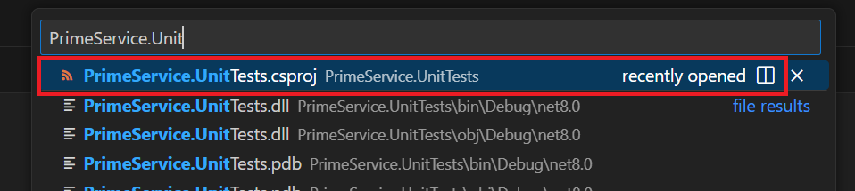
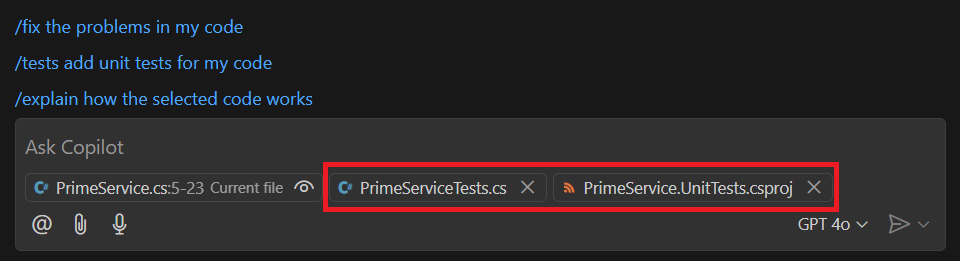
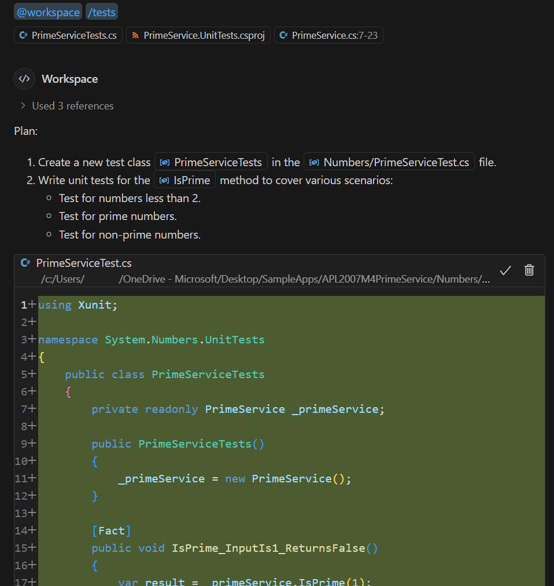
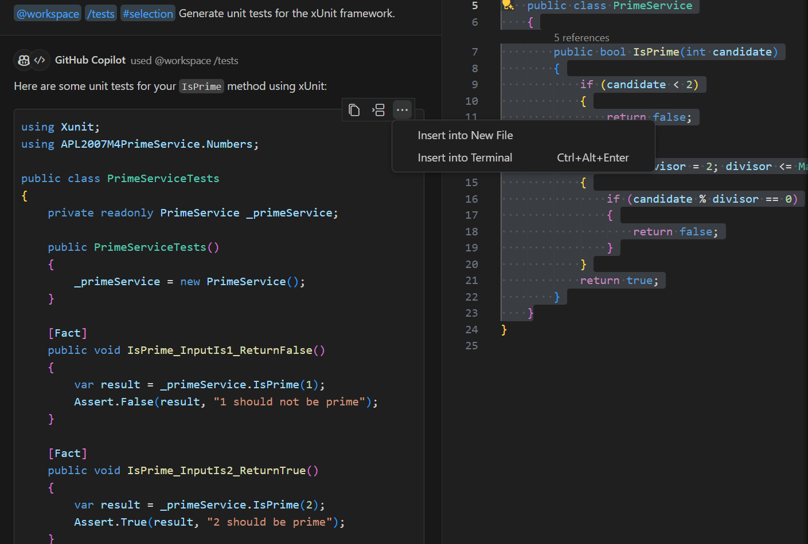
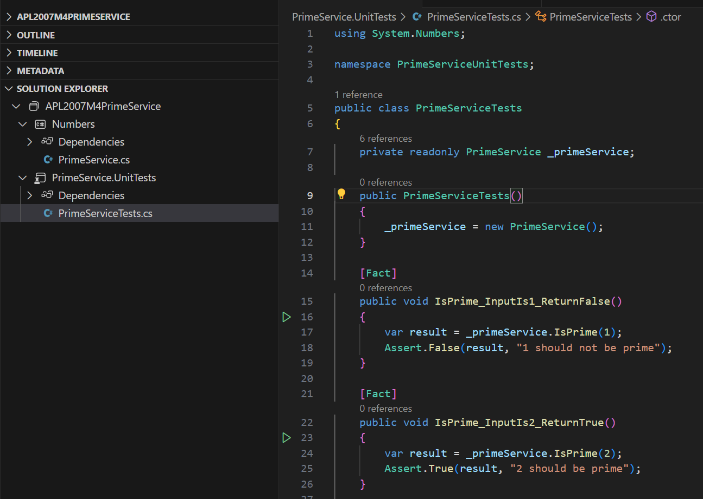

Visual Studio Code and the C# Dev Kit provide a rich set of features to help you create and manage unit tests for your C# projects. You can enable testing for your project, add test framework packages, run and manage unit tests, and generate unit test cases using the C# Dev Kit.

GitHub Copilot can help you generate unit tests for your code by providing inline chat suggestions.

In this exercise, you create unit tests for a code project by using GitHub Copilot Chat in Visual Studio Code.

### Prepare sample apps in your Visual Studio Code environment

This module includes practice activities that use GitHub Copilot, GitHub Copilot Chat, and prepared code samples. The activities are designed for an environment that includes the following resources:

- Visual Studio Code.
- The C# Dev Kit extension for Visual Studio Code
- The GitHub Copilot and GitHub Copilot Chat extensions for Visual Studio Code. A GitHub account with an active subscription for GitHub Copilot is required.
- Sample code projects created using C#.

> [!NOTE]
> If you have not already installed Visual Studio Code and the required extensions, complete those installations before continuing.

To prepare for the exercises in this module, complete the following steps:

1. To download a zip file containing the sample apps, select the following link: [SampleApps](https://raw.githubusercontent.com/MicrosoftLearning/APL-2007-Accelerate-app-development-by-using-GitHub-Copilot/master/LearnModuleExercises/Downloads/SampleApps.zip).

1. Unzip the download files.

    Unzip the files in your development environment. Consider using your PC as your development environment so that you have access to your code after completing this module. If you aren't using your PC as your development environment, you can unzip the files in a sandbox or hosted environment.

    1. On your local machine, navigate to your downloads folder.
    1. Right-click **SampleApps.zip**, and then select **Extract all**.
    1. Select **Show extracted files when complete**, and then select **Extract**.
    1. Make note of the extracted folder location.

1. Copy the extracted **SampleApps** folder to your Windows Desktop folder.

    The **SampleApps** folder contains a collection of sample apps, including the **APL2007M4PrimeService** code project that you use in this exercise.

1. Open the **APL2007M4PrimeService** folder in Visual Studio Code.

1. Expand the Numbers folder, and then take a minute to review the code in the PrimeService.cs file.

    It's important to understand the code that you're testing. The `PrimeService` class has a single public method `IsPrime(int candidate)`. This method checks if a given integer candidate is a prime number (an integer greater than 1 that has no positive divisors other than 1 and itself). The method returns `true` if the candidate is a prime number and `false` if it's not. The method follows these steps to determine if a number is prime:

    - If the `candidate` is less than 2, it's not a prime number, so the method returns `false`.
    - If the `candidate` is 2 or more, it checks for any divisors from 2 up to the square root of the `candidate`. The reason for only checking up to the square root is that a larger factor of the number would be a multiple of smaller factor that has already been checked.
    - If the `candidate` can be divided evenly (with a remainder of 0) by any of these potential divisors, it's not a prime number, so the method returns `false`.
    - If no such divisor is found, then the `candidate` is a prime number, so the method returns `true`.

    This method provides a few options for unit testing.

You're now ready to complete the exercise.

### Create an xUnit test project for your unit tests

Unit test projects are typically created in a folder that's separate from the project that you're testing. This separation helps to keep the test code separate from the production code. In this exercise, you create an xUnit test project for the APL2007M4PrimeService project.

To create a new xUnit test project, complete the following steps:

1. Open the Solution Explorer view in Visual Studio Code.

    The Solution Explorer view is accessible from Visual Studio Code's Side Bar panel. The Solution Explorer is similar to the Explorer view, but it's specifically designed to work with Visual Studio Code projects rather than general file systems.

1. In the Solution Explorer view, right-click **APL2007M4PrimeService**, and then select **New Project**.

    If you don't see the **New Project** option, ensure that you're working in the *Solution Explorer* view, not the *Explorer* view.

1. When the list of project types appears, select **xUnit Test Project**.

1. For the project name, type **PrimeService.UnitTests** and then press Enter.

    The project name should reflect the name of the class that you're testing and it should be unique within the solution. In this case the class is named `PrimeService`, so the test project is named `PrimeService.UnitTests`.

1. Select the default directory location.

    You could also create the xUnit test project using the Visual Studio Code terminal. Open a terminal, navigate to the Numbers folder, and then run the following command:

    ```plaintext
    dotnet new xunit -n PrimeService.UnitTests
    ```

1. Select **Create Project**, and then expand the PrimeService.UnitTests folder.

1. Delete the UnitTest1.cs file that's created with the PrimeService.UnitTests project.

    Before you create a new unit test, you need to add a reference to the unit test project that points to the class project that you want to test.

1. To add a reference to your code project, right-click **PrimeService.UnitTests**, select **Add Project Reference**, and then select **Numbers**.

1. To create a class for your unit tests, right-click **PrimeService.UnitTests**, select **New File**, select **Class**, type **PrimeServiceTests** and then press Enter.

    Visual Studio Code should open the PrimeServiceTests.cs file for you.

1. Take a minute to examine the PrimeServiceTests.cs file.

    Your file should be similar to the following code snippet:

    ```csharp
    namespace PrimeService.UnitTests;
    
    public class PrimeServiceTests
    {
    
    }
    
    ```

1. To help avoid namespace issues when you build the project, update the PrimeServiceTests.cs file as follows:

    ```csharp
    namespace System.Numbers.UnitTests;
    
    public class PrimeServiceTests
    {
    
    }
    ```

    A namespace in C# is used to organize related classes and types. It's a way to avoid name collisions and to make it easier to understand the organization of the code. The `.UnitTests` suffix in the test project's namespace is a common convention to indicate that the code in this namespace is testing the code in the System.Numbers namespace. This makes it clear when looking at the project structure which code is production code and which code is test code.

1. Take a minute to examine the PrimeService.UnitTests.csproj file.

    The PrimeService.UnitTests.csproj file should include an `<ItemGroup>` that contains the following `<PackageReference />` elements:

    ```xml
    <PackageReference Include="coverlet.collector" Version="6.0.0" />
    <PackageReference Include="Microsoft.NET.Test.Sdk" Version="17.8.0" />
    <PackageReference Include="xunit" Version="2.5.3" />
    <PackageReference Include="xunit.runner.visualstudio" Version="2.5.3" />
    ```

    These package references are required to use xUnit as the test library and to configure the test runner. You should also see the following `<ItemGroup>` elements in the PrimeService.UnitTests.csproj file:

    ```xml
    <ItemGroup>
        <Using Include="Xunit" />
    </ItemGroup>
    
    <ItemGroup>
        <ProjectReference Include="..\Numbers\Numbers.csproj" />
    </ItemGroup>
    ```

    These elements are required to reference the Numbers project and to use the xUnit test framework.

1. To build the solution, press **Ctrl+Shift+B**, and then select **dotnet: build**.

    You could also build the solution using a .NET CLI command (dotnet build) or by right-clicking the solution node in the Solution Explorer view and selecting **Build**.

    > [!NOTE]
    > If you see any build errors, review the steps in this exercise to ensure that you've followed each step correctly. You must have a successful build before you continue.

You're now ready to create a unit test using GitHub Copilot Chat.

### Create unit tests using Chat view

GitHub Copilot and GitHub Copilot Chat can help you generate unit tests for your code by providing suggestions based on the context of your codebase. You can use GitHub Copilot Chat to generate unit tests for specific methods or classes in your code.

Use the following steps to complete this section of the exercise:

1. In the Solution Explorer view, under Numbers, open the PrimeService.cs file.

1. Select the **IsPrime** method.

1. Open the Chat view.

1. Select the **Attach Context** button.

    The **Attach Context** button (paperclip icon) is used to inform GitHub Copilot of relevant context within your codebase. The additional context helps GitHub Copilot Chat to provide more accurate suggestions. In this case, you want GitHub Copilot to use your PrimeServiceTests.cs file when proposing unit tests.

    

1. In the **Search attachments** dropdown list, in the **recently opened** section, select **PrimeServiceTests.cs**.

    The **Search attachments** dropdown provides some default options that you can choose from. It also includes a list of recently opened files. The PrimeServiceTests.cs file should be listed in the recently opened section.

    The Search attachments options include

1. Select the **Attach Context** button again.

1. In the Search attachments text box, type **PrimeService.Unit**, and then select **PrimeService.UnitTests.csproj**.

    

    > [!NOTE]
    > You can also drag a file from the Explorer view and drop it onto the Chat view. In many cases this is a quicker way to attach context.

1. Notice that the Chat view is updated with the additional context.

    

1. In the Chat view, select **/tests add unit tests for my code**.

    The **/tests add unit tests for my code** option is used to generate unit tests for the code that you've selected in the editor. In this case, you selected the **IsPrime** method in the PrimeService.cs file.

1. Take a minute to review GitHub Copilot's suggestions.

    GitHub Copilot's suggestion includes two sections, a "Plan" and a code sample containing unit tests.

    The plan suggests creating a new PrimeServiceTest.cs file for the unit tests. It also suggests creating the file in the Numbers project folder.

    

1. In the Chat view, select **Apply Edits**.

    

1. Notice that the Apply Edits button places the unit test code on a new tab in the editor.

    You can use this code to update the PrimeServiceTests.cs file in your PrimeService.UnitTests project.

1. On the **File** menu, select **Save As**, and then navigate to the PrimeService.UnitTests folder.

1. Select **PrimeServiceTests.cs**, and then select **Save**.

1. When prompted to overwrite the existing file, select **Yes**.

1. Take a minute to review the updated PrimeServiceTests.cs file.

    The code suggested by GitHub Copilot Chat should include tests for specific prime and non-prime numbers. The suggested code may include parameterized tests (using `[Theory]` and `[InlineData]` attributes) to test multiple data sets more concisely.

    The code snippet provided should be similar to the following code snippet:

    ```csharp
    using Xunit;
    
    namespace System.Numbers.UnitTests
    {
        public class PrimeServiceTests
        {
            private readonly PrimeService _primeService;
    
            public PrimeServiceTests()
            {
                _primeService = new PrimeService();
            }
    
            [Fact]
            public void IsPrime_InputIs1_ReturnsFalse()
            {
                var result = _primeService.IsPrime(1);
    
                Assert.False(result, "1 should not be prime");
            }
    
            [Fact]
            public void IsPrime_InputIs2_ReturnsTrue()
            {
                var result = _primeService.IsPrime(2);
    
                Assert.True(result, "2 should be prime");
            }
    
            [Fact]
            public void IsPrime_InputIs3_ReturnsTrue()
            {
                var result = _primeService.IsPrime(3);
    
                Assert.True(result, "3 should be prime");
            }
    
            [Fact]
            public void IsPrime_InputIs4_ReturnsFalse()
            {
                var result = _primeService.IsPrime(4);
    
                Assert.False(result, "4 should not be prime");
            }
    
            [Theory]
            [InlineData(5, true)]
            [InlineData(6, false)]
            [InlineData(7, true)]
            [InlineData(8, false)]
            [InlineData(9, false)]
            [InlineData(10, false)]
            public void IsPrime_Values_ReturnExpectedResult(int value, bool expected)
            {
                var result = _primeService.IsPrime(value);
    
                Assert.Equal(expected, result);
            }
        }
    }
    ```

    Notice that the unit tests require an instance of the PrimeService class.

    ```csharp
    private readonly PrimeService _primeService;
    
    public PrimeServiceTests()
    {
        _primeService = new PrimeService();
    }
    ```

1. Rebuild the solution.

    You should see green "test arrows" next to each unit test if the build is successful.

    

    You create more unit tests the next section, so there's no need to run the tests at this time.

    However, there are several ways to run your tests. For example:

    - You can run the tests from the Visual Studio Code terminal by using the `dotnet test` command.
    - You can run the tests from the Visual Studio Code Test Explorer view.
    - You can run the tests from the Visual Studio Code Command Palette by using the **Test: Run All Tests** command.
    - You can run the tests from the Visual Studio Code editor by selecting the **Run Tests in Current File** option from the context menu.

    The tests you created during this section of the exercise should run successfully. The green "test arrows" next to the unit test become green circles with a checkmark.

### Create unit tests using inline chat

Use the following steps to complete this section of the exercise:

1. In the Solution Explorer view, open the PrimeService.cs file.

    PrimeService.cs is located in the Numbers folder.

1. Select the IsPrime method.

1. Open an inline chat session, and then enter the following prompt:

    ```plaintext
    Create unit tests for the IsPrime method using the xUnit framework.
    ```

1. Take a minute to review the suggestions provided by inline chat.

    ```csharp
    using Xunit;
    
    namespace System.Numbers.UnitTests
    {
        public class PrimeServiceTests
        {
            private readonly PrimeService _primeService;
    
            public PrimeServiceTests()
            {
                _primeService = new PrimeService();
            }
    
            [Fact]
            public void IsPrime_InputIs1_ReturnsFalse()
            {
                var result = _primeService.IsPrime(1);
    
                Assert.False(result, "1 should not be prime");
            }
    
            [Fact]
            public void IsPrime_InputIs2_ReturnsTrue()
            {
                var result = _primeService.IsPrime(2);
    
                Assert.True(result, "2 should be prime");
            }
    
            [Fact]
            public void IsPrime_InputIs3_ReturnsTrue()
            {
                var result = _primeService.IsPrime(3);
    
                Assert.True(result, "3 should be prime");
            }
    
            [Fact]
            public void IsPrime_InputIs4_ReturnsFalse()
            {
                var result = _primeService.IsPrime(4);
    
                Assert.False(result, "4 should not be prime");
            }
    
            [Theory]
            [InlineData(5, true)]
            [InlineData(6, false)]
            [InlineData(7, true)]
            [InlineData(8, false)]
            [InlineData(9, false)]
            [InlineData(10, false)]
            public void IsPrime_Values_ReturnExpectedResult(int value, bool expected)
            {
                var result = _primeService.IsPrime(value);
    
                Assert.Equal(expected, result);
            }
        }
    }

    ```

1. Notice that the Chat view and inline chat produce similar test coverage.

1. To discard the inline chat suggestion, select **Discard**, and then close the file tab created by the inline chat.

    Keep in mind that the unit tests suggested by GitHub Copilot during this exercise may be incomplete. The next unit examines additional edge cases that you might consider testing.

### Summary

In this exercise, you created unit tests for a code project by using GitHub Copilot Chat in Visual Studio Code. You created an xUnit test project, added a reference to the project that you wanted to test, and generated unit tests for the `IsPrime` method in the `PrimeService` class. You used GitHub Copilot Chat to generate unit tests in the Chat view and the inline chat.
