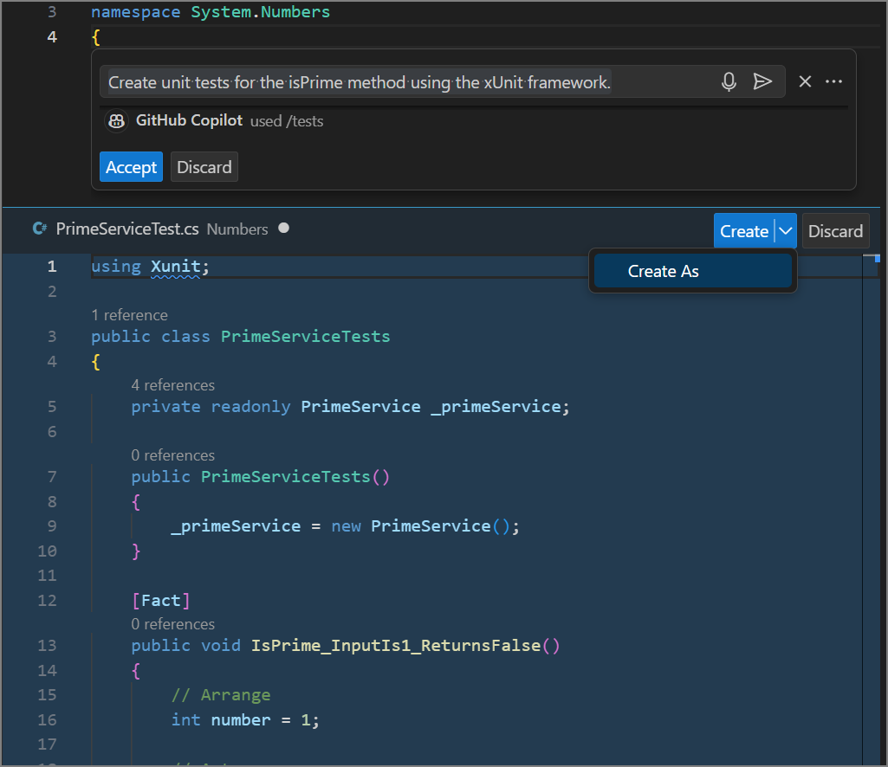

Visual Studio Code and the C# Dev Kit provide a rich set of features to help you create and manage unit tests for your C# projects. You can enable testing for your project, add test framework packages, run and manage unit tests, and generate unit test cases using the C# Dev Kit.

GitHub Copilot can help you generate unit tests for your code by providing inline chat suggestions.

In this exercise, you create unit tests for a code project by using GitHub Copilot Chat in Visual Studio Code.

### Prepare sample apps in your Visual Studio Code environment

This module includes practice activities that use GitHub Copilot, GitHub Copilot Chat, and prepared code samples. The activities are designed for an environment that includes the following resources:

- Visual Studio Code.
- The C# Dev Kit extension for Visual Studio Code
- The GitHub Copilot and GitHub Copilot Chat extensions for Visual Studio Code. A GitHub account with an active subscription for GitHub Copilot is required.
- Sample code projects created using C#.

> [!NOTE]
> If you have not already installed Visual Studio Code and the required extensions, complete those installations before continuing.

1. To download a zip file containing the sample apps, select the following link: [SampleApps](https://raw.githubusercontent.com/MicrosoftLearning/APL-2007-Accelerate-app-development-by-using-GitHub-Copilot/master/LearnModuleExercises/Downloads/SampleApps.zip).

1. Unzip the download files.

    Unzip the files in your development environment. Consider using your PC as your development environment so that you have access to your code after completing this module. If you aren't using your PC as your development environment, you can unzip the files in a sandbox or hosted environment.

    1. On your local machine, navigate to your downloads folder.
    1. Right-click **SampleApps.zip**, and then select **Extract all**.
    1. Select **Show extracted files when complete**, and then select **Extract**.
    1. Make note of the extracted folder location.

1. Copy the extracted **SampleApps** folder to your Windows Desktop folder.

    The **SampleApps** folder contains a collection of sample apps, including the **APL2007M4PrimeService** code project that you use in this exercise.

1. Open the **APL2007M4PrimeService** folder in Visual Studio Code.

1. Take a minute to review the code in the Program.cs file.

    The `PrimeService` class has a single public method `IsPrime(int candidate)` This method checks if a given integer candidate is a prime number. A prime number is a natural number greater than 1 that has no positive divisors other than 1 and itself.

    - If the `candidate` is less than 2, it's not a prime number, so the method returns `false`.
    - If the `candidate` is 2 or more, it checks for any divisors from 2 up to the square root of the `candidate`. The reason for only checking up to the square root is that a larger factor of the number would be a multiple of smaller factor that has already been checked.
    - If the `candidate` can be divided evenly (i.e., with a remainder of 0) by any of these potential divisors, it's not a prime number, so the method returns `false`.
    - If no such divisor is found, then the `candidate` is a prime number, so the method returns `true`.

    This method provides a few options for unit testing.

You are now ready to complete the exercise.

### Create an xUnit test project for your unit tests

Unit test projects are typically created in a folder that's separate from the project that you're testing. This separation helps to keep the test code separate from the production code. In this exercise, you'll create an xUnit test project for the APL2007M4PrimeService project.

To create a new xUnit test project, complete the following steps:

1. Open the Solution Explorer view in Visual Studio Code.

    The Solution Explorer is located at the bottom of the Views bar on the left side of the Visual Studio Code window. The Solution Explorer view is similar to the Explorer view, but it's specifically designed to work with Visual Studio Code projects rather than general file systems.

1. In the Solution Explorer view, right-click the APL2007M4PrimeService folder, and then select **New Project**.

    Ensure that you are working in the Solution Explorer, not the Explorer view.

1. When the list of project types appears, select **xUnit Test Project**.

1. For the project name, enter **PrimeService.UnitTests**.

    The project name should reflect the name of the class that you're testing and it should be unique within the solution. In this case the class is named `PrimeService`, so the test project is named `PrimeService.UnitTests`.

1. Select the default location.

    You could also create the xUnit test project using the Visual Studio Code terminal. Open a terminal, navigate to the Numbers folder, and then run the following command:

    ```plaintext
    dotnet new xunit -n PrimeService.UnitTests
    ```

1. Open the PrimeService.UnitTests folder.

1. Delete the UnitTest1.cs file that was created with the PrimeService.UnitTests project.

    Before you create a new unit test, you need to add a reference to the unit test project that points to the class project that you want to test.

1. To add a reference, right-click the PrimeService.UnitTests project, select **Add Project Reference**, and then select the Numbers project (Numbers should be the only option).

1. To create the class that's used to hold your unit test, right-click the PrimeService.UnitTests project, select **Add New File**, select **Class**, and then enter **PrimeServiceTests**.

    Visual Studio Code should open the PrimeServiceTests.cs file for you.

1. Take a minute to examine the PrimeServiceTests.cs file.

    Your file should be similar to the following code snippet:

    ```csharp
    namespace PrimeService.UnitTests;
    
    public class PrimeServiceTests
    {
    
    }
    
    ```

1. To help avoid namespace issues when you build the project, update the PrimeServiceTests.cs file as follows:

    ```csharp
    using System.Numbers;
    
    namespace PrimeServiceUnitTests;
    
    public class PrimeServiceTests
    {
    
    }
    ```

    This update adds a using statement for the Numbers namespace used by the PrimeService class and ensures that the namespace for the PrimeServiceTests class doesn't conflict with the names of the classes.

1. Take a minute to examine the PrimeServiceTests.csproj file.

    The PrimeServiceTests.csproj file should include an `<ItemGroup>` that contains the following `<PackageReference />` elements:

    ```xml
    <PackageReference Include="coverlet.collector" Version="6.0.0" />
    <PackageReference Include="Microsoft.NET.Test.Sdk" Version="17.8.0" />
    <PackageReference Include="xunit" Version="2.5.3" />
    <PackageReference Include="xunit.runner.visualstudio" Version="2.5.3" />
    ```

    These package references are required to use xUnit as the test library and to configure the test runner. You should also see the following `<ItemGroup>` elements in the PrimeServiceTests.csproj file:

    ```xml
    <ItemGroup>
        <Using Include="Xunit" />
    </ItemGroup>
    
    <ItemGroup>
        <ProjectReference Include="..\Numbers\Numbers.csproj" />
    </ItemGroup>
    ```

    These elements are required to reference the Numbers project and to use the xUnit test framework.

1. To build the solution, press **Ctrl** + **Shift** + **B**, and then select **dotnet: build**.

    You could also run the following command in the Visual Studio Code terminal:

    ```plaintext
    dotnet build
    ```

    > [!NOTE]
    > If you see any build errors, review the steps in this exercise to ensure that you've followed each step correctly. You must have a successful build before you continue.

You are now ready to create a unit test using GitHub Copilot Chat.

### Create unit tests using Chat view

GitHub Copilot and GitHub Copilot Chat can help you generate unit tests for your code by providing suggestions based on the context of your codebase. You can use GitHub Copilot Chat to generate unit tests for specific methods or classes in your code.

1. In the Solution Explorer view, under the Numbers folder, open the PrimeService.cs file.

1. Select the IsPrime method.

1. Open the Chat view, and then enter the following prompt:

    ```plaintext
    @workspace /tests #selection Generate unit tests for the xUnit framework.
    ```

1. Take a minute to review the suggestions provided by GitHub Copilot Chat.

1. Notice that Chat view provides a code sample containing suggested unit tests.

    The class proposed by GitHub Copilot Chat includes tests for specific numbers as well as a theory for testing negative numbers and zero. GitHub Copilot Chat also reminds you that can add more test cases as needed.

    The code snippet provided should be similar to the following code snippet:

    ```csharp
    using Xunit;
    using APL2007M4PrimeService.Numbers;
    
    public class PrimeServiceTests
    {
        private readonly PrimeService _primeService;
    
        public PrimeServiceTests()
        {
            _primeService = new PrimeService();
        }
    
        [Fact]
        public void IsPrime_InputIs1_ReturnFalse()
        {
            var result = _primeService.IsPrime(1);
            Assert.False(result, "1 should not be prime");
        }
    
        [Fact]
        public void IsPrime_InputIs2_ReturnTrue()
        {
            var result = _primeService.IsPrime(2);
            Assert.True(result, "2 should be prime");
        }
    
        [Fact]
        public void IsPrime_InputIs3_ReturnTrue()
        {
            var result = _primeService.IsPrime(3);
            Assert.True(result, "3 should be prime");
        }
    
        [Fact]
        public void IsPrime_InputIs4_ReturnFalse()
        {
            var result = _primeService.IsPrime(4);
            Assert.False(result, "4 should not be prime");
        }
    
        [Theory]
        [InlineData(-1)]
        [InlineData(0)]
        [InlineData(1)]
        public void IsPrime_NegativeNumbersAndZero_ReturnFalse(int value)
        {
            var result = _primeService.IsPrime(value);
            Assert.False(result, $"{value} should not be prime");
        }
    }
    ```

1. Regenerate the unit tests without the surrounding class.

    ```plaintext
    @workspace #selection Generate unit tests for the xUnit framework. Show the unit tests without the surrounding class.
    ```

1. Notice the buttons at the top of the code snippet window.

    The Chat view provides a few options for how you can use the code snippet:

    - The **Copy** button allows you to copy the code snippet to your clipboard.
    - The **Insert** button allows you to insert the code snippet into your project.
    - The "..." button (More Actions) provides options to insert the snippet into either a new file or the terminal.

    

1. At the top of the code snippet window, select **Copy**.

1. Open the PrimeServiceTests.cs file.

1. Select the PrimeServiceTests class, and then paste the contents of the clipboard into the PrimeServiceTests.cs file.

1. Save the PrimeServiceTests.cs file, and then rebuild the solution.

1. If the build is successful, you'll see green "test arrows" next to each unit test.

    

    You are creating additional unit tests using inline chat in the next section, so there is no need to run the tests at this time.

    However, for those who can't wait, there are several ways to run your tests. For example:

    - You can run the tests from the Visual Studio Code terminal by using the `dotnet test` command.
    - You can run the tests from the Visual Studio Code Test Explorer view.
    - You can run the tests from the Visual Studio Code Command Palette by using the **.NET: Run Test(s)** command.
    - You can run the tests from the Visual Studio Code editor by selecting the **Run Test(s)** option from the light bulb menu.
    - You can run the tests from the Visual Studio Code editor by selecting the **Run Test(s)** option from the context menu.

    The tests should pass, and you should see the test results in the Visual Studio Code terminal.

### Create unit tests using inline chat

1. In the Solution Explorer view, open the PrimeService.cs file.

    PrimeService.cs is located in the Numbers folder.

1. Select the IsPrime method.

1. Open an inline chat session, and then enter the following prompt:

    ```plaintext
    Create unit tests for the isPrime method using the xUnit framework.
    ```

1. Take a minute to review the suggestions provided by inline chat.

    ```csharp
    using Xunit;
    
    public class PrimeServiceTests
    {
        private readonly PrimeService _primeService;
    
        public PrimeServiceTests()
        {
            _primeService = new PrimeService();
        }
    
        [Fact]
        public void IsPrime_InputIs1_ReturnsFalse()
        {
            // Arrange
            int number = 1;
    
            // Act
            bool result = _primeService.IsPrime(number);
    
            // Assert
            Assert.False(result);
        }
    
        [Fact]
        public void IsPrime_InputIs2_ReturnsTrue()
        {
            // Arrange
            int number = 2;
    
            // Act
            bool result = _primeService.IsPrime(number);
    
            // Assert
            Assert.True(result);
        }
    
        [Fact]
        public void IsPrime_InputIs4_ReturnsFalse()
        {
            // Arrange
            int number = 4;
    
            // Act
            bool result = _primeService.IsPrime(number);
    
            // Assert
            Assert.False(result);
        }
    
        // Add more test cases as needed
    }
    ```

1. Notice that these unit tests are similar to the ones suggested by the Chat view.

    The inline chat provided a slightly different approach. Inline chat suggested unit tests that include comments for the **Arrange**, **Act**, and **Assert** sections of each test. Inline chat proposed tests for the numbers 1, 2, and 4, and reminded you to add more test cases as needed. There were no theory tests proposed.

1. The inline chat provides a **Create** dropdown that includes a **Create as** option.

    

    You can use the **Create as** option to save the proposed unit tests to the PrimeService.UnitTests folder.

    > [!NOTE]
    > Choosing the **Create as** option does not close the inline chat. You can continue to interact with GitHub Copilot Chat to generate more unit tests.

1. Select the **Create as** option, and then save the file as **PrimeServiceTests2.cs** in the PrimeService.UnitTests folder.

    This results in conflicts with the existing PrimeServiceTests.cs file, but after you look at the two files, you'll delete the PrimeServiceTests.cs file.

1. Take a minute to compare the PrimeServiceTests.cs and PrimeServiceTests2.cs files.

    Notice that no namespace was included and there isn't a `using` for the namespace of the PrimeService class.

1. Update the PrimeServiceTests2.cs file as follows:

    ```csharp
    //using Xunit;
    using System.Numbers;
    
    namespace PrimeServiceUnitTests;
    
    public class PrimeServiceTests
    {
        private readonly PrimeService _primeService;
    
        public PrimeServiceTests()
        {
            _primeService = new PrimeService();
        }
    
        [Fact]
        public void IsPrime_InputIs1_ReturnsFalse()
        {
            // Arrange
            int number = 1;
    
            // Act
            bool result = _primeService.IsPrime(number);
    
            // Assert
            Assert.False(result);
        }
    
        [Fact]
        public void IsPrime_InputIs2_ReturnsTrue()
        {
            // Arrange
            int number = 2;
    
            // Act
            bool result = _primeService.IsPrime(number);
    
            // Assert
            Assert.True(result);
        }
    
        [Fact]
        public void IsPrime_InputIs4_ReturnsFalse()
        {
            // Arrange
            int number = 4;
    
            // Act
            bool result = _primeService.IsPrime(number);
    
            // Assert
            Assert.False(result);
        }
    
        // Add more test cases as needed
    }
    ```

1. Delete the PrimeServiceTests.cs file.

    You could comment out the contents of the file rather than deleting if you want. That way you can reference the contents in the next unit of this module.

1. Save the PrimeServiceTests2.cs file, and then rebuild the solution.

1. You should now see the green "test arrows" next to each unit test in the PrimeServiceTests2.cs file.

    Keep in mind that the generated unit tests do not cover all possible scenarios.

### Summary

In this exercise, you created unit tests for a code project by using GitHub Copilot Chat in Visual Studio Code. You created an xUnit test project, added a reference to the project that you wanted to test, and generated unit tests for the `IsPrime` method in the `PrimeService` class. You used GitHub Copilot Chat to generate unit tests in the Chat view and the inline chat.
