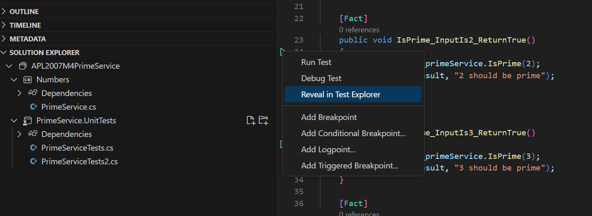
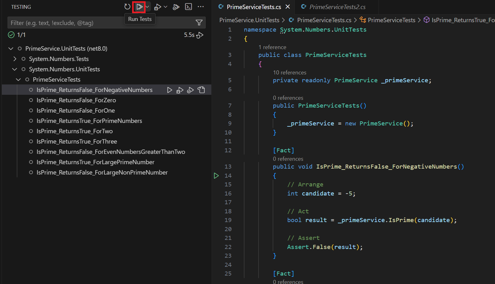

The GitHub Copilot extensions can help you to create unit tests for specific conditions in your code. For example, you can use GitHub Copilot Chat to test the behavior of a method when it receives specific input.

In this exercise, you use the GitHub Copilot extensions to create unit tests for specific conditions.

### Create unit tests using GitHub Copilot code line completion suggestions

You can create unit tests using GitHub Copilot autocompletion suggestions. Using autocompletion suggestions can help you to quickly generate unit tests for your code.

In this section of the exercise, you use GitHub Copilot to create unit tests for the `IsPrime` method of the `PrimeService` class.

Use the following steps to complete this section of the exercise:

1. Locate the SampleApps folder that contains the sample apps for this training.

1. Open the **APL2007M4PrimeService-UnitTests** project folder in Visual Studio Code.

1. Open the PrimeServiceTests.cs file in the editor.

1. Delete all of the code inside the `PrimeServiceTests` class.

    The contents of the PrimeServiceTests.cs file should resemble the following code snippet:

    ```csharp
    namespace System.Numbers.UnitTests;
    
    public class PrimeServiceTests
    {
    }
    ```

1. Save the PrimeServiceTests.cs file, and then rebuild the solution.

1. To have GitHub Copilot generate an inline completion, create a blank line inside the `PrimeServiceTests` class.

    If you wait a second or two, GitHub Copilot suggests a completion for the `PrimeServiceTests` class.

1. Select **Accept**, and the take a minute to review the unit tests generated by GitHub Copilot.

1. Take a minute to review the collection of unit tests that GitHub Copilot generated for the `IsPrime` method.

    It's okay if the test coverage is incomplete. The next section of the exercise shows you how to use GitHub Copilot Chat to ask GitHub Copilot to suggest additional edge cases that should be tested.

    ```csharp
    namespace System.Numbers.UnitTests
    {
        public class PrimeServiceTests
        {
            private readonly PrimeService _primeService;
    
            public PrimeServiceTests()
            {
                _primeService = new PrimeService();
            }
    
            [Fact]
            public void IsPrime_ReturnsFalse_ForNegativeNumbers()
            {
                // Arrange
                int candidate = -5;
    
                // Act
                bool result = _primeService.IsPrime(candidate);
    
                // Assert
                Assert.False(result);
            }
    
            [Fact]
            public void IsPrime_ReturnsFalse_ForZero()
            {
                // Arrange
                int candidate = 0;
    
                // Act
                bool result = _primeService.IsPrime(candidate);
    
                // Assert
                Assert.False(result);
            }
    
            [Fact]
            public void IsPrime_ReturnsFalse_ForOne()
            {
                // Arrange
                int candidate = 1;
    
                // Act
                bool result = _primeService.IsPrime(candidate);
    
                // Assert
                Assert.False(result);
            }
    
            [Fact]
            public void IsPrime_ReturnsTrue_ForPrimeNumbers()
            {
                // Arrange
                int candidate = 7;
    
                // Act
                bool result = _primeService.IsPrime(candidate);
    
                // Assert
                Assert.True(result);
            }
        }
    }
    
    ```

### Create unit tests for specific conditions using GitHub Copilot and GitHub Copilot Chat

1. Select the contents of the `PrimeServiceTests` class.

1. Open the Chat view.

1. To add the PrimeService.cs file to the Chat view context, drag-and-drop the PrimeService.cs file from the Explorer view into the Chat view.

1. Enter the following prompt in the Chat view:

    ```plaintext
    @workspace #selection are there any edge cases that should also be tested 
    ```

1. Take a minute to review the suggestions provided by GitHub Copilot.

    ```plaintext
    Yes, there are a few edge cases that should also be tested:
    
    1. Large Prime Numbers: Ensure the function can handle large prime numbers.

    2. Large Non-Prime Numbers: Ensure the function can handle large non-prime numbers.

    3. Even Numbers Greater Than 2: Ensure the function returns false for even numbers greater than 2.

    4. Small Prime Numbers: Ensure the function correctly identifies small prime numbers like 2 and 3.

    Here are the additional test cases:
    ```

    ```csharp
    [Fact]
    public void IsPrime_ReturnsTrue_ForTwo()
    {
        // Arrange
        int candidate = 2;
    
        // Act
        bool result = _primeService.IsPrime(candidate);
    
        // Assert
        Assert.True(result);
    }
    
    [Fact]
    public void IsPrime_ReturnsTrue_ForThree()
    {
        // Arrange
        int candidate = 3;
    
        // Act
        bool result = _primeService.IsPrime(candidate);
    
        // Assert
        Assert.True(result);
    }
    
    [Fact]
    public void IsPrime_ReturnsFalse_ForEvenNumbersGreaterThanTwo()
    {
        // Arrange
        int candidate = 4;
    
        // Act
        bool result = _primeService.IsPrime(candidate);
    
        // Assert
        Assert.False(result);
    }
    
    [Fact]
    public void IsPrime_ReturnsTrue_ForLargePrimeNumber()
    {
        // Arrange
        int candidate = 7919;
    
        // Act
        bool result = _primeService.IsPrime(candidate);
    
        // Assert
        Assert.True(result);
    }
    
    [Fact]
    public void IsPrime_ReturnsFalse_ForLargeNonPrimeNumber()
    {
        // Arrange
        int candidate = 8000;
    
        // Act
        bool result = _primeService.IsPrime(candidate);
    
        // Assert
        Assert.False(result);
    }
    ```

1. Create a blank line after the last test method in the `PrimeServiceTests` class.

1. In the Chat view, hover the mouse over the code snippet, and then select **Insert at Cursor**.

1. Save the PrimeServiceTests.cs file, and then rebuild the solution.

1. Take a minute to review the collection of unit tests that GitHub Copilot generated for the `IsPrime` method.

    As always, it's important to review the work completed by GitHub Copilot to ensure that the tests are valid and that they cover the edge cases that you want to test. Once you're satisfied with the tests, you can run them to verify that they pass.

1. Hover the mouse pointer over one of the green "test arrows".

    Notice the tooltip message telling you that you can either click to run the test, or right-click to see more options.

1. Right-click one of the green "test arrows".

    

1. Select **Reveal in Test Explorer**.

    Notice that the Test Explorer view opens. The Test Explorer view can be used to run and debug tests, and to view the results of test runs. To open the Test Explorer view manually, select **Testing** from the Activity Bar on the left side of the Visual Studio Code window. The icon for the **Testing** view is the one that looks like a lab flask.

1. At the top of the Test Explorer view, select **Run Tests**.

    

    After a few seconds, the Test Explorer shows the results of the test run. You should see that all of the tests pass. Green checkmarks in the Test Explorer and to the left of the unit tests in the Editor indicate that the test passed.

### Summary

In this exercise, you used GitHub Copilot and GitHub Copilot Chat to create unit tests for specific conditions in the `PrimeService` class. You used code line completions to generate assertions to ensure that function input parameters are valid, and you used the Chat view to ask GitHub Copilot to suggest additional edge cases that should be tested. You reviewed the suggestions provided by GitHub Copilot and ran the tests to verify that they pass. You also learned how to use the Test Explorer in Visual Studio Code to run and view the results of test runs.
