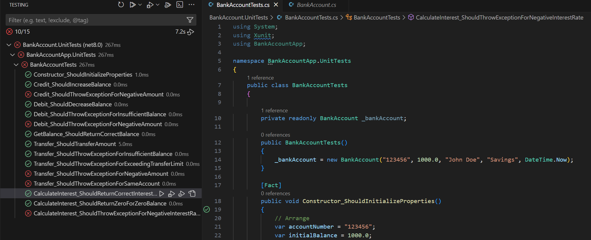

Your challenge was to create unit tests for each method of the `BankAccount` class to achieve the following requirements:

1. Create a test project named `BankAccount.UnitTests` that you can use to create unit tests for the `BankAccount` class.

1. Create a base set of unit tests for each method.

1. Explore and create unit tests for edge cases.

This review describes the Copilot Chat features and prompts used to complete the challenge.

> [!NOTE]
> The responses generated by GitHub Copilot Chat are based on chat history and the context provided by the user. Other factors, such as AI model updates, may also influence responses. Your results should be similar to the results shown below with some variations expected.

The following sections show one possible solution for the challenge from the previous unit.

### Create unit test project

1. Open the Solution Explorer view.

1. Right-click the **APL2007M4BankAccountClass** folder, and then select **New Project**.

1. In the **Create a new project** dialog box, select **xUnit Test Project**.

1. Name the project **BankAccount.UnitTests**.

1. Create the project using the default location.

1. Delete the UnitTest1.cs file.

1. Add a reference to the BankAccount project.

1. Add a new class file named **BankAccountTests.cs** to the BankAccount.UnitTests project.

1. Build the solution.

### Create unit tests for the `BankAccount` class using the Chat view

1. Open the BankAccount.cs file.

1. Select the BankAccount class.

    You could select a single method that you want to test, but that can lead to issues when GitHub Copilot generates the tests. By selecting the entire class, you help GitHub Copilot understand the context of the code you're working on. Your prompt can still specify unit tests for a specific method.

1. Open the Chat view.

1. Use the Attach Context button to add BankAccountTests.cs and BankAccount.UnitTests.csproj the Chat context.

1. In the Chat view, select **/tests add unit tests for my code**

1. In the Chat view, select **Apply Edits**.

1. On the **File** menu, select **Save As**, and then navigate to the BankAccount.UnitTests folder.

1. Select **BankAccountTests.cs**, and then select **Save**.

1. When prompted to overwrite the existing file, select **Yes**.

1. Ensure that the BankAccountTests class includes a private readonly field _bankAccount of type BankAccount.

    A private readonly field _bankAccount of type BankAccount is required. This field is used to hold an instance of the BankAccount class that will be used across multiple test methods within the BankAccountTests class.

    For example:

    ```csharp
    private readonly BankAccount _bankAccount;

    public BankAccountTests()
    {
        _bankAccount = new BankAccount("123456", 1000.0, "John Doe", "Savings", DateTime.Now);
    }
    ```

1. Rebuild the solution to ensure that the tests are built and recognized within the Visual Studio Code environment.

### Create unit tests for edge cases using the Chat view

1. Open the BankAccountTests.cs file.

1. Select the BankAccountTests class.

1. Open the Chat view.

1. Use the Attach Context button to add BankAccount.cs to the Chat context.

1. Enter a prompt similar to the following prompt:

    ```plaintext
    @workspace #selection Are there edge case unit tests for the BankAccount class that are missing? If so, generate the edge case unit tests. Show the unit tests without the surrounding class.
    ```

1. In the Chat view, review the edge case unit tests suggested by GitHub Copilot.

    ```csharp
    [Fact]
    public void Credit_ShouldThrowExceptionForNegativeAmount()
    {
        // Arrange
        var account = new BankAccount("123456", 1000.0, "John Doe", "Savings", DateTime.Now);
        var amount = -500.0;
    
        // Act & Assert
        Assert.Throws<ArgumentException>(() => account.Credit(amount));
    }
    
    [Fact]
    public void Debit_ShouldThrowExceptionForNegativeAmount()
    {
        // Arrange
        var account = new BankAccount("123456", 1000.0, "John Doe", "Savings", DateTime.Now);
        var amount = -500.0;
    
        // Act & Assert
        Assert.Throws<ArgumentException>(() => account.Debit(amount));
    }
    
    [Fact]
    public void Transfer_ShouldThrowExceptionForNegativeAmount()
    {
        // Arrange
        var fromAccount = new BankAccount("123456", 1000.0, "John Doe", "Savings", DateTime.Now);
        var toAccount = new BankAccount("654321", 500.0, "Jane Doe", "Savings", DateTime.Now);
        var amount = -200.0;
    
        // Act & Assert
        Assert.Throws<ArgumentException>(() => fromAccount.Transfer(toAccount, amount));
    }
    
    [Fact]
    public void Transfer_ShouldThrowExceptionForSameAccount()
    {
        // Arrange
        var account = new BankAccount("123456", 1000.0, "John Doe", "Savings", DateTime.Now);
        var amount = 200.0;
    
        // Act & Assert
        Assert.Throws<InvalidOperationException>(() => account.Transfer(account, amount));
    }
    
    [Fact]
    public void CalculateInterest_ShouldReturnZeroForZeroBalance()
    {
        // Arrange
        var account = new BankAccount("123456", 0.0, "John Doe", "Savings", DateTime.Now);
        var interestRate = 0.05;
    
        // Act
        var interest = account.CalculateInterest(interestRate);
    
        // Assert
        Assert.Equal(0.0, interest);
    }
    
    [Fact]
    public void CalculateInterest_ShouldThrowExceptionForNegativeInterestRate()
    {
        // Arrange
        var account = new BankAccount("123456", 1000.0, "John Doe", "Savings", DateTime.Now);
        var interestRate = -0.05;
    
        // Act & Assert
        Assert.Throws<ArgumentException>(() => account.CalculateInterest(interestRate));
    }
    ```

1. Add the edge case unit tests to the BankAccountTests.cs file.

1. Save the file, and then build the solution to verify that the tests are built and recognized within the Visual Studio Code environment.

1. Verify that you've created at least 12 unique xUnit unit tests.

    If you haven't reached the challenge requirements, repeat the process of generating edge case unit tests for the `BankAccount` class.

1. Select the entire contents of the BankAccountTests.cs file.

1. Open an inline chat session, and then enter a prompt similar to the following prompt:

    ```plaintext
    #selection arrange the unit tests in order by the method that they are testing
    ```

1. Review and then Accept the suggested updates.

    Your BankAccountTests.cs file should resemble the following code snippet:

    ```csharp
    using System;
    using Xunit;
    using BankAccountApp;
    
    namespace BankAccountApp.UnitTests
    {
        public class BankAccountTests
        {
    
            private readonly BankAccount _bankAccount;
    
            public BankAccountTests()
            {
                _bankAccount = new BankAccount("123456", 1000.0, "John Doe", "Savings", DateTime.Now);
            }
    
            [Fact]
            public void Constructor_ShouldInitializeProperties()
            {
                // Arrange
                var accountNumber = "123456";
                var initialBalance = 1000.0;
                var accountHolderName = "John Doe";
                var accountType = "Savings";
                var dateOpened = DateTime.Now;
    
                // Act
                var account = new BankAccount(accountNumber, initialBalance, accountHolderName, accountType, dateOpened);
    
                // Assert
                Assert.Equal(accountNumber, account.AccountNumber);
                Assert.Equal(initialBalance, account.Balance);
                Assert.Equal(accountHolderName, account.AccountHolderName);
                Assert.Equal(accountType, account.AccountType);
                Assert.Equal(dateOpened, account.DateOpened);
            }
    
            [Fact]
            public void Credit_ShouldIncreaseBalance()
            {
                // Arrange
                var account = new BankAccount("123456", 1000.0, "John Doe", "Savings", DateTime.Now);
                var amount = 500.0;
    
                // Act
                account.Credit(amount);
    
                // Assert
                Assert.Equal(1500.0, account.Balance);
            }
    
            [Fact]
            public void Credit_ShouldThrowExceptionForNegativeAmount()
            {
                // Arrange
                var account = new BankAccount("123456", 1000.0, "John Doe", "Savings", DateTime.Now);
                var amount = -500.0;
    
                // Act & Assert
                Assert.Throws<ArgumentException>(() => account.Credit(amount));
            }
    
            [Fact]
            public void Debit_ShouldDecreaseBalance()
            {
                // Arrange
                var account = new BankAccount("123456", 1000.0, "John Doe", "Savings", DateTime.Now);
                var amount = 500.0;
    
                // Act
                account.Debit(amount);
    
                // Assert
                Assert.Equal(500.0, account.Balance);
            }
    
            [Fact]
            public void Debit_ShouldThrowExceptionForInsufficientBalance()
            {
                // Arrange
                var account = new BankAccount("123456", 1000.0, "John Doe", "Savings", DateTime.Now);
                var amount = 1500.0;
    
                // Act & Assert
                Assert.Throws<Exception>(() => account.Debit(amount));
            }
    
            [Fact]
            public void Debit_ShouldThrowExceptionForNegativeAmount()
            {
                // Arrange
                var account = new BankAccount("123456", 1000.0, "John Doe", "Savings", DateTime.Now);
                var amount = -500.0;
    
                // Act & Assert
                Assert.Throws<ArgumentException>(() => account.Debit(amount));
            }
    
            [Fact]
            public void GetBalance_ShouldReturnCorrectBalance()
            {
                // Arrange
                var account = new BankAccount("123456", 1000.0, "John Doe", "Savings", DateTime.Now);
    
                // Act
                var balance = account.GetBalance();
    
                // Assert
                Assert.Equal(1000.0, balance);
            }
    
            [Fact]
            public void Transfer_ShouldTransferAmount()
            {
                // Arrange
                var fromAccount = new BankAccount("123456", 1000.0, "John Doe", "Savings", DateTime.Now);
                var toAccount = new BankAccount("654321", 500.0, "Jane Doe", "Savings", DateTime.Now);
                var amount = 200.0;
    
                // Act
                fromAccount.Transfer(toAccount, amount);
    
                // Assert
                Assert.Equal(800.0, fromAccount.Balance);
                Assert.Equal(700.0, toAccount.Balance);
            }
    
            [Fact]
            public void Transfer_ShouldThrowExceptionForInsufficientBalance()
            {
                // Arrange
                var fromAccount = new BankAccount("123456", 1000.0, "John Doe", "Savings", DateTime.Now);
                var toAccount = new BankAccount("654321", 500.0, "Jane Doe", "Savings", DateTime.Now);
                var amount = 1500.0;
    
                // Act & Assert
                Assert.Throws<Exception>(() => fromAccount.Transfer(toAccount, amount));
            }
    
            [Fact]
            public void Transfer_ShouldThrowExceptionForExceedingTransferLimit()
            {
                // Arrange
                var fromAccount = new BankAccount("123456", 1000.0, "John Doe", "Savings", DateTime.Now);
                var toAccount = new BankAccount("654321", 500.0, "Jane Doe", "Savings", DateTime.Now);
                var amount = 600.0;
    
                // Act & Assert
                Assert.Throws<Exception>(() => fromAccount.Transfer(toAccount, amount));
            }
    
            [Fact]
            public void Transfer_ShouldThrowExceptionForNegativeAmount()
            {
                // Arrange
                var fromAccount = new BankAccount("123456", 1000.0, "John Doe", "Savings", DateTime.Now);
                var toAccount = new BankAccount("654321", 500.0, "Jane Doe", "Savings", DateTime.Now);
                var amount = -200.0;
    
                // Act & Assert
                Assert.Throws<ArgumentException>(() => fromAccount.Transfer(toAccount, amount));
            }
    
            [Fact]
            public void Transfer_ShouldThrowExceptionForSameAccount()
            {
                // Arrange
                var account = new BankAccount("123456", 1000.0, "John Doe", "Savings", DateTime.Now);
                var amount = 200.0;
    
                // Act & Assert
                Assert.Throws<InvalidOperationException>(() => account.Transfer(account, amount));
            }
    
            [Fact]
            public void CalculateInterest_ShouldReturnCorrectInterest()
            {
                // Arrange
                var account = new BankAccount("123456", 1000.0, "John Doe", "Savings", DateTime.Now);
                var interestRate = 0.05;
    
                // Act
                var interest = account.CalculateInterest(interestRate);
    
                // Assert
                Assert.Equal(50.0, interest);
            }
    
            [Fact]
            public void CalculateInterest_ShouldReturnZeroForZeroBalance()
            {
                // Arrange
                var account = new BankAccount("123456", 0.0, "John Doe", "Savings", DateTime.Now);
                var interestRate = 0.05;
    
                // Act
                var interest = account.CalculateInterest(interestRate);
    
                // Assert
                Assert.Equal(0.0, interest);
            }
    
            [Fact]
            public void CalculateInterest_ShouldThrowExceptionForNegativeInterestRate()
            {
                // Arrange
                var account = new BankAccount("123456", 1000.0, "John Doe", "Savings", DateTime.Now);
                var interestRate = -0.05;
    
                // Act & Assert
                Assert.Throws<ArgumentException>(() => account.CalculateInterest(interestRate));
            }
        }
    
    }
    ```

1. Save the file, and then rebuild the solution.

### Run the unit tests using the Test Explorer

1. Open the Test Explorer view and ensure that at least 12 unit tests are visible in the interface.

1. Select **Run Tests** to run all the tests.

1. Verify that at least one test for each method passes.

    

Tests that fail can be reviewed to determine is the issue is with the test or the code being tested. In this case, some of the test failures identify opportunities to implement code improvements.
