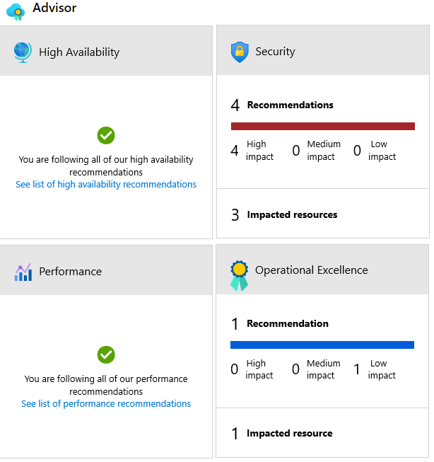

[Azure Advisor](https://azure.microsoft.com/services/advisor?azure-portal=true) is a free service built into Azure that provides recommendations on high availability, security, performance, and cost. Advisor analyzes your deployed services and looks for ways to improve your environment across those four areas. 

With Azure Advisor, you can:
- Get proactive, actionable, and personalized best practices recommendations. 
- Improve the performance, security, and high availability of your resources as you identify opportunities to reduce your overall Azure costs.
- Get recommendations with proposed actions inline.

You can access Azure Advisor through the Azure portal. After you sign in to the portal, either select **Advisor** from the navigation menu, or search for it in the *All services* menu.

You can download recommendations from Azure Advisor in PDF or CSV format, which you can then share.

