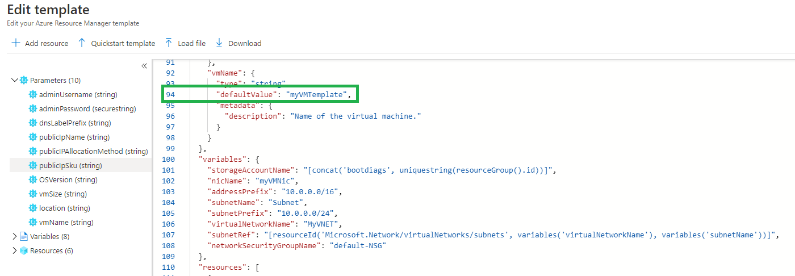
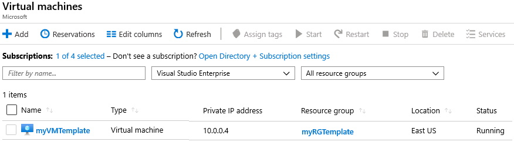
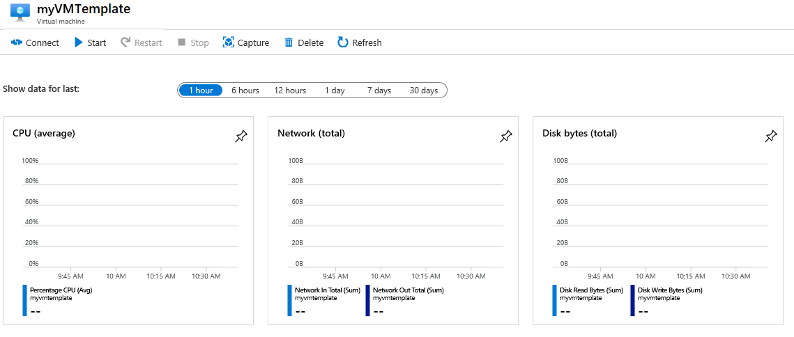
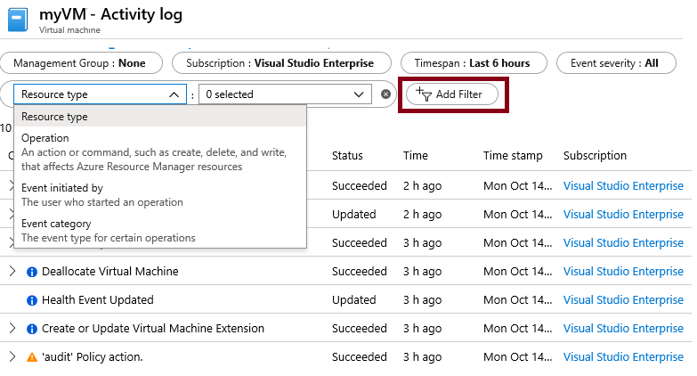

## Exercise - Use Templates to create a Virtual Machine

> [!NOTE]
> This lab requires an Azure Subscription to complete.  You can use a free Azure account, or a paid one.

---

## Create a Virtual Machine with a Template

In this walkthrough, we will deploy a virtual machine with a quickstart template and examine monitoring capabilities.

### Task 1: Explore the gallery and locate a template

In this task, we will browse the Azure quickstart gallery and deploy a template that creates a virtual machine. 

1. In a browser, access the [Azure quickstart Templates gallery](https://azure.microsoft.com/resources/templates?azure-portal=true). In the gallery, you will find a number of popular and recently updated templates. These templates automate deployment of Azure resources, including installation of popular software packages.

2. Browse through the many different types of templates that are available. 

    > [!NOTE]
    > Are there are any templates that are of interest to you?

3. Search for or directly access the [Deploy a simple Windows Virtual Machine](https://azure.microsoft.com/resources/templates/101-vm-simple-windows?azure-portal=true) template.

    > [!NOTE]
    > The **Deploy to Azure** button enables you to deploy the template via the Azure portal. During such deployment, you will be prompted only for small set of configuration parameters. 

4. Click the **Deploy to Azure** button. Your browser session will be automatically redirected to the [Azure portal (https://portal.azure.com)](https://portal.azure.com?azure-portal=true).

5. If prompted, sign in to the Azure subscription you want to use in this lab.

6. Click **Edit template**. The Resource Manager template format uses the JSON format. Review the parameters and variables.  Then locate the parameter for virtual machine name. Change the name to **myVMTemplate**. **Save** your changes. You are returned to the **Custom deployment** blade in the Azure portal.

    

7. Configure the template parameters (replace **xxxx** in the DNS label prefix with letters and digits such that the label is globally unique). Leave the defaults for everything else. 

    | Setting| Value|
    |----|----|
    | Subscription | **Choose your subscription**|
    | Resource group | **myRGTemplate** (create new) |
    | Location | **(US) East US** |
    | Admin username | **azureuser** |
    | Admin password | **Pa$$w0rd1234** |
    | DNS label prefix | **myvmtemplatexxxx** |
    | Windows OS version | **2019-Datacenter** |
    | | |

8. Check the box **I agree to the terms and conditions stated above** and then click **Purchase**.

    > [!NOTE]
    > There is no cost associated with this template.

9. Monitor your deployment. 

### Task 2: Verify and monitor your virtual machine deployment

In this task, we will verify the virtual machine deployed correctly. 

1. From the **All services** blade, search for and select **virtual machines**.

2. Ensure your new virtual machine was created. 

    

3. Select your virtual machine and on the **Overview** pane scroll down to view monitoring data.

    > [!NOTE]
    > The monitoring timeframe can be adjusted from one hour to 30 days.

4. Review different charts that are provided including **CPU (average)**, **Network (total)**, and **Disk bytes (total)**. 

    

5. Click on any chart. Notice that you can **Add metric** and change the chart type. As you have time, experiment with the chart types. 

6. Return to the **Overview** blade.

7. Click on the **Activity log** (left pane). Activity logs record such events as creation or modification of resources. 

8. Click **Add filter**, and experiment with searching for different event types and operations. 

    

> [!NOTE]
> To avoid additional costs, you can remove this resource group. Search for resource groups, click your resource group, and then click **delete resource group**. Verify the name of the resource group and then click **delete**. Monitor the **notifications** to see how the delete is proceeding.
