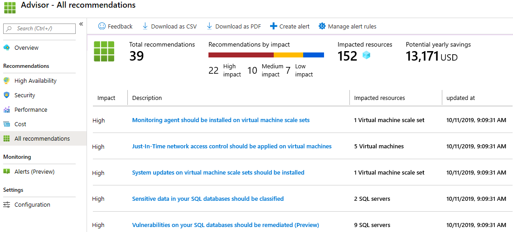

## Exercise - Using PowerShell to create a VM

> [!NOTE]
> A sandbox is provided to aid in your completion of this lab.  Otherwise, this Lab requires an Azure subscription.

---

In this walk-through, we will configure the Cloud Shell, use Azure PowerShell module to create a resource group and virtual machine, and review Azure Advisor recommendations. 

### Task 1: Configure the Cloud Shell

In this task, we will configure Cloud Shell. 

1. If you are using the MS Learn sandbox, you can do Task2.  Otherwise, sign in to the [Azure portal (https://portal.azure.com)](https://portal.azure.com?azure-portal=true).

2. From the Azure portal, open the **Azure Cloud Shell** by clicking on the icon in the top right of the Azure portal.

    

3. If you have previously used the Cloud Shell, proceed to the next task. 

4. When prompted to select either **Bash** or **PowerShell**, select **PowerShell**. 

5. When prompted, click **Create storage**, and wait for the Azure Cloud Shell to initialize. 

### Task 2: Verify the <rgn>[sandbox resource group name]</rgn> resource group exists, and Create virtual machine

In this task, we will use PowerShell to create a resource group and a virtual machine.  

1. Ensure **PowerShell** is selected in the upper-left drop-down menu of the Cloud Shell pane.

2. Verify your new resource group. 

    ```PowerShell
    Get-AzResourceGroup | Format-List
    ```

3. Create a virtual machine. When prompted provide the username (**azureuser**) and the password (**Pa$$w0rd1234**) that will be configured as the local Administrator account on that virtual machines. Ensure that you include the tick (`) characters at the end of each line except for the last one (there should not be any tick characters if you type entire command on a single line).

    ```PowerShell
    New-AzVm `
    -ResourceGroupName "<rgn>[sandbox resource group name]</rgn>" `
    -Name "myVMPS" `
    -Location "West US" `
    -VirtualNetworkName "myVnetPS" `
    -SubnetName "mySubnetPS" `
    -SecurityGroupName "myNSGPS" `
    -PublicIpAddressName "myPublicIpPS"
    ```

4. Close the PowerShell session Cloud Shell pane.

5. In the Azure portal, search for **Virtual machines** and verify the **myVMPS** is running. This may take a few minutes.

    

6. Access the new virtual machine and review the Overview and Networking settings to verify your information was correctly deployed. 

### Task 3: Execute commands in the Cloud Shell

In this task, we will practice executing PowerShell commands from the Cloud Shell. 

1. From the Azure portal, open the **Azure Cloud Shell** by clicking on the icon in the top right of the Azure portal.

2. Ensure **PowerShell** is selected in the upper-left drop-down menu of the Cloud Shell pane.

3. Retrieve information about your virtual machine including name, resource group, location, and status. Notice the PowerState is **running**.

    ```PowerShell
    Get-AzVM -name myVMPS -status | Format-List
    ```

4. Stop the virtual machine. When prompted confirm (Yes) to the action. 

    ```PowerShell
    Stop-AzVM -ResourceGroupName <rgn>[sandbox resource group name]</rgn> -Name myVMPS
    ```

5. Verify your virtual machine state. The PowerState should now be **deallocated**. You can also verify the virtual machine status in the portal. 

    ```PowerShell
    Get-AzVM -name myVMPS -status | Format-List
    ```

### Task 4: Review Azure Advisor Recommendations

> [!NOTE]
> This same task is in the Create a VM with Azure CLI lab. 

In this task, we will review Azure Advisor recommendations for our virtual machine. 

1. If you are using the MS Learn sandbox, you can do Task2.  Otherwise, sign in to the [Azure portal (https://portal.azure.com)](https://portal.azure.com?azure-portal=true).

2. From the **All services** blade, search for and select **Advisor**. 

3. On the **Advisor** blade, select **Overview**. Notice recommendations are grouped by High Availability, Security, Performance, and Cost. 

    

4. Select **All recommendations** and take time to view each recommendation and suggested actions. 

    > [!NOTE]
    > Depending on your resources, your recommendations will be different. 

    

5. Notice that you can download the recommendations as a CSV or PDF file. 

6. Notice that you can create alerts. 

7. If you have time, continue to experiment with Azure PowerShell. 

Congratulations! You have configured Cloud Shell, created a virtual machine using PowerShell, practiced with PowerShell commands, and viewed Advisor recommendations.

> [!NOTE]
> To avoid additional costs, you can remove this resource group. Search for resource groups, click your resource group, and then click **Delete resource group**. Verify the name of the resource group and then click **Delete**. Monitor the **Notifications** to see how the delete is proceeding.
