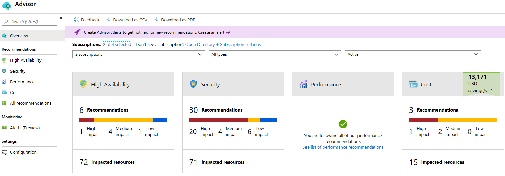

## Exercise - Using Azure Command Line Interface to create a Virtual Machine

> [!NOTE]
>  A sandbox is provided to aid in your completion of this lab. Otherwise, this Lab requires an Azure subscription.

---

## Create a Virtual Machine with the Command Line Interface

In this walk-through, we will configure the Cloud Shell, use Azure CLI to create a resource group and virtual machine, and review Azure Advisor recommendations. 

### Task 1: Configure the Cloud Shell

In this task, we will configure Cloud Shell. 

1. If you are using the MS Learn sandbox, skip to Task 2.  Else, Sign in to the [Azure portal (https://portal.azure.com)](https://portal.azure.com?azure-portal=true).

2. From the Azure portal, open the **Azure Cloud Shell** by clicking on the icon in the top right of the Azure portal.

    

3. If you have previously used the Cloud Shell, proceed to the next task. 

4. When prompted to select either **Bash** or **PowerShell**, select **Bash**. 

5. When prompted, click **Create storage**, and wait for the Azure Cloud Shell to initialize. 

### Task 2: Verify the  a resource group and a virtual machine

In this task, we will use Azure CLI to create a resource group and a virtual machine.  

1. Ensure you have a resource group <rgn>[sandbox resource group name]</rgn> and create a VM.

    ```cli
    az group list --output table
    ```

2. Create a new virtual machine. Make sure that each line except for the last one is followed by the caret (`^`) character. If you type the whole command on the same line, do not use any backslash characters. 

    ```cli
    az vm create \
    --name myVMCLI \
    --resource-group <rgn>[sandbox resource group name]</rgn> \
    --image UbuntuLTS \
    --location EastUS \
    --admin-username azureuser \
    --admin-password Pa$$w0rd1234
    ```
    > [!NOTE]
    > The command will take 2 to 3 minutes to complete. The command will create a virtual machine and various resources associated with it such as storage, networking and security resources. Do not continue to the next step until the virtual machine deployment is complete. 


### Task 3: Execute commands in the Cloud Shell

In this task, we will practice executing CLI commands from the Cloud Shell. 

1. From the Azure portal, open the **Azure Cloud Shell** by clicking on the icon in the top right of the Azure portal.

2. Ensure **Bash** is selected in the upper-left drop-down menu of the Cloud Shell pane.

3. Retrieve information about the virtual machine you provisioned, including name, resource group, location, and status. Notice the PowerState is **running**.

    ```cli
    az vm show --resource-group <rgn>[sandbox resource group name]</rgn> --name myVMCLI --show-details --output table 
    ```

4. Stop the virtual machine. Notice the message that billing continues until the virtual machine is deallocated. 

    ```cli
    az vm stop --resource-group <rgn>[sandbox resource group name]</rgn> --name myVMCLI
    ```

5. Verify your virtual machine status. The PowerState should now be **stopped**.

    ```cli
    az vm show --resource-group <rgn>[sandbox resource group name]</rgn> --name myVMCLI --show-details --output table 
    ```

### Task 4: Review Azure Advisor Recommendations

In this task, we will review Azure Advisor recommendations.

   > [!NOTE]
   > If you have completed the previous lab (Create a VM with PowerShell), then you have already performed this task. 

1. Sign in to the [Azure portal (https://portal.azure.com)](https://portal.azure.com?azure-portal=true).

2. From the **All services** blade, search for and select **Advisor**. 

3. On the **Advisor** blade, select **Overview**. Notice recommendations are grouped by High Availability, Security, Performance, and Cost. 

    

4. Select **All recommendations** and take time to view each recommendation and suggested actions. 

    > [!NOTE]
    > Depending on your resources, your recommendations will be different. 

    

5. Notice that you can download the recommendations as a CSV or PDF file. 

6. Notice that you can create alerts. 

7. If you have time, continue to experiment with Azure CLI. 

Congratulations! You have configured Cloud Shell, created a virtual machine using Azure CLI, practiced with Azure CLI commands, and viewed Advisor recommendations.

> [!NOTE]
> To avoid additional costs, you can remove this resource group. Search for resource groups, click your resource group, and then click **Delete resource group**. Verify the name of the resource group and then click **Delete**. Monitor the **Notifications** to see how the delete is proceeding.
