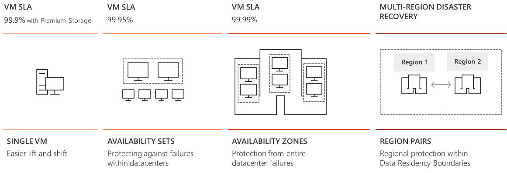

## Availability Options

+ A single virtual machine with premium storage has an SLA of 99.9%. You can quickly migrate existing virtual machines to Azure through “lift and shift”. Lift and shift is a no-code option where each application is migrated as-is, providing the benefits of the cloud without the risks or costs of making code changes.

+ By placing virtual machines in an availability set, you protect against datacenter failures and increases the SLA to 99.95%.

+ Adding virtual machines to availability zones protects from entire datacenter failures and increases the SLA to 99.99%, which is highest level of protection that is provided. 

+ For multi-region disaster recovery, region pairs protect and provide data residency boundaries. 

