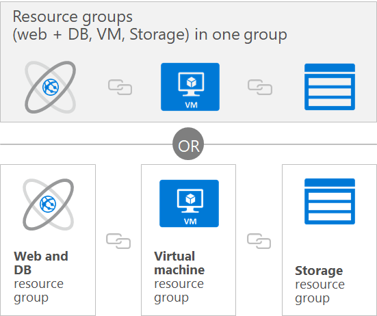
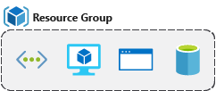
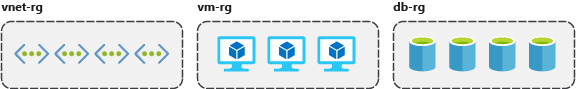
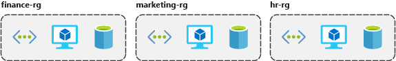
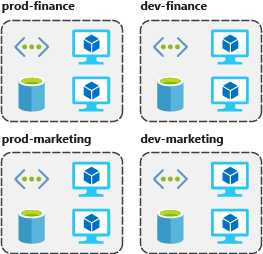

A **resource group** is a unit of management for your resources in Azure. You can think of your resource group as a container that allows you to aggregate and manage all the resources required for your application in a single manageable unit. This allows you to manage the application collectively over its lifecycle, rather than manage components individually. Before any resource can be provisioned, you need a resource group for it to be placed in.

You can manage and apply the following resources at resource group level:

+ Metering and billing
+ Policies
+ Monitoring and alerts
+ Quotas
+ Access control

Remember that when you delete a resource group you delete all resources contained within it.

## Considerations

When creating and placing resources within resource groups there are a few considerations:

+ Each resource must exist in one, and only one, resource group.

+ A resource group can contain resources that reside in different regions.

+ You decide how you want to allocate resources to resource groups based on what makes the most sense for your organization.

+ You can add or remove a resource to a resource group at any time.

+ You can move a resource from one resource group to another.

+ Resources for an application do not need to exist in the same resource group. However, it is recommended that you keep them in the same resource group for ease of management.

✔️  Do you have a strategy on how you will organize your Azure resources?

### Logical grouping

Resource groups exist to help manage and organize your Azure resources. By placing resources of similar usage, type, or location, you can provide some order and organization to resources you create in Azure. Logical grouping is the aspect that we're most interested in here, since there's a lot of disorder among our resources.

### Life cycle

If you delete a resource group, all resources contained within are also deleted. Organizing resources by life cycle can be useful in non-production environments, where you might try an experiment, but then dispose of it when done. Resource groups make it easy to remove a set of resources at once.

### Authorization

Resource groups are also a scope for applying role-based access control (RBAC) permissions. By applying RBAC permissions to a resource group, you can ease administration and limit access to allow only what is needed.

## Create a resource group

Resource groups can be created by using the following methods:

- Azure portal
- Azure PowerShell
- Azure CLI
- Templates
- Azure SDKs (like .NET, Java)

Let's walk through the steps you'd take to create a resource group in the Azure portal. If you'd like to follow along in your own subscription, you may.

1. Open a web browser and sign into the [Azure portal](https://portal.azure.com/?azure-portal=true).

    > [!IMPORTANT]
    > Make sure to use your _own_ subscription. When you are in the free sandbox environment, it will not allow you to create resource groups. You can tell which subscription you are using by looking at the tenant name under your profile picture. You can switch tenants by selecting your profile picture and selecting **Switch Directory** from the options menu.

1. On the Azure portal menu or from the **Home** page, select **Create a resource**.

1. Type **resource group** in the search box and hit Enter.

1. The first item in the list should be the resource group resource. Select it and then select the **Create** button.

    

1. Enter your resource group name, let's use **msftlearn-core-infrastructure-rg**. Select the subscription it should be in, and select the region for the resource group. Select **Review + Create** and then **Create** to create the resource group.

    

That's it, you've created a resource group that you can now use when you deploy Azure resources. Let's take a closer look at this resource group and some important things to consider.

## Explore a resource group and add a resource

On the Azure portal menu or from the **Home** page, select **resource groups**, and select your newly created resource group. You may also see a resource group called **NetworkWatcherRG**. You can ignore this resource group, it's created automatically to enable Network Watcher in Azure virtual networks.

On the Overview panel, there's the basic information about the resource group like the subscription it's in, the subscription ID, any tags that are applied, and a history of the deployments to this resource group. We'll cover tags in the next unit. The deployments link takes you to a new panel with the history of all deployments to this resource group. Anytime you create a resource, it's a deployment, and you see that history for the resource group here.

Across the top you can add more resources, change the columns in the list, move the resource group to another subscription, or delete it entirely.

On the left menu, there are a number of options

We don't have any resources in this resource group yet, so the list at the bottom is empty. Let's create a couple resources inside the resource group.

1. Select **+ Add** at the top or select the **Create resources**, either will work.

1. Search for **Virtual network**. The first result should be the virtual network resource. Select it, and on the next screen select **Create**.

1. Name the virtual network **msftlearn-vnet1**. For the **resource group** drop-down, select the resource group that you created earlier. Enter **192.168.0.0/24** for both the **Address space** and subnet **Address range**. Leave the defaults for all other options, and select **Create**.

1. Repeat the steps again to create one more VNet, where both the **Address space** and subnet **Address range** are for a different network than your previous network, (e.g. **192.168.100.0/24**). Name it **msftlearn-vnet2**, and make sure to place it in the resource group that you created earlier.

1. Go back to your resource group, and on the **Overview** panel you should see the two VNets you created.

    

Our resource group now contains two virtual network resources because we specified in our deployment (when we created the resources) which resource group we wanted the VNet to be placed in. We could create additional resources inside this resource group, or we could create additional resource groups in the subscription to deploy resources into.

When creating resources, you usually have the option to create a new resource group as an alternative to using an existing resource group. This simplifies the process a bit, but as you see in your new organization, can lead to resources spread across resource groups with little thought as to how to organize them.

## Use resource groups for organization

So how can you use resource groups to your advantage in your new organization? There are some guidelines and best practices that can help with the organization.

### Consistent naming convention

You can start with using an understandable naming convention. We named our resource group **msftlearn-core-infrastructure-rg**. We've given some indication of what it's used for (**msftlearn**), the types of resources contained within (**core-infrastructure**), and the type of resource it is itself (**rg**). This descriptive name gives us a better idea of what it is. If we had named it **my-resource-group** or **rg1**, we have no idea on a glance of what the usage may be. In this case, we can deduce that there are probably core pieces of infrastructure contained within. If we created additional VNets, storage accounts, or other resources the company may consider _core infrastructure_, we could place them here as well, to improve the organization of our resources. Naming conventions can vary widely between and even within companies, but some planning can help.

### Principles of organize resource groups

Resource groups can be organized in a number of ways, let's take a look at a few examples. We might put all resources that are _core infrastructure_ into this resource group. But we could also organize them strictly by resource type. For example, put all VNets in one resource group, all virtual machines in another resource group, and all Azure Cosmos DB instances in yet another resource group.

We could organize them by environment (prod, qa, dev). In this case, all production resources are in one resource group, all test resources are in another resource group, and so on.

We could organize them by department (marketing, finance, human resources). Marketing resources go in one resource group, finance in another resource group, and HR in a third resource group.

We could even use a combination of these strategies and organize by environment and department. Put production finance resources in one resource group, dev finance resources in another, and the same for the marketing resources.

There are a few factors that can play into the strategy you use to organize resources: authorization, resource life cycle, and billing.

#### Organize based on authorization needs

Since resource groups are a scope of RBAC, you can organize resources by _who_ needs to administer them. If your database administration team is responsible for managing all of your Azure SQL Database instances, putting them in the same resource group would simplify administration. You could give them the proper permissions at the resource group level to administer the databases within the resource group. Similarly, the database administration team could be denied access to the resource group with virtual networks, so they don't inadvertently make changes to resources outside the scope of their responsibility.

#### Organize for resource life cycle

We mentioned earlier that resource groups serve as the life cycle for the resources within it. If you delete a resource group, you delete all the resources in it. Use this to your advantage, especially in areas where resources are more disposable, like non-production environments. If you deploy 10 servers for a project that you know will only last a couple of months, you might put them all in a single resource group. One resource group is easier to clean up than 10 or more resource groups.

#### Organize for usage in billing reports

Lastly, placing resources in the same resource group is a way to group them for usage in billing reports. If you're trying to understand how your costs are distributed in your Azure environment, grouping them by resource group is one way to filter and sort the data to better understand where costs are allocated.

✔️ The bottom line is that you have flexibility in how to organize resources in your resource groups. Put some thought into it so that you have a coherent approach to how you use resource groups in your Azure environment.
