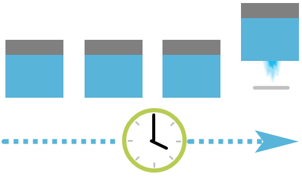

## Azure Resource Manager

[Azure Resource Manager](https://azure.microsoft.com/features/resource-manager?azure-portal=true) is a management layer in which resource groups and all the resources within it are created, configured, managed, and deleted. It provides a consistent management layer which allows you automate the deployment and configuration of resources using different automation and scripting tools, such as Microsoft Azure PowerShell, Azure Command-Line Interface (Azure CLI), Azure portal, REST API, and client SDKs.

With Azure Resource Manager, you can:

+ **Deploy Application resources**. Update, manage, and delete all the resources for your solution in a single, coordinated operation.

+ **Organize resources**. Manage your infrastructure through declarative templates rather than scripts. You can view which resources are linked by a dependency, and you can apply tags to resources to categorize them for management tasks, such as billing.

+ **Control access and resources**. You can control who in your organization can perform actions on the resources. You manage permissions by defining roles, adding users or groups to the roles, and applying policies at resource group level. Examples of elements you may wish to control are: enforcing naming convention on resources, limiting which types and instances of resources can be deployed, or limiting which regions can host a type of resource.

