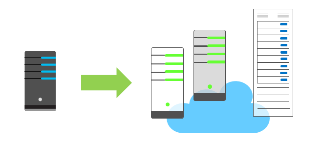

The concept of **economies of scale** is the ability to reduce costs and gain efficiency when operating at a larger scale in comparison to operating at a smaller scale.

Cloud providers such as Microsoft, Google, and Amazon are large businesses, and are able to leverage the benefits of economies of scale, and then pass those benefits on to their customers.

This is apparent to end users in a number of ways, one of which is the ability to acquire hardware at a lower cost than if a single user or smaller business were purchasing it.

Storage costs, for example, have decreased significantly over the last decade due in part to cloud providers' ability to purchase larger amounts of storage at significant discounts. They are then able to use that storage more efficiently and pass on those benefits to end users in the form of lower prices.

✔️ There are limits to the benefits large organizations can realize through economies of scale. A product will inevitably have an underlying core cost, as it becomes more of a commodity, based on what it costs to produce. Competition is also another factor which has an effect on costs of cloud services.
