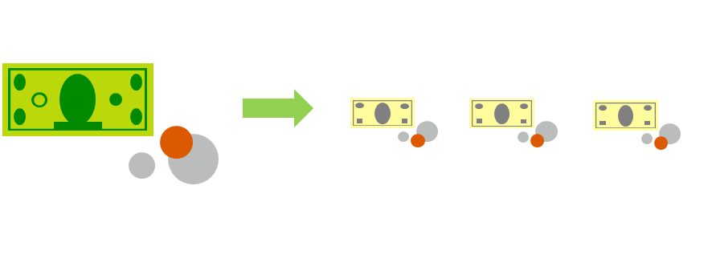

In previous years, startup companies needed to acquire a physical premises and infrastructure to start their business and begin trading. Large amounts of money were needed to get a new business up and running, or to grow an existing company. A company would have to buy new datacenters or new servers in order to allow them build out new services, which they could then deliver to their customers. With cloud services, that is no longer the case. 

Today, organizations can sign up for a service from a cloud provider to get up and running. This enables the company to begin selling or providing services to their customers quickly, without the need for a significant investment into up front costs.

There are two approaches to investment, commonly referred to as:

- **Capital Expenditure (CapEx)**: This is the up front spending of money on physical infrastructure, and then deducting that up front expense over time. The up front cost from CapEx has a value that reduces over time.

- **Operational Expenditure (OpEx)**: This is spending money on services or products now and being billed for them now. You can deduct this expense in the same year you spend it. There is no up front cost, as you pay for a service or product as you use it.

## CapEx computing costs

A typical on-premises datacenter includes costs such as:

### Server costs

This area includes all hardware components and the cost of supporting them. When purchasing servers, make sure to design fault tolerance and redundancy, such as server clustering, redundant power supplies, and uninterruptible power supplies. When a server needs to be replaced or added to a datacenter, you need to pay for the computer. This can affect your immediate cash flow because you must pay for the server up front.

### Storage costs

This area includes all storage hardware components and the cost of supporting it. Based on the application and level of fault tolerance, centralized storage can be expensive. For larger organizations, you can create tiers of storage where more expensive fault‐tolerant storage is used for critical applications, and lower expense storage is used for lower priority data.

### Network costs

Networking costs include all on-premises hardware components, including cabling, switches, access points, and routers. This also includes wide area network (WAN) and Internet connections.

### Backup and archive costs

This is the cost to back up, copy, or archive data. Options might include setting up a backup to or from the cloud. There's an upfront cost for the hardware and additional costs for backup maintenance and consumables, like tapes.

### Organization continuity and disaster recovery costs

Along with server fault tolerance and redundancy, you need to plan for how to recover from a disaster and continue operating. Your plan should consist of creating a data recovery site. It could also include backup generators. Most of these are upfront costs, especially if you build a data recovery site, but there's an additional ongoing cost for the infrastructure and its maintenance.

### Datacenter infrastructure costs

These are costs for construction and building equipment, as well as future renovation and remodeling costs that may arise as demands grow. Additionally, this infrastructure incurs operational expenses for electricity, floor space, cooling, and building maintenance.

### Technical personnel

While not a capital expenditure, the personnel required to work on your infrastructure are specific to on-premises datacenters. You will need the technical expertise and workforce to install, deploy, and manage the systems in the datacenter and at the data recovery site.

## OpEx cloud computing costs

With cloud computing, many of the costs associated with an on-premises datacenter are shifted to the service provider. Instead of thinking about physical hardware and datacenter costs, cloud computing has a different set of costs. For accounting purposes, all these costs are operational expenses:

### Leasing software and customized features

Using a pay-per-use model requires actively managing your subscriptions to ensure users do not misuse the services, and that provisioned accounts are being utilized and not wasted. As soon as the provider provisions resources, the billing starts. It is your responsibility to de-provision the resources when they aren't in use so that you can minimize costs.

### Scaling charges based on usage/demand instead of fixed hardware or capacity

Cloud computing can bill in various ways, such as the number of users or CPU usage time. However, billing categories can also include allocated RAM, I/O operations per second (IOPS), and storage space. Plan for backup traffic and data recovery traffic to determine the bandwidth needed.

### Billing at the user or organization level

The subscription (pay-per-use) model is a computing billing method that is designed for both organizations and users. The organization or user is billed for the services used,and typically on a recurring basis. You can scale, customize, and provision computing resources, including software, storage, and development platforms. For example, when using a dedicated cloud service, you could pay based on server hardware and usage. 

## Benefits of CapEx

With capital expenditures, you plan your expenses at the start of a project or budget period. Your costs are fixed, meaning you know exactly how much is being spent. This is appealing when you need to predict the expenses before a project starts due to a limited budget.

## Benefits of OpEx

Demand and growth can be unpredictable and can outpace expectation, which is a challenge for the CapEx model as shown in the following graph.

With the OpEx model, companies wanting to try a new product or service don't need to invest in equipment. Instead, they pay as much or as little for the infrastructure as required. 

OpEx is particularly appealing if the demand fluctuates or is unknown. Cloud services are often said to be _agile_. Cloud agility is the ability to rapidly change an IT infrastructure to adapt to the evolving needs of the business. For example, if your service peaks one month, you can scale to demand and pay a larger bill for that month. If the following month the demand drops, you can reduce the used resources and then have a lower bill. This agility lets you manage your costs dynamically, optimizing spending as requirements change.

✔️ Companies wanting to start a new business or grow their business do not have to incur up front costs to try out a new product or service for customers. Instead, they can get into a market immediately and pay as much or as little for the infrastructure as the business requires. They also can terminate that cost if and when they need to.

If your service is busy and you consume a lot of resources in a month, then you would receive a large bill. If those services are minimal and don't use a lot of resources, then you would receive a smaller bill.

A business can still use the CapEx expenditure strategy if they wish, but it is no longer a requirement that they do so. 
