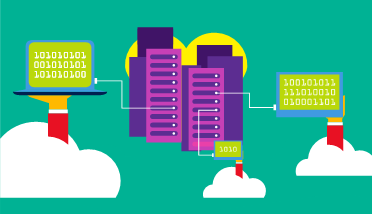

A public cloud is owned by the cloud services provider (also known as a *hosting provider*). It provides resources and services to multiple organizations and users, who connect to the cloud service via a secure network connection, typically over the internet. 

Public cloud models have the following characteristics:

- **Ownership** - Ownership refers to the resources that an organization or end user uses. Examples include storage and processing power. Resources do not belong to the organization that is utilizing them, but rather they are owned and operated by a third party, such as the cloud service provider.
- **Multiple end users** - Public cloud modes may make their resources available to multiple organizations.
- **Public access** - Public access allows the public to access the desired cloud services.
- **Availability** - Public cloud is the most common cloud-type deployment model. 
- **Connectivity** - Users and organizations are typically connected to the public cloud over the internet using a web browser.
- **Skills** - Public clouds do not require deep technical knowledge to set up and use its resources.

With a public cloud, there is no local hardware to manage or keep up to date; everything runs on the cloud provider’s hardware. In some cases, cloud users can save additional costs by sharing computing resources with other cloud users.

A common use case scenario is deploying a web application or a blog site on hardware and resources that are owned by a cloud provider. Using a public cloud in this scenario allows cloud users to get their website/blog up and running quickly, and then focus on maintaining the site without having to worry about purchasing, managing, or maintaining the hardware on which it runs.

Businesses can use multiple public cloud service provider companies of varying scale. Microsoft Azure is an example of a public cloud provider.

