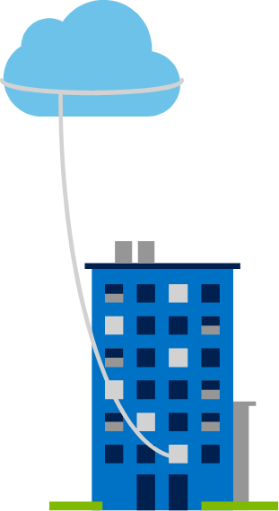

A private cloud is owned and operated by the organization that uses the resources from that cloud. They create a cloud environment in their own datacenter and provide self-service access to compute resources to users within their organization. The organization remains the owner, entirely responsible for the operation of the services they provide.

Private cloud models have the following characteristics:

+ **Ownership**. The owner and user of the cloud services are the same.

+ **Hardware**. The owner is entirely responsible for the purchase, maintenance, and management of the cloud hardware.

+ **Users**. A private cloud operates only within one organization and cloud computing resources are used exclusively by a single business or organization.

+ **Connectivity**. A connection to a private cloud is typically made over a private network that is highly secure.

+ **Public access**. Does not provide access to the public.

+ **Skills**. Requires deep technical knowledge to set up, manage, and maintain.

A use case scenario for a private cloud would be when an organization has data that cannot be put in the public cloud, perhaps for legal reasons. For example, they may have medical data that cannot be exposed publicly.

Another scenario may be where government policy requires specific data to be kept in-country or privately.

A private cloud can provide cloud functionality to external customers as well, or to specific internal departments such as Accounting or Human Resources.

