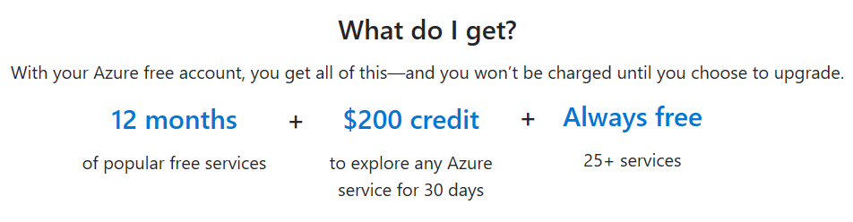

Azure has a free account for users who need to explore what is possible in Azure.

An Azure [free account](https://azure.microsoft.com/free?azure-portal=true) provides subscribers with 12 months of our most popular services, a credit to explore any Azure service for 30 days, and over 25 services are free.

**Do you pay anything to start with the Azure free account?**
No. Starting is free, plus you get a credit you can spend during the first 30 days.

**What do you need to sign up for a free account?**
All you need is a phone number, a credit or debit card, and a GitHub account or Microsoft account username (formerly Windows Live ID).

**What happens once you use my free credit or I’m at the end of 30 days?**
We’ll notify you so you can decide if you want to upgrade to pay-as-you-go pricing and remove the spending limit. If you do, you’ll have access to all the free products. If you don’t, your account and products will be disabled, and you'll need to upgrade to resume usage.

**What happens at the end of the 12 months of free products?**
For 12 months after you upgrade your account, certain amounts of popular products for compute, networking, storage, and databases are free. After 12 months, any of these products you may be using will continue to run, and you’ll be billed at the standard pay-as-you-go rates.
