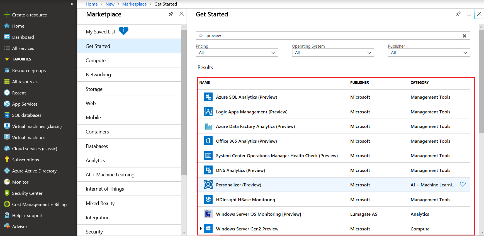
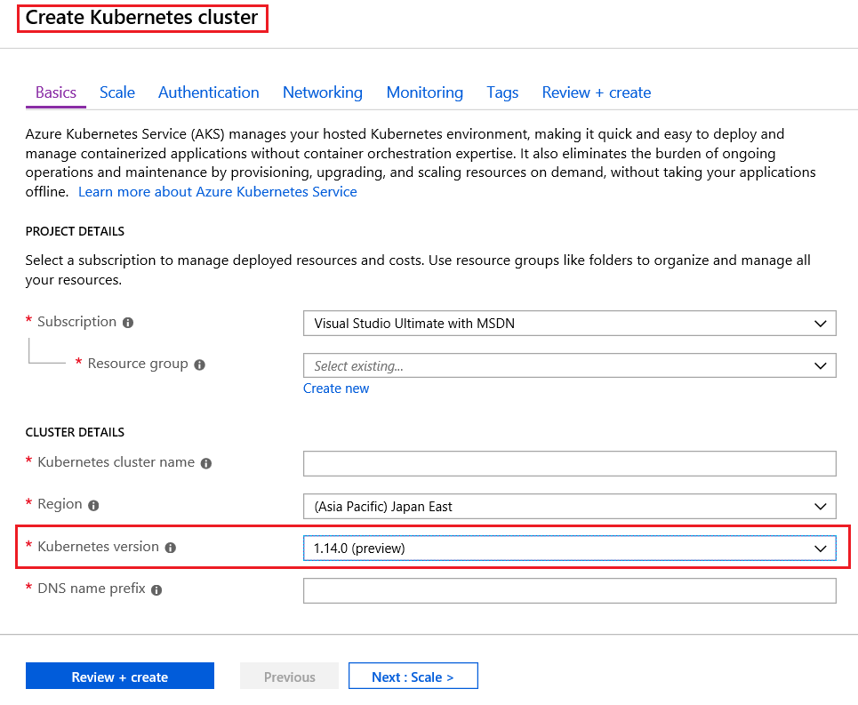

You can access publicly available Preview features directly via the Azure portal. 

## Try this - access preview features

You can view preview services by doing the following

+ Sign into the **Azure portal**
+ Click **Create a resource**
+ Type **preview** in the search box and press **Enter**
+ A list of services is returned and displayed for you to browse through. You can select one to learn more about it, and also create an instance of the service, then try it out.

## Preview - new functionality / features within an existing service

Some preview features relate to a specific area of an existing Azure Service. These preview features are accessible as you deploy, configure and manage the service. One such example is **Azure Kubernetes Service (AKS)**, where you can view preview functionality available within AKS by doing the following.

+ Sign into **Azure portal**
+ Open, **Azure Kubernetes Services (AKS)** then click **Create Kubernetes service** button 
+ Under, **Cluster Details** > **Kubernetes version** section expand the drop-down list to display the versions.
+ The latest version **1.14.0** is listed as currently in preview **1.14.0 (preview)**. It's being made available to provide new functionality in AKS and allow testing.

> [!div class="checklist"]   
> * You may choose to use an Azure preview service in production. Remember, the preview feature or functionality may not yet be ready for production deployments. Make sure you're aware of any limitations around its use before deploying to production.
