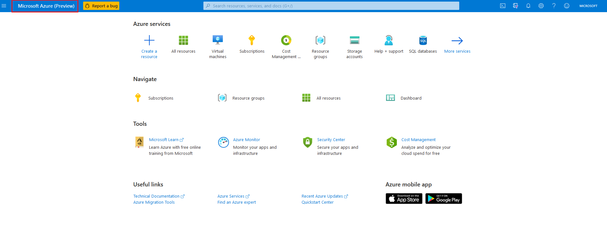

You can access preview features that are specific to the Azure portal from the [https://preview.portal.azure.com](https://preview.portal.azure.com?azure-portal=true) page. Typical portal preview features provide performance, navigation, and accessibility improvements to the Azure portal interface.

## Provide feedback

Azure customers can provide feedback on the preview features they've tested by *sending a smile* in the portal.  Or customers can post ideas and suggestions on the *Azure portal feedback forum*. You can revert to the default Azure portal by going to the [https://portal.azure.com](https://portal.azure.com?azure-portal=true) page.

> [!div class="checklist"]  
> * There is a [Azure portal feedback forum](https://feedback.azure.com/forums/223579-azure-portal?azure-portal=true).
> * For more information about Azure portal preview features, see [Get early access to the newest Azure portal features](https://azure.microsoft.com/updates/get-early-access-to-new-portal-features-2?azure-portal=true).
